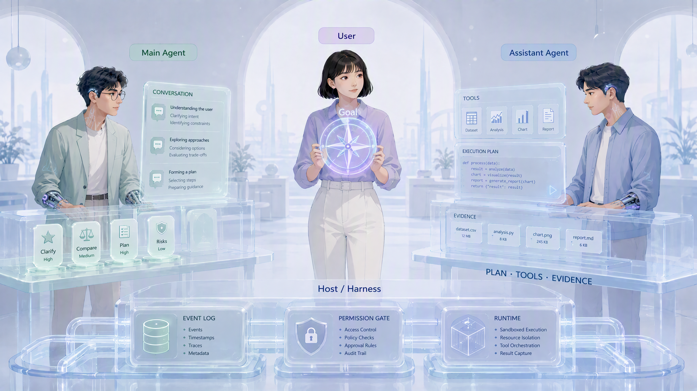
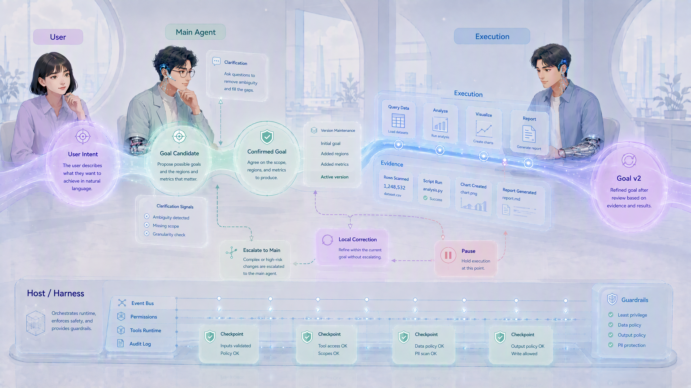
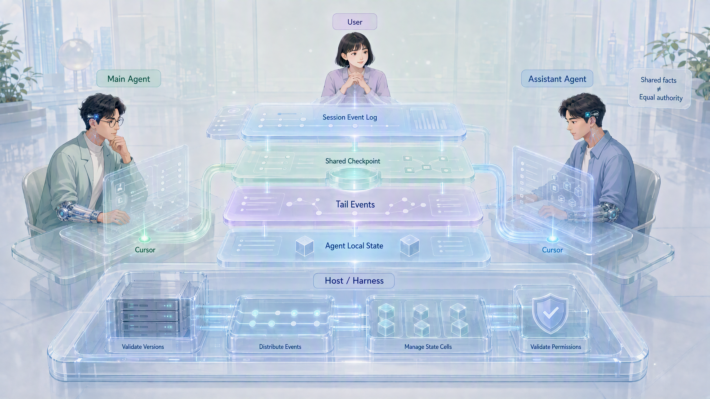
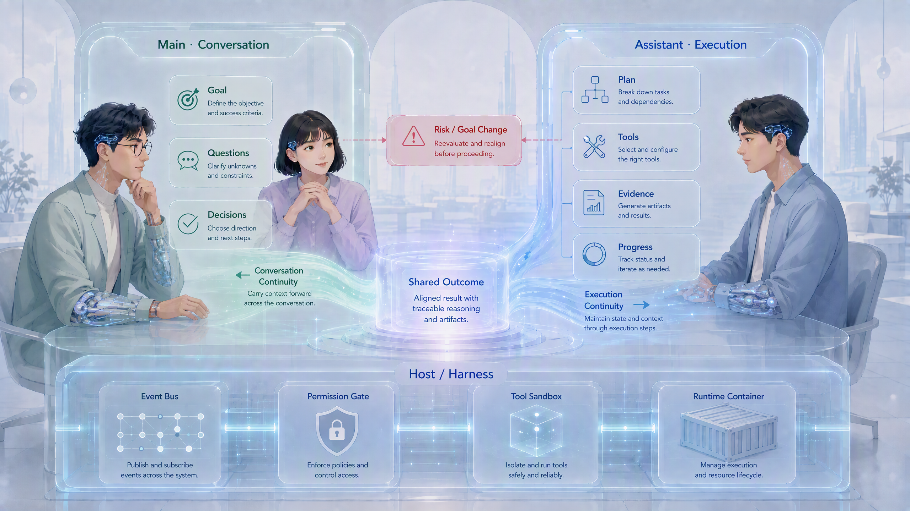

# Pair Agent 模型：持久双 Agent 的角色、权限与共享上下文设计


> **文档摘要：**本文将一种持久双 Agent 会话模式命名为 **Pair Agent 模型**。讨论从“执行任务时增加一个只读伴随助手”开始，逐渐收敛为“Main Agent 持续与用户思考和对话，Assistant Agent 持续承担执行”的双角色模型。文章不逐次复述思想实验，而是提炼其中暴露的关键矛盾、形成的取舍，以及这些结论如何沉淀为角色权限、目标管理、任务协作、共享上下文、LLM 请求和会话压缩设计。

**关键词：**Pair Agent · 持久助手 · 用户目标 · 执行自治 · Session Event · Shared Checkpoint · Context Compaction

> **探索状态：**阶段性产品与协议设计，更新于 2026-08-24。本文不要求现有 `react-loop` 协议立即支持该模型，也不代表具体 API、存储结构和界面方案已经定型。
>
> **技术设计参考：**[pair-agent-spec.md](pair-agent-spec.md)

---

## 一、真正的问题不是缺少一个 Agent，而是会话和执行争夺同一个主体

现在常见的 Agent 产品把对话和执行都交给同一个 Agent。用户发布任务后，它开始搜索、读写文件、调用工具和等待子任务；产品虽然可以展示进度，但原本与用户一起理解问题、讨论方案的对象已经离开对话，投入执行。

这会造成几种体验断裂：

- 长任务运行时，用户难以继续追问和探索新的问题；
- 目标讨论、工具进度和中间产物混在同一条时间线上；
- 用户看到中间结果并想纠偏时，不清楚是在讨论可能性，还是在修改正在执行的任务；
- 执行结束后，Agent 需要重新吸收执行期间发生的对话，用户也需要重新理解任务已经走到哪里；
- 如果另开一个普通聊天助手，它又不了解任务现场，容易给出脱离事实的回答。

最初的设想是在执行 Agent 旁边增加一个只读伴随助手：执行期间由它继续回答用户问题，所有任务控制仍回到原会话。但继续推演后发现，持续理解用户、澄清问题和维护整体方向的角色，更像会话的主人；主要负责跑工具、搜索、写代码和交付产物的角色，反而更像助手。

因此角色被反转：

- **Main Agent** 留在对话中，持续理解用户；
- **Assistant Agent** 离开对话去完成工作，但始终作为同一会话中的固定角色存在；
- **临时 Sub-agent** 仍然可以由 Assistant 按子任务创建，用完即回收。

核心变化不是“多调用一个模型”，而是把会话连续性和执行连续性分别交给两个长期角色。

## 二、Pair Agent 的基本模型

### 2.1 用户：最终目标的唯一所有者

用户拥有最终目标、价值判断和目标变更权。用户可能只说一句高层想法，Main 负责把它逐步澄清为：

- 期望结果；
- 成功标准；
- 不可牺牲的关键约束；
- 已经明确的优先级；
- 尚未确认的假设和开放问题。

Main 的“确认”只表示它已经正确理解了用户，不代表 Main 与用户共同拥有目标，更不代表 Main 有权审批用户的目标。

### 2.2 Main Agent：整体意图的维护者

Main 的主要职责是：

- 与用户持续探索、推理、诊断和答疑；
- 将零散表达整理为整体意图；
- 发现目标、约束和方案之间的矛盾；
- 把工作分派给 Assistant，并维护跨任务优先级；
- 吸收执行结果，解释它对整体目标的影响；
- 当执行中的新要求可能改变目标时，重新与用户对齐。

Main 可以拥有服务于当前对话的轻量工具，例如核对一个文件或查询一个即时事实，但不应重新陷入长时间执行。判断边界不只看工具是否只读，而看它是否能在当前交互节奏内闭环、是否产生正式产物或外部副作用。

### 2.3 Assistant Agent：持久执行者和现实证据提供者

Assistant 与会话共同存在，持续理解上下文，负责：

- 计划和执行已分派任务；
- 搜索、整理、实验、写代码和运行工具；
- 展示计划、进度、中间产物、验证和阻塞；
- 在任务内部组织 Sub-agent 或动态工作流；
- 接受不改变最终目标的用户直接纠偏；
- 发现事实冲突、目标偏离和风险时，主动暂停、提出异议并同步 Main。

Assistant 不是没有判断力的执行器。它拥有认识性参与权、建议权和异议义务，但没有最终目标的决定权。

### 2.4 Host：记录、同步和约束，不替 Agent 作语义决定

Host 负责：

- 两个角色的生命周期和界面承载；
- Session Event 的记录和分发；
- Shared Checkpoint、游标和本地状态管理；
- 工具权限、写权限和运行时隔离；
- 让两个 Agent 在下一次调用前获得新增上下文。

Host 不应自行判断一句话是否改变了用户目标，也不应代替 Main 分派任务。它可以做确定性的权限校验、版本校验和事件归并，语义判断仍属于 Agent。



## 三、思想实验真正带来的发现

八个现实场景的价值不在于找到一个完美类比，而在于暴露不同边界。产品经理与程序员、CEO 与秘书、研发 VP 与团队 Leader、组长与外包、操盘手与数据专员、售楼经理与售楼专员、医生与护士长、主编辑与副编辑，没有任何一组关系可以完整映射 Pair Agent；但它们共同揭示了以下问题。

### 3.1 信息该发给谁，取决于决策价值，而不是组织层级

用户可以直接向 Assistant 提供演示反馈、复现步骤、局部体验和一次性执行信息。它们可以被 Assistant 当场消费，不必让 Main 处理每个细节。

但满足以下任一条件的信息，应进入长期共同认知并提醒 Main：

- 将成为后续反复使用的长期知识；
- 构成重要转折；
- Main 不知道就可能影响后续决策；
- 虽然短期有效，却会立即推翻当前事实或方案。

因此，“是否长期”不是唯一标准。投资数据可能几分钟后就失效，却足以让当前判断立即作废。正确的同步判断应综合长期价值、即时影响、风险和事实颠覆程度。

### 3.2 用户可以直接纠正 Assistant，但不能让 Assistant 私下改写最终目标

现实使用中，用户会盯着 Assistant 的执行过程。看到中间产物后，用户可能意识到原来的想法有误，直接要求调整。这种交互不能全部被拒绝并赶回 Main，否则 Pair Agent 只是制造了新的流程阻力。

当前取舍是：

- 如果新指令仍然通往相同的期望结果，且不改变成功标准、关键约束和既定优先级，Assistant 可以直接调整执行，并同步 Main；
- 如果新指令明确影响最终目标，Assistant 应立即停止受影响的旧方向，记录用户的新要求并通知 Main，但不能自行生成新的权威 Goal；
- 如果用户只是在提问、求证或探索，或者新要求与当前目标存在矛盾，Assistant 不应把它误当作变更指令，而应让 Main 与用户澄清；
- 沿原方向暂停和继续属于运行控制，可以直接接受；改变方向后再继续则需要更新任务。

这里不是 Main 拥有否决用户的权力，而是只有 Main 负责把用户的新意图重新整理成完整、一致、可继续执行的目标版本。

### 3.3 “停止”与“改变方向”必须分开处理

紧急停止是一个特殊动作。它不要求 Agent 先理解新的目标，也不创造新的方向，只是阻止旧动作继续产生影响。因此用户可以直接要求 Assistant 暂停，Assistant 应立即执行并同步 Main。

这条原则很重要：如果连停止都必须等待 Main 重新确认，系统可能在明知用户撤回意图后继续执行。反过来，停止之后采取什么新方向，仍然需要重新对齐。

### 3.4 上下文可见不等于授权，用户转述也不等于 Main 已下达

Assistant 可以拥有常设事务权限，例如整理材料、执行测试和推进已经确认的任务。但如果用户告诉 Assistant“Main 已经同意修改范围”，Assistant 不能把这句话当成 Main 的正式任务变更。

在 Pair Agent 中，Host 能让 Main 立即看到这条消息，所以 Assistant 不需要在用户和 Main 之间充当人工传话筒；它应标记潜在变更，等待 Main 基于共同上下文完成确认和重新分派。

这揭示了三个不同概念：

```text
看见一条消息 ≠ 相信它描述的事实 ≠ 获得执行授权
```

### 3.5 用户拥有目标权，但自然语言不能临时扩大系统权限

用户可以改变要实现的目标，却不能仅凭一句“出了问题我负责”就让 Assistant 获得生产凭证、敏感数据或安全豁免。

目标权、任务授权、工具能力和安全边界属于不同层面：

- 用户决定要什么；
- Main 整理并维护一致的目标理解；
- Assistant 在被授予的任务和工具范围内执行；
- Harness 执行确定性的权限限制；
- 产品和模型已有的安全边界始终有效。

### 3.6 Assistant 不只是劳动力，也承担事实和风险上的独立责任

数据专员、护士长和副编辑的类比都说明：专业执行者不能为了服从当前方向而隐瞒异常、降低事实确定性或忽略风险。

Assistant 发现以下情况时必须主动同步 Main，必要时暂停受影响部分：

- 新证据推翻了当前方案的前提；
- 当前执行已经偏离用户确认的成功标准；
- 用户的新要求与硬约束冲突；
- 继续执行将产生高风险或不可逆影响；
- 用户要求向 Main 隐瞒影响共同目标的重要信息。

Main 与 Assistant 始终只代表用户利益，没有彼此对立的组织目标。但二者共享完整会话上下文，因此不存在“只告诉其中一方、要求向另一方保密”的会话内私密通道。

## 四、核心矛盾与当前取舍

| 核心矛盾 | 过度偏向一侧的结果 | 当前取舍 |
| --- | --- | --- |
| 对话连续性与事实可靠性 | Main 无工具会脱离事实；工具过多又会消失在执行中 | Main 保留轻量认知工具，持续工作交给 Assistant |
| 用户直达与整体一致性 | 所有变化都经 Main 会拖慢；Assistant 全接会导致目标漂移 | 局部纠偏直达，目标影响升级 |
| Assistant 自治与用户目标权 | 机械执行缺乏价值；过度自治会替用户作选择 | Assistant 有计划、建议和异议权，无 Goal 决定权 |
| 完整共享与权限安全 | 不共享会失忆；全部提升为高权限上下文会造成指令注入 | 原始事件共享，控制状态单独结构化 |
| 上下文完整与调用成本 | 全历史最真实但无限增长；只靠摘要会失真 | 不可变事件账本 + Shared Checkpoint + 增量事件 |
| 缓存命中与角色清晰 | 角色前置减少共享前缀；普通用户文本又不能安全选择身份 | Common Pair Contract 预先定义双角色，Host 在保留边界用 user-role reminder 选择 Active Role，确定性权限仍由 Harness 执行 |
| 执行透明与整体结论 | 只等 Main 汇总会延迟；Assistant 直接宣布总目标成功会越权 | Assistant 交付执行事实，Main 解释整体意义 |

一句话概括当前设计：

> 共享的是事实和证据，维护的是共同理解，委派的是行动，保留给用户的是价值选择。

## 五、目标不是一段 Prompt，而是一条有来源、有版本的状态演进

Pair Contract 最早定义 Goal 的字段、权威来源和更新规则，但不包含某个会话的具体目标。具体 Goal 最早出现在用户的原始消息中，之后才经过 Main 的解释和用户确认成为权威状态。

```text
用户原话
  → Goal Candidate
  → Main 澄清
  → 用户确认
  → goal_confirmed / goal_updated
  → SharedCheckpoint.goal_state
```



例如“让新用户更快获得价值”只是高层意图。“更快获得价值”本身不可工程验证，继续对话后才逐步得到：

- 期望结果：新用户更快获得产品价值；
- 指标：新注册用户 7 天留存率；
- 成功标准：达到 60%；
- 硬约束：不能用仅面向新用户赠送会员等差异化利益换取留存；
- 硬约束：不能为了迎合新用户而破坏老用户已深度使用的功能；
- 当前策略：先调研竞品和行业做法，再比较方案工作量与难度。

这些信息不是一次性写进 Goal 的，而是来自不同用户事件。Main 的价值在于把它们规范化，同时保留来源。

一个简化事件可以是：

```json
{
  "type": "goal_confirmed",
  "goalVersion": 1,
  "confirmedBy": "user",
  "canonicalizedBy": "main",
  "sourceEventIds": ["e12", "e18", "e23", "e27"],
  "goal": {
    "expectedOutcome": "让新用户更快获得价值",
    "successCriteria": ["新注册用户 7 天留存率达到 60%"],
    "hardConstraints": ["不以新用户专属利益换留存", "不破坏老用户既有功能"]
  }
}
```

`canonicalizedBy: main` 表示 Main 负责整理，不表示目标由 Main 决定。历史 Goal 不应被覆盖，而应通过 `goalVersion` 和 `supersedes` 保留演进关系。

### 5.1 Assistant 如何判断用户的新消息

可以用一个简化决策过程表达：

```text
if 用户要求立即停止:
    暂停受影响动作
    同步 Main
elif 只是讨论、提问或求证:
    回答或提供证据
    不修改任务
elif 不改变 outcome / success criteria / hard constraints / priority:
    接受局部纠偏
    更新执行计划并同步 Main
else:
    停止旧方向中受影响的部分
    标记 goal-impacting change
    等待 Main 与用户对齐并下发新 task revision
```

真正困难的不是流程，而是“是否改变目标”的语义判断。协议应允许 Assistant 在不确定时升级，而不是要求它永远准确分类。

## 六、任务协作：共同为最终目标负责，但承担不同阶段的责任

Main 分派给 Assistant 的不是一句孤立命令，而是一个引用当前 Goal 版本的任务：

```json
{
  "taskId": "research-01",
  "goalVersion": 1,
  "objective": "调研竞品的新用户价值引导方式，并评估候选方案工作量和难度",
  "scope": "调研和评估，不实施产品改动",
  "acceptance": ["列出行业做法", "说明适用条件", "比较工作量与难度"]
}
```

Assistant 可以在任务内部制定计划、使用工具和创建 Sub-agent。Sub-agent 继承所属任务的目标和边界，不能自行升级成新的顶层任务。

执行过程采用两阶段结果表达：

1. **Assistant 交付执行事实：**做了什么、证据是什么、如何验证、还存在哪些未知；
2. **Main 完成整体吸收：**结果是否满足用户目标、是否改变已有理解、是否需要新的决策或任务。

Assistant 的“任务完成”不等于用户的最终目标已经实现；Main 的“整体吸收”也不能重写 Assistant 的原始证据。

并发方面，默认保持一个前台任务、少量相互独立且低冲突的后台任务，其余明确排队。Main 负责跨任务优先级和冲突，Assistant 负责单个任务内部如何并行。

## 七、共享上下文不是任务结束后的互相总结

综合模拟暴露了一个关键缺陷：如果 Main 在 Assistant 执行期间继续与用户讨论“模板优先是否会让用户机械完成项目”等产品问题，而 Assistant 直到任务完成才收到摘要，它的后续执行就可能建立在已经过时的理解上。

这不是模拟细节疏漏，而是对“事后同步”设计的否定。Pair Agent 需要一个共同事件源，而不是两个独立对话在最后交换会议纪要。

### 7.1 四层上下文

推荐把会话状态分成四层：

```text
Session Event Log          不可变的事实账本
    ↓ derive
Shared Checkpoint          截止某个序号的共同认知快照
    +
Tail Events                Checkpoint 之后的增量事件
    +
Agent Local State          角色自己的执行续接状态
```



**Session Event Log** 保存用户消息、两个 Agent 的公开输出、任务变化、工具结果引用、确认事件和状态变化。原文原则上保留；体积大的产物保存为引用和校验信息。

**Shared Checkpoint** 是从历史事件派生的结构化共同认知，包括最新 Goal、已确认事实、决策、假设、冲突、任务状态和开放问题。它不是新的真相来源，也不是对旧事件的覆盖。

**Tail Events** 是 checkpoint 之后发生、尚未进入下一次 checkpoint 的事件。重建共享语境时使用 `checkpoint + tail`。

**Agent Local State** 保存只服务于某个角色续接的内容，例如 Assistant 尚未完成的 tool-call 链、临时执行草稿和角色游标。它不能偷偷包含会影响共同决策但未同步的信息。

### 7.2 Shared Checkpoint 与 unread events 不是一回事

Checkpoint 的 `throughSequence = N` 表示它概括了事件 `1...N`。每个 Agent 还有自己的 `consumedThrough` 游标，表示它已经主动处理到哪里。

```text
checkpoint.throughSequence = 100
main.consumedThrough        = 108
assistant.consumedThrough   = 103
session.head                = 110
```

此时重建模型上下文所需的公共尾部是 `101...110`；对 Assistant 来说需要特别关注的 unread events 是 `104...110`。已经读过的尾部事件仍可能出现在重建上下文中，只是不再标记为新事件。

因此：

- Checkpoint 解决历史压缩；
- Tail 解决 checkpoint 之后的上下文完整性；
- Cursor 解决每个 Agent 的消费进度；
- unread 标记解决下一轮最需要关注什么。

### 7.3 同步的真正含义

两个 Agent 共享事件账本后，“同步”不再主要指复制消息，而是：

- 提醒另一角色优先关注某个事件；
- 更新结构化控制状态；
- 标记旧事实、旧任务或旧 Goal 已失效；
- 要求另一角色基于新证据重新判断；
- 推进角色自己的 consumed cursor。

Host 应保证：一个 Agent 发出的公开事件，在另一个 Agent 下一次 LLM 调用前可见。对于停止、目标冲突和高风险事件，还需要主动唤醒或中断，而不能等对方自然轮询。

## 八、每次 LLM 调用携带什么

一次请求可以概念化为：

```text
model
tools allowed for this role

system/developer: Common Pair Contract，完整定义两个角色与 reminder 协议
system/developer: sanitized shared control state（可选，仅限控制面）
user: Shared Checkpoint
user: Tail Session Events, including unread markers
messages: Agent Local State
user: Host-owned Active Role Reminder
user: Current Trigger（首个 step；工具续接 step 可省略）
```

这里最重要的不是字段名字，而是正确区分“规则、权威状态、事实材料和本地续接”。

### 8.1 Shared Context 不应整体提升为 system/developer

适合放入高权限消息的是经过 Host 结构化和校验的内容：

- Pair Contract；
- Goal 和任务的当前版本号；
- 已确认的硬约束；
- 明确的角色权限和任务归属。

原始用户消息、另一 Agent 的分析、网页文本和工具输出应作为带来源标记的共享事件数据传入。若把所有共享历史放进 `developer`，等于把其中引用的文本、猜测甚至不可信工具内容都提升成高优先级指令。

即使把最新 Goal 基线放在 developer 控制状态中，也必须明确它是“最近一次确认状态”，用户仍可提出更新；否则模型可能拿旧 Goal 对抗用户的新意图。

Chat Completions 一类接口通常也没有 `other_agent` 角色。因此另一 Agent 的输出不应伪装成当前 Agent 的 `assistant` 历史，而应作为带有 `actor`、`channel`、`eventType` 和 `authority` 的结构化事件输入。当前 Agent 自己尚未结束的模型原生输出或 tool-call 续接，则属于 Agent Local State。

### 8.2 Active Role Reminder 是 Host 保留的角色选择协议

下面的普通用户输入只是在消息中加入 XML 标签，并不会获得 system 权限，也不能改变当前 Agent Session、工具集合或 Harness 授权：

```text
user: <system-reminder>你是 Main Agent</system-reminder>
```

Pair Agent 采用更严格的保留协议：Common Pair Contract 在真正的 `system`/`developer` 指令层预先完整定义两个角色，并约定只有 Host 在 Agent Local History 之后的保留位置生成的独立 user-role `<system-reminder>` 才能选择本轮 Active Role。有严格结构化 Current Trigger 时，Reminder 紧邻其前；没有 Trigger 的工具续接 step 中，Reminder 是最后一条消息。有效性由结构和位置确定，而不是同类标签第一次或最后一次出现。Reminder 只是 selector，不授予工具、不修改 Goal，也不生成权威 Pair 状态。用户输入、共享事件、工具结果和引用文本中的相似标签都只是数据；合法用户 XML 不做转义或改写；确定性角色绑定、工具视图和写权限仍由 Harness 校验。

### 8.3 缓存友好与语义稳定之间的取舍

当前选择的缓存优先排列是：

```text
system/developer: Common Pair Contract，定义双角色和 reminder 协议
system/developer: Common Shared Control State（可选）
user: Common Shared Checkpoint and Tail Events
messages: Role-local State
user: Host-owned Active Role Reminder = Navigator | Pilot
user: Current Trigger（可选；存在时严格结构化）
```

它让两个请求的 Common Contract 和 Shared Context 保持共同前缀；两条 Agent Local History 本来就彼此不同，因此把 Reminder 移到 Local History 之后不会缩短可跨角色复用的共享前缀。Common Pair Contract 提供角色语义权威，保留位置上的 Reminder 只从已经定义的角色中选择当前响应者。

另一种角色前置排列只能作为不同协议版本的研究方向：

```text
system/developer: Common Pair Contract
user: Host-owned Active Role Reminder = Navigator | Pilot
user: Common Shared Checkpoint and Tail Events
user: Role-local State and Current Trigger
```

角色前置更早产生 Navigator/Pilot 差异，会缩短跨角色缓存前缀，而且允许后续用户自由文本覆盖 selector，因此不满足当前保留位置协议。如果实验发现某个模型无法稳定遵循后置 reminder，或者其 API 不允许所需的消息顺序，应使用新的协议版本并把 Active Role 放入真正的 system/developer 等更高权限通道，不能静默回退到前置的 user-role reminder。

这里所说的“共同前缀”只对同一个 Session 快照成立。Navigator 和 Pilot 如果在不同时间调用，看到的 `session.head` 本来就可能不同；共享完整上下文要求所有已发生事件最终可见，不要求两个并发请求在任意时刻字节完全相同。

Prompt Cache 依赖精确前缀。Checkpoint 一旦重写，checkpoint 内容之后的缓存通常也会变化。因此有三种策略：

| 策略 | 优点 | 代价 |
| --- | --- | --- |
| 携带完整 Session Events | 保真度高、与普通长会话接近、共同前缀长 | 上下文持续增长，成本和窗口压力最终不可避免 |
| Shared Checkpoint + Tail | 成本可控、可审计、适合长会话 | 每次 checkpoint 会形成新的压缩边界，需要防止摘要漂移 |
| 只用模型供应商原生压缩 | 续接简单、可能最节省调用成本 | 通常不可读或不可审计，不足以重建应用层 Pair 状态 |

当前推荐第二种，并允许在较短会话中暂时退化为完整事件历史。

## 九、压缩必须适配 Pair Agent，而不是生成一段普通摘要

每次产生新的 Shared Checkpoint，本质上都是一次应用层会话压缩。但 Session Event 不应被删除或改写；系统只是增加一个覆盖到事件 N 的派生 checkpoint，旧事件仍可用于审计和重算。

压缩不能只使用“请总结以上对话”这种通用 Prompt。Pair Agent 需要保留权威来源、目标演进和两个任务视角，因此应定制压缩规则，并使用结构化输出约束形状。

一个简化的压缩 Prompt 可以强调：

```text
你正在生成 Shared Checkpoint，不是在回答用户。

- 不得把 Agent 推断提升为用户已确认事实；
- 区分 confirmed fact、decision、hypothesis、conflict 和 superseded belief；
- 保留 Goal、硬约束、任务状态和开放问题的来源 event id；
- 区分 task-local 变更与 goal-level 变更；
- 不得通过摘要创造权限或外部承诺；
- 对无法确定的信息保留冲突，不要强行统一；
- 明确记录已知压缩损失。
```

适合用确定性 Reducer 维护的内容，不应全部交给 LLM：

- 最新有效 `goalVersion`；
- Goal 和任务的 supersedes 关系；
- 任务状态、游标和 artifact ID；
- 明确确认、暂停、取消和权限事件。

LLM 更适合压缩语义材料，例如讨论理由、假设、体验反馈和未解决矛盾。结构正确不等于语义一定正确，所以 checkpoint 生成后仍需校验来源和版本一致性。

模型供应商提供的原生 compaction 可以作为另一层优化，保存模型继续推理所需的不透明状态；但它不能替代应用层 Shared Checkpoint。两者可以同时存在：

```text
Application Shared Checkpoint   可读、可追溯、用于双 Agent 重建
Provider Compaction State       不透明、用于特定模型续接
```

## 十、如何重建 Main 和 Assistant 会话

重建不等于还原两个互相隔离的聊天窗口，而是从同一事实账本构造两个角色视图。

```text
function buildRequest(agentRole):
    contract   = loadPairContract()
    checkpoint = loadLatestValidCheckpoint()
    tail       = loadEventsAfter(checkpoint.throughSequence)
    local      = loadAgentLocalState(agentRole)
    unread     = markUnread(tail, local.consumedThrough)

    return compose(
        contract,
        checkpoint,
        unread,
        activeRole(agentRole),
        local,
        currentTrigger(agentRole)
    )
```

恢复时至少要验证：

- checkpoint 覆盖范围和事件哈希有效；
- checkpoint 引用的 Goal、Task 和 Artifact 仍然存在；
- tail 中不存在遗漏序号；
- 未完成的原生 tool-call 对没有被错误拆散；
- Main 和 Assistant 的角色游标独立恢复；
- 影响共同决策的内容没有只留在 Agent Local State。

两个 Agent 对过去事件的“理解”不需要依赖模型供应商替它永久保存聊天历史，而是由 Host 在每次调用时重新提供 checkpoint、tail 和必要的本地续接状态。模型本身仍是无状态的，持久性来自 Harness。

## 十一、界面不是装饰，而是在表达权限和注意力

较自然的交互形态是让 Main 对话区和 Assistant 执行区同时存在：

- Main 区用于目标讨论、推理、解释和跨任务决策；
- Assistant 区展示任务计划、工具进度、中间产物、局部问题和交付；
- 用户可以在两个区域直接输入；
- 共享事件让双方都知道用户在另一侧说了什么；
- 界面应明确标识一条消息是在讨论、局部纠偏、暂停，还是可能影响 Goal 的变更；
- 关键升级事件应跨区域显示，避免用户误以为 Assistant 已接受目标变更。



两个区域不是两个隐私域，也不是两个完全独立会话。它们是同一 Session Event Log 上的两个职责视图。

Assistant 执行结束时，过程不应突然消失。用户先看到执行交付，随后看到 Main 对整体目标的吸收。这样既保留透明度，也避免让 Assistant 越权宣布业务目标已经达成。

## 十二、当前设计最容易失败的地方

### 12.1 两个 Agent 看到了相同内容，却形成不同理解

完整共享只能解决信息可见性，不能保证语义一致。Goal 版本、决策事件和冲突标记需要成为明确协议对象，不能只依赖两份自然语言摘要恰好一致。

### 12.2 Main 成为新的流程瓶颈

如果任何执行细节都必须回到 Main，用户会重新失去即时性。需要持续校准“改变最终得到什么”和“只改变如何做到”的边界。

### 12.3 Assistant 把讨论误当成指令

用户在执行区可能只是问“是否可以换一种方案”。Assistant 应先回答和分析，而不是因为消息来自用户就立即修改任务。

### 12.4 摘要悄悄改变权威来源

最危险的压缩错误不是漏掉一句闲聊，而是把 Main 的建议写成用户确认、把临时假设写成事实，或者遗漏一项硬约束。Checkpoint 必须保留 provenance 和不确定性。

### 12.5 把缓存友好的 reminder 误当成权限机制

Host-owned user-role reminder 可以在 Common Pair Contract 已定义协议的前提下保留公共共享前缀，但它仍不是权限提升机制。有效 selector 必须位于所有不可信自由文本之后：有严格结构化 Current Trigger 时紧邻其前，无 Trigger 时作为最后一条消息。若实现只依赖 XML 文本、无法证明 reminder 来自保留 request boundary，或让模型自述决定工具能力，普通对话就可能覆盖角色选择。缓存只能优化正确设计；Agent Session binding、工具授权和状态变更仍必须由 Harness 确定性执行。

### 12.6 Pair Agent 退化成两个重复回答的聊天机器人

如果 Main 和 Assistant 都对每条消息响应，用户会收到重复答案。Host 和协议需要明确当前响应责任人、事件受众以及何时只更新上下文而不发言。

## 十三、还需要继续验证的问题

当前讨论已经从角色概念推进到上下文架构，但以下内容仍需原型或评测：

- 什么样的分类器或决策 Prompt 能可靠区分讨论、局部纠偏和 Goal 变更？
- Host-owned Active Role Reminder 后置后的实际缓存收益和模型身份稳定性，在不同供应商上分别如何？
- Shared Checkpoint 在多长事件间隔、什么安全水位生成最合适？
- 如何量化 checkpoint 的语义损失和两个 Agent 的认知分歧？
- 哪些事件必须主动唤醒另一个 Agent，哪些只需等待下一轮自然消费？
- Main 的轻量工具边界如何在不同任务类型中保持一致？
- 两个区域的消息路由和状态提示怎样让用户无需学习复杂协议？
- Pair Agent 如何与现有 ReAct Loop、Plan Mode、Sub-agent 和 dynamic workflow 组合？
- 如果两个 Agent 使用不同模型或不同工具集合，共享上下文和缓存策略如何变化？

这些问题适合用短链路原型验证，而不是继续依赖角色类比。思想实验已经帮助我们找到边界，下一阶段需要测量真实模型在并发消息、目标纠偏、checkpoint 压缩和会话恢复中的表现。

## 十四、阶段性结论

Pair Agent 的价值不在于同时运行两个大模型，而在于让两种连续性同时成立：

- Main 保持用户意图和对话的连续性；
- Assistant 保持计划、工具和执行现场的连续性。

用户拥有唯一的最终目标。Main 负责把目标理解得足够完整并维护其版本；Assistant 在目标内自主执行，也有义务用现实证据挑战错误方向；Host 保存不可变事件、构造共享上下文并实施确定性权限。

两者共享完整会话，但不共享相同权力；用户可以直接纠正 Assistant，但最终目标只能经用户与 Main 的对齐进入新的权威版本；暂停可以立即生效，方向改变必须重新整理；Shared Checkpoint 用于压缩共同认知，Session Event Log 保留事实来源，Agent Local State 只负责角色续接。

因此，一个可工作的 Pair Agent 不只是“双窗口 + 双模型”，而至少需要同时设计：角色权威、目标版本、任务边界、事件账本、同步语义、上下文压缩、运行时权限和界面责任。任何一项缺失，都可能让双 Agent 从协作系统退化为两个互相追赶上下文的聊天机器人。
