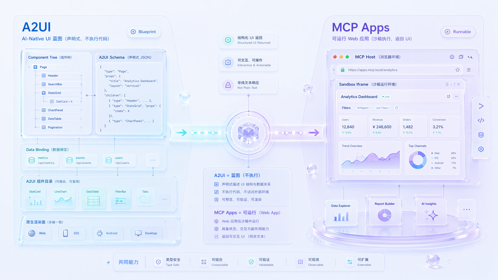
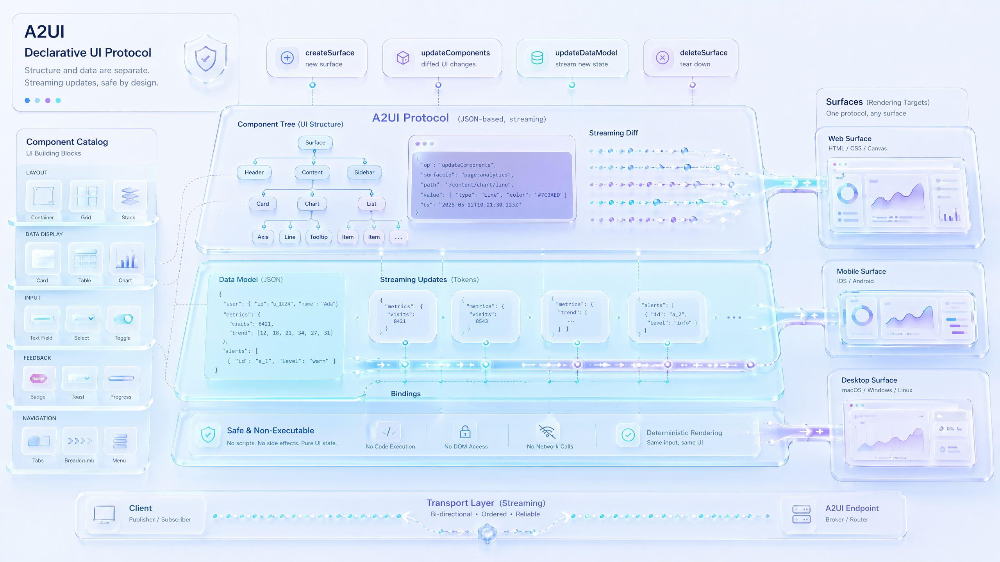
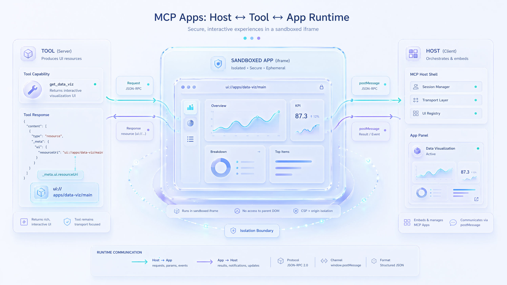
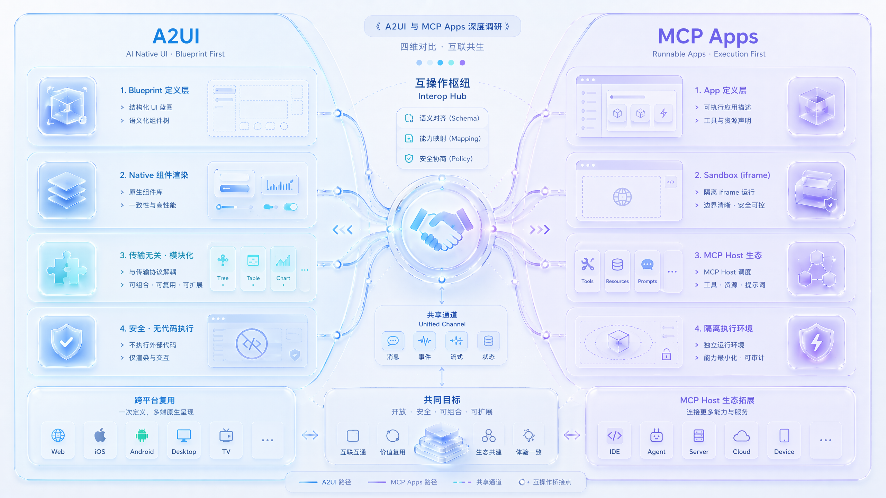

# A2UI 与 MCP Apps 深度调研

> 💡 **一句话结论**:A2UI 与 MCP Apps 都解决"让 AI agent 返回可交互界面而非纯文本"这一痛点,但分属两大阵营、走两条根本不同的路线——A2UI(Google 主导)投递**声明式 UI 蓝图**、不执行代码;MCP Apps(Anthropic + OpenAI + MCP-UI 社区联合主导)投递**沙箱里运行的 Web 应用**。二者正走向互操作,而非互斥。

本文基于两边官方规范、博客与生态页等一手资料整理,信息截至 2026 年 6 月。

_A2UI 走声明式 UI 蓝图路线，MCP Apps 走可运行 app 路线；目标一致，承载形态与安全边界不同。_

---

## 一、A2UI(Agent to UI)

### 1. 技术原理

A2UI 是一个**声明式、流式、JSON-based 的 UI 协议**,核心哲学是"UI 结构"与"应用数据"彻底分离,客户端逐条消息增量渲染。

_A2UI 只传 UI 蓝图与数据模型，不下发可执行代码；客户端按 catalog 将同一份结构渲染为宿主原生界面。_

**服务端 → 客户端的四类消息(envelope):**

| 消息类型 | 作用 |
|---|---|
| `createSurface` | 创建一个渲染画布(surface),并绑定一个组件目录(catalog) |
| `updateComponents` | 以扁平列表 + ID 引用(邻接表模型)下发组件,客户端渲染时重建树结构;组件可乱序到达、可渐进式渲染 |
| `updateDataModel` | 用 JSON Pointer 路径更新数据模型(upsert 语义),组件通过数据绑定响应式刷新 |
| `deleteSurface` | 移除画布及其全部内容 |

**几个关键设计:**

- **邻接表模型**:UI 是扁平组件列表,树由 `id` 引用隐式构成,只要 `root` 组件就位即可开始渐进渲染。
- **数据双向绑定**:输入类组件(TextField / CheckBox / Slider 等)与本地数据模型双向绑定;但绑定是**纯本地的**,键入不触发网络请求,只有用户触发 action(如点按钮)时才把数据随 context 回传服务端。
- **可换 catalog**:envelope schema 与 catalog 解耦,企业可定义自有组件目录,把 agent 严格约束在自家设计系统内。
- **prompt-first 取向**:v0.9 起从"为 structured output 优化"转向"直接嵌入 prompt 让 LLM 生成 JSON",换来更丰富表达力,代价是需要"生成 → 校验 → 纠错"循环(VALIDATION_FAILED 反馈给 LLM 自我修正)。
- **不执行任何代码**:这是 A2UI 的安全基石——只传声明式数据,客户端用自己受信任的原生组件渲染,天然杜绝代码注入。

### 2. 兼容性 / 传输

A2UI **传输无关(transport-agnostic)**,只要传输层满足:有序可靠投递、消息分帧、能携带元数据(用于能力协商和数据模型同步)。官方列出的绑定包括 A2A(主打远程 agent 通信)、AG-UI(低延迟、共享状态)、MCP(作为 tool outputs 或 resource subscriptions 投递)、以及 SSE + JSON-RPC、WebSockets、REST。

跨端渲染上,同一份 JSON 可在 Web(Lit / Angular / React)、移动端(Flutter / SwiftUI / Jetpack Compose)、桌面端渲染,外观由各端原生组件库决定。

### 3. 适用场景

- 多 agent / 远程 agent 系统:UI 需要跨服务、跨组织、跨信任边界安全传递
- 需要"原生外观一致性"的场景:界面要融入宿主 app 的设计系统、无障碍、性能
- 企业受控 UI:用自定义 catalog 把 AI 能生成的界面严格限定在合规组件内
- 跨平台一键复用:一份 agent 响应,Web / 移动 / 桌面通吃

### 4. 已落地场景

| 类别 | 项目 | 说明 |
|---|---|---|
| 生产部署 | Google Opal | 自然语言搭 AI mini-app,A2UI 是其生成式 UI 系统的底座 |
| 生产部署 | Gemini Enterprise | 企业自定义 agent 渲染表单、审批面板等富交互 UI |
| 生产部署 | Flutter GenUI SDK | 移动 / 桌面 / Web 生成式 UI,底层即 A2UI |
| 生产部署 | Google ADK / ADK Web | 内置 A2UI 渲染 + A2UI↔A2A 消息转换 |
| 合作集成 | AG-UI / CopilotKit | day-zero 兼容,React / Vue / Angular 全栈框架 |
| 合作集成 | AG2 | A2UIAgent 原生支持,带 schema 校验重试,A2A + AG-UI 双传输 |
| 社区 | json-render(Vercel)、OpenClaw Canvas、Restaurant Finder 等 | 第三方渲染库与示例 |

### 5. 发展计划 / 最新进展

- **版本节奏**:v0.8(legacy) → v0.9(2025-11-20 stable,prompt-first 重构) → v0.9.1(current,稳定) → v1.0(candidate,候选),GitHub 上活跃开发中(约 15.4k★、102 个 PR、212 个 issue)。
- **MIME 类型**标准化为 `application/a2ui+json`,并放宽了 surfaceId 约束。
- 与 MCP 的互通正在文档化(站点设有 "A2UI over MCP""MCP Apps in A2UI""A2UI in MCP Apps" 三个专题,部分页面仍在建设中),表明两套协议正走向**互操作而非互斥**。

---

## 二、MCP Apps

### 1. 技术原理

MCP Apps 让 MCP 工具返回**富交互界面而非纯文本**:工具声明一个 UI 资源,host 把它渲染进**沙箱 iframe**,用户直接在对话里交互。

_MCP Apps 让工具返回 UI 资源，host 在 sandbox iframe 中运行 HTML / JavaScript app，并通过 JSON-RPC over postMessage 与服务端双向通信。_

**架构两大支柱:**

- **带 UI 元数据的工具**:工具在 `_meta.ui.resourceUri` 指向一个 UI 资源
- **UI 资源**:通过 `ui://` scheme 提供的、打包好的 HTML / JavaScript(MIME `text/html`,提案期写作 `text/html+mcp`)

host 取回资源 → 渲染进沙箱 iframe → 通过 **JSON-RPC over postMessage** 实现双向通信。

**App API(`@modelcontextprotocol/ext-apps` 的 App 类)能力:**

| 方法 | 作用 |
|---|---|
| `ontoolresult` | 接收 host 传来的工具结果 |
| `callServerTool` | UI 反向调用服务端工具 |
| `updateModelContext` | 把用户在 UI 里的操作"喂回"模型上下文 |

此外还能记录调试事件、在浏览器打开链接、发送后续消息推进对话——全部走标准 postMessage,不锁定框架。

**关键设计决策(提案 SEP-1865):**

- **预声明资源**:UI 模板是 `ui://` 资源,host 可在工具执行前预取、预审,且把"静态模板"与"动态数据"分离以利缓存。
- **复用 MCP 传输**:不发明新协议,UI 与 host 用既有 MCP JSON-RPC base protocol 通信,未来 MCP 新特性自动可用。
- **从 HTML 起步**:首版只支持 `text/html` + 沙箱 iframe;外部 URL、remote DOM、原生 widget 等明确推迟到后续迭代。
- **向后兼容**:它是可选扩展,现有实现无需改动;服务端应为所有 UI 工具提供纯文本兜底,以同时服务 UI-capable 和 text-only 的 host。

### 2. 兼容性

- 绑定 MCP 生态,是 **MCP 首个官方扩展**。
- UI 开发用标准 `@modelcontextprotocol/sdk` 即可,跨 host 通用——"一次开发,无需写任何客户端专属代码即可跨多个主流 client 运行"。
- MCP-UI 的 SDK 已支持 MCP Apps 模式,且推荐 Client SDK 作为 host 采用 MCP Apps 的框架;已用 MCP-UI 的项目可平滑迁移。

### 3. 适用场景

官方点名的四类高价值场景:

- **数据探索**:销售分析工具返回可筛选 / 下钻 / 导出的交互式 dashboard
- **配置向导**:部署工具的表单带依赖字段(选"生产"展开安全选项)
- **文档审阅**:合同分析工具内联展示 PDF 并高亮条款,用户点击批准 / 标记,模型实时看到决策
- **实时监控**:服务器健康面板随系统变化实时刷新,无需重跑工具

### 4. 已落地场景

- **Client 支持**(2026-01 官宣时):Claude(Web + 桌面)、Goose、VS Code(Insiders)均已可用,ChatGPT 当周上线;JetBrains、AWS Kiro、Google Antigravity 等表示将探索接入。
- **生态前身验证**:MCP-UI 已被 Postman、Shopify、Hugging Face、Goose、ElevenLabs 等在生产中采用;OpenAI Apps SDK 验证了 ChatGPT 内富 UI 的需求。
- **官方示例 server**:threejs(3D)、map(地图)、pdf(文档)、system-monitor(实时面板)、sheet-music(乐谱)等,均在 ext-apps 仓库。

### 5. 发展计划 / 最新进展

- **时间线**:2025-11-21 作为 SEP-1865 提案发布 → 2026-01-26 正式成为**首个官方 MCP 扩展、production ready**。
- 作者阵容罕见:OpenAI + Anthropic 的 MCP 核心维护者,联合 MCP-UI 创始人(Ido Salomon、Liad Yosef)与 UI 工作组。
- 官方定位它正"开始像一个 **agentic app runtime**",提案刻意精简,后续将逐步扩展(外部 URL、remote DOM、原生 widget 等)。

---

## 三、横向对比

_总览图：A2UI 更像“待渲染的蓝图”，MCP Apps 更像“能运行的应用”；行业方向是互补与互操作，而非单选替代。_

| 维度 | A2UI | MCP Apps |
|---|---|---|
| 主导方 | Google(开源项目) | Anthropic + OpenAI + MCP-UI 社区(SEP-1865) |
| 所属生态 | A2A / AG-UI 协议家族 | Model Context Protocol(首个官方扩展) |
| 投递的东西 | 声明式 JSON 组件树("蓝图") | 打包的 HTML/JS Web 应用("能跑的 app") |
| 渲染方式 | 客户端原生组件(Lit/Angular/Flutter/SwiftUI…) | host 沙箱 iframe |
| 是否执行代码 | 否 ✅ | 是 ⚠️(iframe 内运行) |
| 安全哲学 | 不传代码,从源头杜绝注入 | 承认跑外部代码,靠 iframe 沙箱 + 可审计 JSON-RPC + 用户授权隔离 |
| 通信 | 单向消息流(server→client)+ action 回传;数据模型经 metadata 同步 | JSON-RPC over postMessage 双向桥 |
| 关键标识 | createSurface / updateComponents / updateDataModel + catalog | _meta.ui.resourceUri + ui:// 资源 |
| 外观控制权 | 宿主(跨端原生一致) | 开发者(界面更自由定制) |
| 传输 | 传输无关(A2A/AG-UI/MCP/SSE/WS/REST) | 绑定 MCP 传输 |
| 跨端 | 一份 JSON 通吃 Web/移动/桌面 | 主要面向能跑 iframe 的 host(浏览器内核) |
| 成熟度(2026-06) | v0.9.1 稳定、v1.0 候选 | 已是官方扩展、production ready |
| 典型落地 | Opal、Gemini Enterprise、Flutter GenUI、ADK | Claude、ChatGPT、Goose、VS Code |

### 二者关系:互补而非纯竞争

> ℹ️ 两套协议都明确支持**对方作为传输 / 承载**:A2UI 可"over MCP"投递,MCP Apps 也在 A2UI 文档里有 "MCP Apps in A2UI / A2UI in MCP Apps" 专题。换句话说,行业方向是让它们互操作,而非二选一。

### 选型建议

**✅ 倾向 MCP Apps**

- 做 MCP 工具 / server,目标是 Claude、ChatGPT、VS Code 等 host
- 想让工具结果可点可探索
- 需要高度定制化、复杂前端交互(3D、地图、富媒体)

**✅ 倾向 A2UI**

- 做跨平台、多 agent 系统
- UI 需安全跨信任边界传给不可信渲染端,且要原生外观一致
- 受监管 / 高安全要求、绝不允许执行外来代码

> 📌 **一句话收尾**:MCP Apps 投递"能跑的应用",生态势能大、交互上限高;A2UI 投递"待渲染的蓝图",更安全、更跨端统一。

---

## 四、参考来源

- [What is A2UI? — A2UI 官方文档](https://a2ui.org/introduction/what-is-a2ui)
- [A2UI Protocol v0.9 规范(GitHub)](https://github.com/google/A2UI/blob/main/specification/v0_9/docs/a2ui_protocol.md)
- [A2UI in the World — 生态落地](https://a2ui.org/ecosystem/a2ui-in-the-world)
- [MCP Apps — Bringing UI Capabilities To MCP Clients(官方博客)](https://blog.modelcontextprotocol.io/posts/2026-01-26-mcp-apps)
- [MCP Apps Extension 提案 SEP-1865(官方博客)](https://blog.modelcontextprotocol.io/posts/2025-11-21-mcp-apps)
