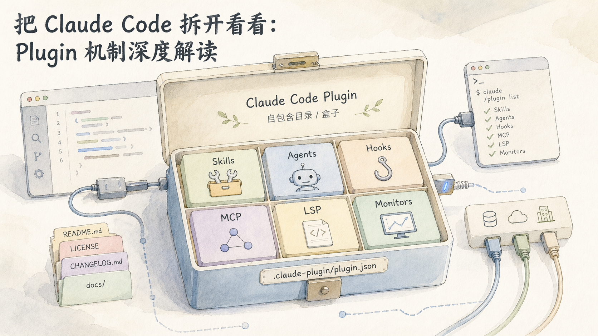
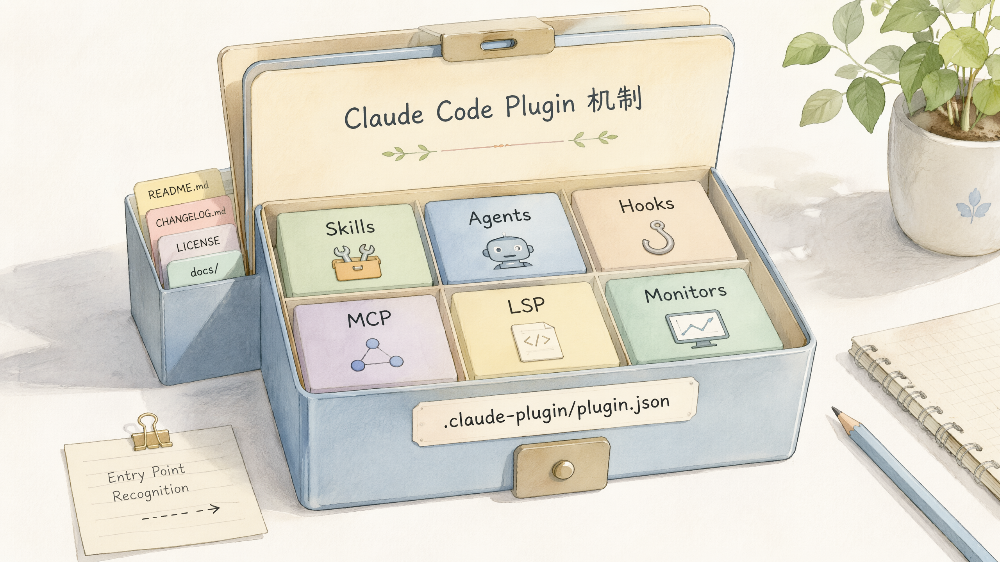
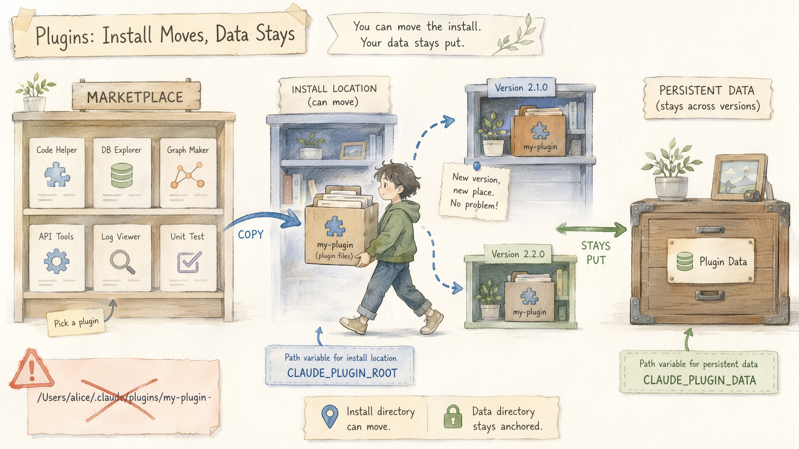
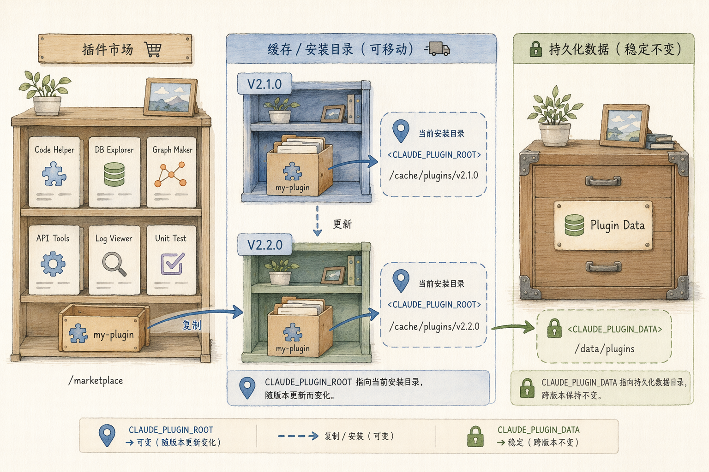
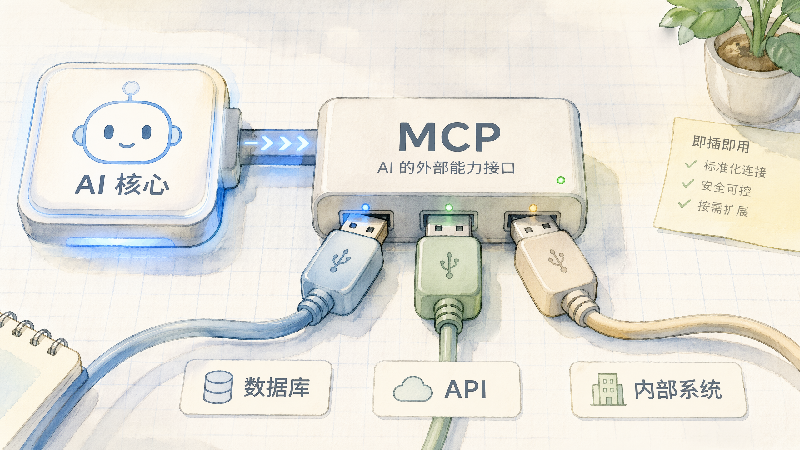
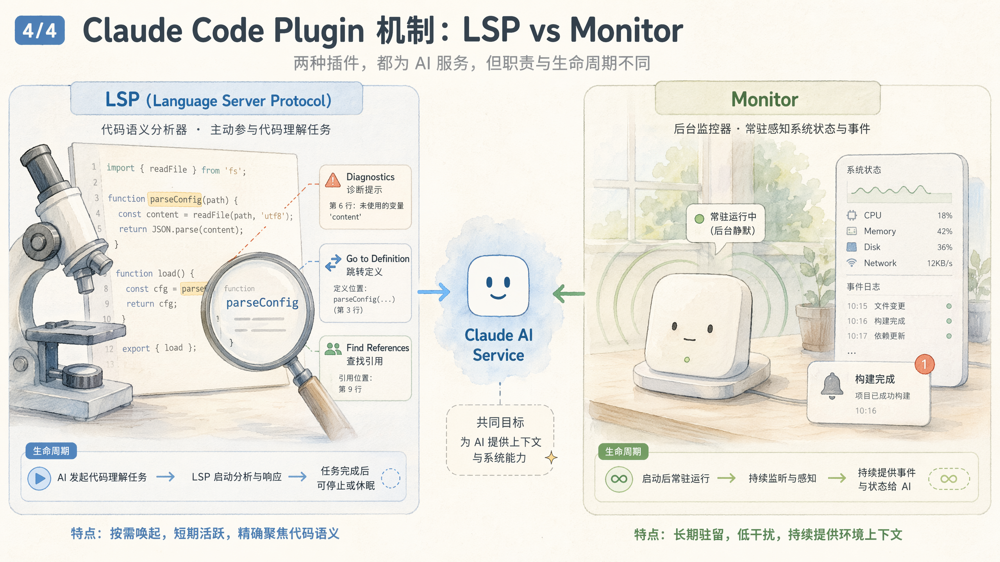
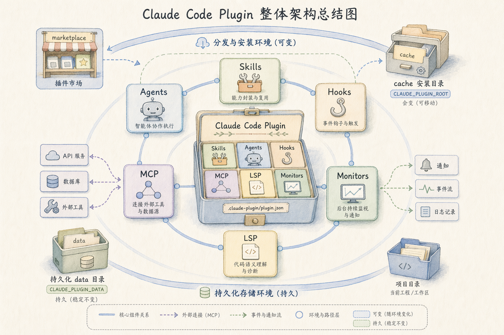

# 把 Claude Code 拆开看看：Plugin 机制深度解读

> 💡 \*\*一句话总览：\*\*Claude Code 的 Plugin 是一个"自包含目录"，它把 Skills、Agents、Hooks、MCP、LSP、Monitors 六类能力打包成一个可安装、可版本化、可分发的单元——相当于给 AI 编程助手装"扩展插件"，和你给浏览器装插件是同一种心智模型。
> 本文从"插件长什么样"讲到"它怎么活在你的机器里"，再钻到 MCP、LSP、Monitor 三个最容易被绕晕的子系统，最后聊聊它能不能搬到 Codex / opencode 上。



# 一、先认个脸:Plugin 到底是个啥

> 📌 把一个"复杂任务专家(Skill)"、一个"自动化触发器(Hook)"、一个"外接数据源(MCP)"放在一起，你会希望它们能被一次性安装、一起更新、整体卸载——Plugin 就是为此而生的"打包盒子"。

Claude Code 的 **Plugin(插件)本质上是一个**自包含目录(self-contained directory):一个文件夹，里面按约定放好若干子目录和一个清单文件，Claude Code 读到它，就知道该加载哪些扩展能力。这个心智模型和浏览器插件、VS Code 扩展几乎一致——你装的是一个有边界、有名字、有版本的整体，而非一些散落的脚本。

目录里唯一"必须存在"的东西，是清单文件 `.claude-plugin/plugin.json`。它描述插件的元信息，而其中真正强制要求的字段只有一个:`name`(插件名)。其余如版本、描述、作者都是可选的。

> ❗ **注意:一个极易踩的坑**——只有 `plugin.json` 这一个文件放在 `.claude-plugin/` 目录里。其他所有组件目录(skills、agents、hooks 等)一律放在**插件根目录**下，而不是塞进 `.claude-plugin/`。放错位置，Claude Code 就"看不见"它们。

```text
my-plugin/
├── .claude-plugin/
│   └── plugin.json          # 唯一必需文件,只有 name 是必填
├── skills/                  # 各类组件都在根目录下
│   └── my-skill/SKILL.md
├── agents/
├── hooks/
├── .mcp.json                # MCP 配置
├── .lsp.json                # LSP 配置
└── monitors/monitors.json   # Monitor 配置
```



这种"目录即插件"的设计带来一个直接好处:插件是可移动、可分享、可版本管理的。你可以把它丢进 Git 仓库，挂到一个 marketplace(插件市场)里，别人一条命令就能装上。

# 二、六类组件:插件的"积木清单"

一个插件最多能装六类组件，可以把它们想象成六种不同形状的积木。下面这张表是全文的"地图"，后面会反复回来看它。

| 组件                | 通俗解释               | 解决什么问题                     |
| ----------------- | ------------------ | -------------------------- |
| **Skills(技能)**    | 一份写给 AI 看的"专项操作手册" | 把某类复杂任务的知识和步骤封装好，让 AI 按需调用 |
| **Agents(子代理)**   | 一个能独立干活的"分身"       | 把大任务拆给专门的子代理并行处理           |
| **Hooks(钩子)**     | "在某事发生时自动做某事"的触发器  | 事件驱动的自动化，如保存前自动格式化         |
| **MCP servers**   | 外接的"能力插座"          | 把数据库、API、内部系统接进来给 AI 用     |
| **LSP servers**   | 语言服务器(代码智能引擎)      | 给 AI 提供编译器级的诊断、跳转、查引用      |
| **Monitors(监视器)** | 后台常驻的"传感器"         | 持续盯着某个数据流，有变化就通知 AI        |

> 💡 \*\*说明:\*\*除这六类外，插件还能携带 themes(主题)、output-styles(输出样式)、以及 `bin/` 下的可执行文件等附属内容。但真正构成"能力"的主力，是上面这六位。

## Plugin 与 Skill，到底什么关系

这是最容易混淆的一对概念。澄清它的最简单方式是看层级:**Skill 是 Plugin 能打包的六类组件之一**。也就是说，Plugin 是"盒子",Skill 是"盒子里可以放的其中一种东西"。

| 维度     | Plugin(分发单元)                        | Skill(能力单元)                |
| ------ | ----------------------------------- | -------------------------- |
| 关注点    | 如何打包、安装、版本化、分发                      | 某项任务具体怎么做                  |
| 形态     | 自包含目录，含清单文件 plugin.json             | 一份 Markdown 操作手册(SKILL.md) |
| 能装什么   | 可同时含多个 skill、hook、MCP、LSP、monitor 等 | 就是它自己，是 Plugin 可打包的六类组件之一  |
| 能否单独存在 | 是组合载体                               | 可独立存在，也可被 Plugin 打包        |
| 一句话    | 盒子                                  | 盒子里可以放的其中一种东西              |

所以二者并非竞争关系，而是包含关系:你可以只用一个孤零零的 Skill，也可以把它和其他组件一起塞进 Plugin，获得统一的分发与版本管理。

# 三、它怎么活在你的机器里:安装、缓存与路径



插件不是装上就完事，它有自己的"户口、住址和搬家规则"。理解这套生命周期，能帮你避开"为什么更新后路径失效""为什么文件读不到"这类常见困惑。

## 分发:Marketplace 与多种来源

插件通过 \*\*marketplace(插件市场)\*\*分发，市场用一个 `.claude-plugin/marketplace.json` 描述自己收录了哪些插件。插件的来源相当灵活，支持相对路径、GitHub 仓库、URL、git 子目录、npm 包等多种形式，满足不同的托管习惯。

## 安装与缓存:插件会被"搬进"统一的家

当你安装一个市场插件时，Claude Code 会把它\*\*复制(copy)\*\*到本地缓存目录 `~/.claude/plugins/cache`。这带来一条硬规则:**插件只能引用自己目录内的文件**，不能引用插件目录之外的东西——因为搬家之后，外部路径就指不到了。

> 💡 \*\*说明:\*\*插件支持四种安装作用域(scope):user(用户级)、project(项目级)、local(本地)、managed(受管控)。它们决定插件对谁可见、由谁管理。

## 路径变量:别写死绝对路径

因为插件会被搬家、会更新版本，所以你**不能**在配置里写死绝对路径。Claude Code 提供了几个会自动解析的路径变量:

| 变量                      | 指向 & 特点                           |
| ----------------------- | --------------------------------- |
| `${CLAUDE_PLUGIN_ROOT}` | 插件当前安装目录。**更新后会变**，所以适合放"跟版本走"的文件 |
| `${CLAUDE_PLUGIN_DATA}` | 跨版本持久化目录。更新不影响它，适合放需要长期保留的数据      |
| `${CLAUDE_PROJECT_DIR}` | 当前项目根目录                           |

> ✅ **推荐记法:**"跟版本走的东西"(脚本、二进制、配置)用 `${CLAUDE_PLUGIN_ROOT}`;"想跨版本留下来的东西"(用户数据、缓存)用 `${CLAUDE_PLUGIN_DATA}`。



## 更新与热重载:谁能热重载，谁必须重启

插件升级时，旧版本会被保留约 7 天(给回滚留余地)。运行时层面，`/reload-plugins` 能热重载 skills、agents、hooks、MCP、LSP——但**有一个例外:Monitor 不能热重载，必须重启会话**。这个例外后面专门讲。

# 四、MCP:插件里最常用的"外接能力"



\*\*MCP(Model Context Protocol，模型上下文协议)\*\*是一个开放标准，用来给 AI 模型外接"工具和数据源"。你可以把它理解成 AI 世界的"USB 接口":只要设备符合这个接口，就能即插即用。在插件里，MCP 是最常被用到的扩展能力。

## 怎么配置:文件与内容

插件里的 MCP 通过根目录下的 `.mcp.json` 声明。它的核心是一个 `mcpServers` 对象，每个键是一个 server 名，值描述如何启动它(命令、参数、环境变量)。

```json
{
  "mcpServers": {
    "plugin-database": {
      "command": "${CLAUDE_PLUGIN_ROOT}/servers/db-server",
      "args": ["--config", "${CLAUDE_PLUGIN_ROOT}/config.json"],
      "env": { "DB_PATH": "${CLAUDE_PLUGIN_ROOT}/data" }
    }
  }
}
```

这里 `${CLAUDE_PLUGIN_ROOT}` 的存在感很强:因为插件会被复制进缓存、会随更新换目录，所有指向插件内部文件的路径都得靠它来动态解析，写死绝对路径必然在更新后失效。

## 它在插件里怎么"跑起来"

插件激活后，Claude Code 读取 `.mcp.json`，按声明拉起对应的 MCP server 进程，server 暴露的工具(tools)就出现在 AI 的可用工具列表里。整个过程纳入插件生命周期管理:`/reload-plugins` 可以热重载 MCP 配置，无需重启会话。

## 放进插件 vs 不放进插件，有什么区别

同样是接 MCP，放在插件内和单独配置在插件外，差别主要在"分发与管理"，而非"运行原理"。

| 维度      | 插件内 MCP                        | 插件外 MCP    |
| ------- | ------------------------------ | ---------- |
| 分发      | 随插件一键安装，团队共享同一份配置              | 每个人各自手动配置  |
| 版本管理    | 跟插件版本一起锁定、回滚                   | 需自行维护      |
| 路径处理    | 用 `${CLAUDE_PLUGIN_ROOT}` 自动解析 | 通常写本机绝对路径  |
| 与其他能力打包 | 可和 skill / hook 一起组成完整方案       | 孤立存在       |
| 适用场景    | 要分享、要复用、要团队统一                  | 个人临时、一次性接入 |

> ✅ \*\*推荐:\*\*如果某个 MCP 能力你想分享给团队、或想跟着项目一起版本化，就放进插件;如果只是自己机器上临时接一下，插件外配置更省事。

# 五、LSP:让 AI 从"读文本"升级到"懂语义"

\*\*LSP(Language Server Protocol，语言服务器协议)\*\*是微软提出、现已成为行业标准的协议，定义了编辑器(客户端)与语言分析引擎(服务器)之间的通信规范，让代码智能能力从具体编辑器中解耦出来 [\[Language Server Protocol\]](https://microsoft.github.io/language-server-protocol/)。它当初被发明，就是为了把"M 个编辑器 × N 种语言"的适配工作量，从 M×N 降到 M+N。

## LSP 给 AI 带来什么

有了 LSP,Claude Code 就从"读文本"升级到"懂语义"，能拿到编译器/类型检查器级别的精确信息:

| 能力                    | 作用                      |
| --------------------- | ----------------------- |
| 实时诊断 Diagnostics      | 边写边报语法/类型错误，改完立刻知道是否报错  |
| 跳转定义 Go to Definition | 准确定位符号在哪定义，不靠猜          |
| 查找引用 Find References  | 找出函数/变量被哪些地方调用，改动前评估影响面 |
| 类型信息 / 悬停 Hover       | 知道变量真实类型、函数签名           |
| 符号搜索 / 补全             | 工程级符号索引，而非字符串匹配         |

## 怎么开发一个语言服务器

开发 LSP 服务器，本质是实现协议规定的那套 JSON-RPC 消息。客户端与服务器通过 JSON-RPC 通信(可走 stdio、管道或 socket)，消息分请求、响应、通知三类 [\[LSP Specification\]](https://microsoft.github.io/language-server-protocol/specifications/lsp/3.17/specification/)。典型生命周期消息包括:

* `initialize` / `initialized`:握手，交换双方支持的能力

* `textDocument/didOpen`、`didChange`、`didSave`:同步文件内容与变更

* `textDocument/publishDiagnostics`:服务器主动推送错误/警告

* `textDocument/definition`、`references`、`hover`、`completion`:按需查询

> ✅ \*\*推荐:\*\*绝大多数主流语言已有成熟服务器(Python 的 pyright、TS 的 typescript-language-server、Go 的 gopls、Rust 的 rust-analyzer)，直接复用即可。真要自研，用官方 SDK(如 vscode-languageserver-node)能省不少力气。

## 在插件里怎么接入

对使用者来说，通常不写服务器，只在 `.lsp.json` 里声明"如何启动这个已有的二进制":

```json
{
  "go": {
    "command": "gopls",
    "args": ["serve"],
    "extensionToLanguage": { ".go": "go" }
  }
}
```

## 三个常被追问的问题

> 🔗 **为什么要绑定 plugin?**
> 为了复用插件的整套基础设施:统一分发、版本锁定、`/reload-plugins` 热重载、与相关 skill/hook 一起打包。官方的语言支持本身就是以插件形式发布的，如 pyright-lsp、typescript-lsp、rust-analyzer-lsp。
> 📦 **为什么不内置所有语言?**
> 每个语言服务器都是独立的大型程序(动辄上百 MB)，且版本常需与项目工具链匹配。全内置会让体积失控、版本冲突，还要替整个语言生态持续维护——按需安装才是合理选择。
> 🚪 **不装插件能用 LSP 吗?**
> 不能。LSP 在已记录的机制里是插件构件，零插件时 Claude Code 没有原生 LSP。此时它降级为"读文本 + 跑命令验证":用 Read/Grep 读代码，用 Bash 跑 tsc / go build / pytest 替代实时诊断。

> 💡 \*\*说明:\*\*这也意味着——在 Claude Code 里"启用某语言的 LSP"，在机制上等同于"安装对应的 LSP 插件"，并自行准备好语言服务器二进制(如 gopls、pyright)。

# 六、Monitor:后台的"传感器"

\*\*Monitor(监视器)\*\*是后台运行的 shell 命令，它把每一行 stdout 输出当作一条通知投递给 Claude。形象点说，它是插件给 AI 装的"传感器":部署状态变了、错误日志多了一行，它就戳一下 AI。

## 怎么配置

```json
[
  {
    "name": "deploy-status",
    "command": "\"${CLAUDE_PLUGIN_ROOT}\"/scripts/poll-deploy.sh",
    "description": "Deployment status changes"
  },
  {
    "name": "error-log",
    "command": "tail -F ./logs/error.log",
    "description": "Application error log",
    "when": "on-skill-invoke:debug"
  }
]
```

其中 `when` 字段决定启动时机:默认 `always`(会话开始 + 插件 reload 时启动)，或 `on-skill-invoke:<skill>`(被指定 skill 触发时才启动)。

## 生命周期:它和 LSP 不太一样

Monitor 与 LSP 的生命周期模型有明显差异，这张对比表是本节的核心:

| 维度          | Monitor                         | LSP                    |
| ----------- | ------------------------------- | ---------------------- |
| 存活周期        | 整个会话                            | 会话期间常驻进程               |
| 启动方式        | 插件激活自动启动(由 `when` 控制)           | 声明后拉起语言服务器进程           |
| 更新方式        | **必须重启会话**,`/reload-plugins` 无效 | `/reload-plugins` 可热重载 |
| 中途禁用插件      | 已在跑的 monitor 不会停，要等会话结束         | —                      |
| 能否脱离 plugin | 能力可(底层是内置 Monitor 工具)，声明式不可     | 否(文档层面绑定 plugin)       |

> ❗ **注意几个易踩点:Monitor 需要 Claude Code v2.1.105+;仅在交互式 CLI 会话中运行，以 hook 信任级别(unsandboxed)执行;project-scope 的 @skills-dir 插件**不加载 monitor。



## 能不能脱离插件?

这是 Monitor 与 LSP 最本质的区别。声明式的 `monitors.json` 是插件构件，但**监控能力本身是 Claude Code 的内置 Monitor 工具**——官方文档明确插件 monitor "使用与 Monitor 工具相同的机制"。所以监控能力能脱离插件(走内置工具)，只是"自动启动的声明式 monitor"必须依附插件。而 LSP 在已记录的机制里则没有这种"内置后门"，始终是插件构件。

# 七、能搬到 Codex / opencode 吗

一个自然的问题:Claude Code 这套插件生态，能不能直接搬到 Codex、opencode 这些平台上?先说结论，再看横向对比。

## 各家都有自己的扩展架构

| 维度    | Claude Code                                             | Codex (OpenAI)                                                                      | opencode                |
| ----- | ------------------------------------------------------- | ----------------------------------------------------------------------------------- | ----------------------- |
| 扩展机制  | 原生 Plugin 系统                                            | 原生插件系统(自 v0.117.0 起)                                                                | 基于 TypeScript 的插件       |
| 配置/位置 | 插件目录 + `.claude-plugin/plugin.json` 清单，经 marketplace 分发 | `~/.codex/config.toml`                                                              | `.opencode/plugin/*.ts` |
| 组件构成  | 六类:Skills / Agents / Hooks / MCP / LSP / Monitors       | 打包 Skills / Apps / MCP [Codex Plugins](https://developers.openai.com/codex/plugins) | 以 MCP 为核心的可扩展性          |
| 分发方式  | marketplace + 多种来源(相对路径/GitHub/URL/git 子目录/npm)         | 随 Codex 配置体系分发                                                                      | 项目内 TS 文件               |
| 核心标准  | MCP / Agent Skills                                      | MCP / Agent Skills                                                                  | MCP                     |
| 特点小结  | 组件类型最丰富，分发体系最完整                                         | 原生支持，贴合 OpenAI 工具链                                                                  | 轻量、TS 友好、MCP 中心化        |

## 能不能互通?分三层看

> ❌ **完整插件包:不可移植**
> 三家的插件目录结构、清单格式、组件类型各不相同，整包搬运行不通。
> ✅ **MCP server:通用复用**
> MCP 是跨平台标准，同一个 MCP server 三家都能接，几乎零改动。
> 🔄 **Skills:大体可移植**
> Agent Skills 正在成为通用标准，skill 内容跨平台迁移成本较低。

> ✅ \*\*跨平台的最佳实践:\*\*把核心能力写成一个 **MCP server**(通用底座)，再为每个平台套一层薄薄的封装(thin wrapper)。这样核心逻辑只写一次，各平台各取所需。

# 八、写在最后:一张表收束全文



读到这里，Plugin 的全貌应该清晰了:它是一个把六类能力打包起来、可安装可版本化可分发的"盒子"。最后用一张表，把全文最该记住的点收束在一起。

| 主题              | 一句话记住                                                     |
| --------------- | --------------------------------------------------------- |
| Plugin 本质       | 自包含目录，唯一必需文件是 `.claude-plugin/plugin.json`，唯一必填字段是 `name` |
| 目录陷阱            | 只有 plugin.json 放 `.claude-plugin/`，其余组件全在根目录              |
| 六类组件            | Skills / Agents / Hooks / MCP / LSP / Monitors            |
| Plugin vs Skill | 包含关系:Plugin 是盒子，Skill 是盒子里的一种东西                           |
| 路径变量            | 跟版本走用 `ROOT`，要持久化用 `DATA`，别写死绝对路径                         |
| 热重载例外           | `/reload-plugins` 几乎都能热重载，唯独 Monitor 要重启会话                |
| MCP 内外之别        | 运行原理一样，差别在分发与版本管理                                         |
| LSP             | 编译器级代码智能;绑定 plugin、不内置全语言、零插件时无法使用                        |
| Monitor         | 会话级传感器;能力来自内置工具，声明式启动靠插件                                  |
| 跨平台             | 整包不可移植，MCP 通用，Skill 大体可迁;核心写成 MCP + 各平台薄封装                |

> 💡 Plugin 真正解决的，是 AI 编程助手扩展能力的"工程化"问题——让能力可以像软件包一样被打包、分享、版本化和回滚。理解了这套机制，你不仅会用插件，更能判断什么时候该把自己的能力沉淀成一个插件。

*本文内容综合自 Claude Code 官方文档(plugins-reference、plugin-marketplaces、plugins)、OpenAI Codex 插件文档，以及 LSP 官方协议规范整理而成。*
