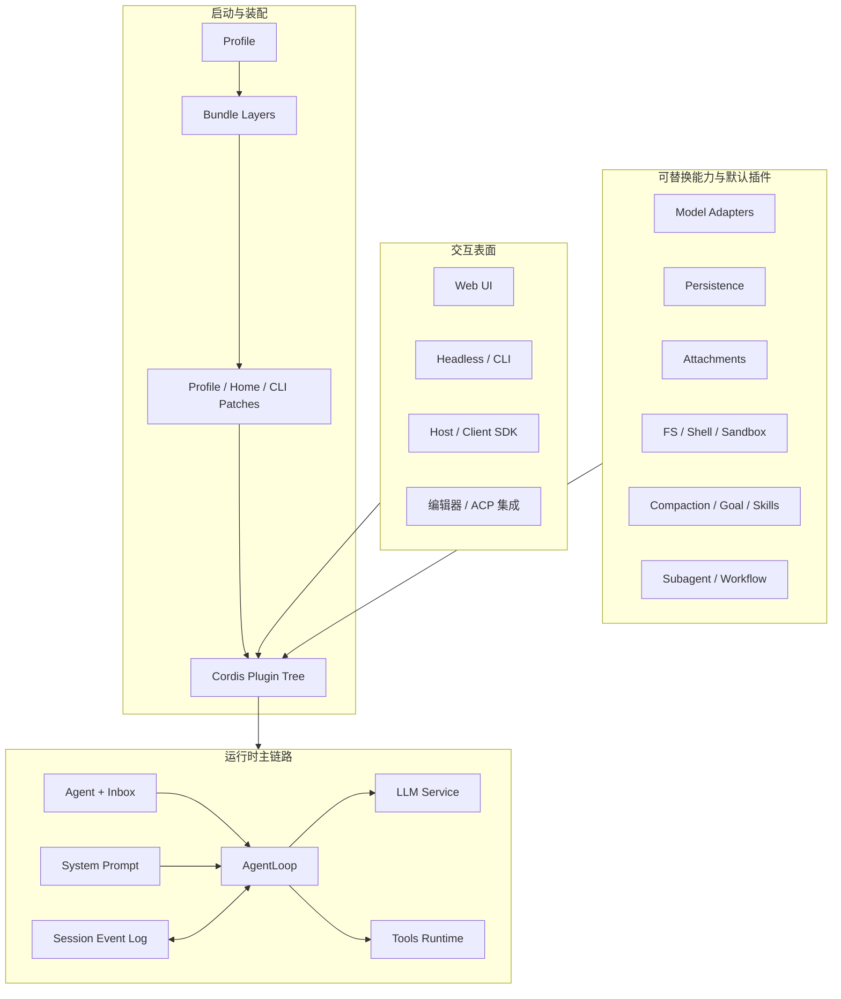
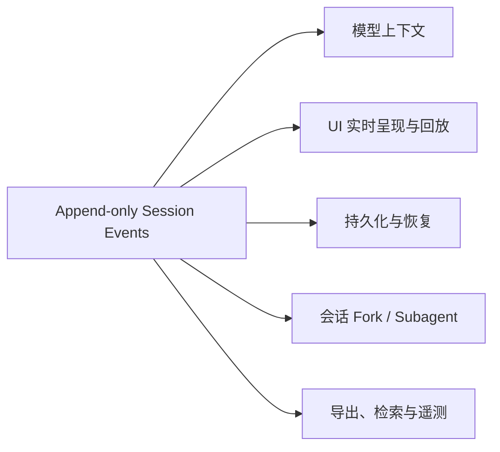

# Deepseek Harness 技术概览

> DeepSeek Harness（命令名 `dsh`）不是一个把模型调用、工具和界面写死在一起的 Coding Agent，而是一个以 Cordis 插件树为运行容器、以事件日志为状态真值的可组合 Agent Harness。它最鲜明的特点可以概括成三句话：产品能力由插件装配，模型上下文由会话事件投影，Agent 执行由可拦截的循环与工具管线驱动。

本文结合 DeepSeek Harness 仓库源码整理其核心技术设计，重点回答它如何组装、如何运行、如何保存状态，以及哪些部分适合作为扩展点。

**阅读基线**：仓库 [`deepseek-ai/deepseek-harness`][repo]，提交 [`b150a551b8d465e31e418e1b2eaf5e79bbb7d28e`][baseline]，版本 `0.1.1-rc.2`。该版本仍处于开发者预览阶段，官方明确提示后续可能出现破坏兼容性的变更。本文结论来自固定提交的源码和仓库文档，不代表本地运行或性能实测。

## 1. 核心定位

### 1.1 Harness 解决什么问题

一个完整 Agent 产品通常不只有 ReAct Loop，还需要模型适配、工具注册、权限控制、会话持久化、上下文压缩、子 Agent、Web 或编辑器接入等设施。DeepSeek Harness 将这些设施拆成相互协作的插件，并通过配置决定最终运行哪些插件。

因此它更接近“Agent 产品运行时”而不是“一个固定 Agent 应用”：

- Cordis 提供插件生命周期、依赖注入、类型化事件和可撤销副作用。
- Profile、Bundle 与 Patch 决定一个具体产品实例由哪些插件组成。
- Session 记录可恢复的事实，AgentLoop 负责模型与工具之间的执行循环。
- LLM、Tools、Persistence、Filesystem、Shell、Subagent 等以能力接口与 Provider 解耦。
- Web、Headless、SDK 或编辑器集成只是运行时之上的不同交互表面。

官方用 “Everything is a Plugin” 描述这套架构。这里的重点不是插件数量多，而是系统不存在一个必须修改的特权业务内核：模型适配器、工具注册表、会话日志乃至 AgentLoop 本身都可以通过装配替换。[架构文档][architecture]对此给出了明确说明。

### 1.2 总体架构



理解这张图时要区分两层：

1. **核心运行时层**：Session、Agent、AgentLoop、SystemPrompt、Tools、LLM 等服务契约和事件边界。
2. **默认产品组合**：DeepSeek 适配器、JSONL、SQLite 查询、附件、沙箱、Goal、Plan Mode、Subagent、Web UI 等具体插件。

前者定义 Agent 怎样工作，后者决定发行版开箱即用时具有什么能力。

## 2. 插件装配：产品形态由配置合成

### 2.1 Profile、Bundle 与 Patch

DeepSeek Harness 用三种概念组织运行配置：

| 概念 | 作用 | 典型内容 |
|---|---|---|
| Profile | 一个具名的产品组装 | 选择 Bundle、保存用户插件和 Profile Patch |
| Bundle | 一组可分发的默认插件配置 | Base、Web App、Headless |
| Patch | 对插件树进行插入、替换、禁用或覆盖 | 用户配置、Home 配置、命令行 Overlay |

启动时不是读取一份最终配置，而是在空插件列表上依次叠加：

```text
Profile 声明的 Bundle（按顺序）
  → Profile/cordis.patch.yml
  → $DSH_HOME/cordis.patch.yml
  → --patch overlays
  → 启动期强制策略
  → Cordis 插件树
```

[`profile-boot.ts`][profile-boot] 会准备 Profile、组合这些 Patch、提供不可变的启动环境与命令行参数，并负责失败处理、信号退出和用户 Patch 热更新。Patch 通过稳定 `id` 定位插件条目；后面的层可以替换前面层的完整配置，因此最终行为取决于“装配结果”，不能只靠源码 import 关系判断。

### 2.2 Base Bundle 是默认产品能力清单

[`packages/bundle/base/cordis.patch.yml`][base-bundle] 是理解默认发行版最有效的入口。当前版本在 Base Bundle 中装配了：

- Session、Agent、AgentLoop、LLM、System Prompt 与 Tools 等核心服务；
- DeepSeek 官方模型和可配置的 `pi-ai` 多 Provider 适配器；
- JSONL 会话持久化、附件存储和可选的 SQLite 全文检索；
- 文件、Shell、进程、沙箱、审批与权限预设；
- Skills、Commands、Goal、Plan Mode、Token Meter 与 Compaction；
- Subagent、Workflow、后台 Jobs、结果溢写和工具结果裁剪；
- 设置、凭据、会话标题、遥测等产品设施。

这也说明“核心包存在”不等于“功能默认启用”。例如 SQLite 会话查询服务默认存在，但全文搜索以 `openAt: never` 关闭；遥测插件已装配，但默认模式为 `DISABLED`；不同操作系统会启用不同的 Shell 与沙箱插件。

## 3. 运行时核心模块

| 模块 | 主要职责 | 关键接口或事实 |
|---|---|---|
| Session | 保存仅追加的类型化事件并投影模型历史 | `append()`、`deriveMessages()`、`session/event`、`session/flush` |
| Agent | 代表一个活跃执行主体 | Session、Inbox、作用域、状态与取消 |
| AgentLoop | 驱动 turn、step、模型流和工具调用 | `preStep()`、`turn()`、`step()` |
| SystemPrompt | 组装提示词片段与工具 Schema | 每个 Step 动态生成 Prompt Assembly |
| LLM | 提供模型无关的请求和流式输出契约 | Adapter、Message、Content Block、Chunk |
| Tools | 注册工具并执行权限、包装和结果管线 | `tools/pre-execute`、`tools/execute`、`tools/post-execute` |
| Persistence | 把 Session 事件异步写入可恢复存储 | Coordinator、Backend、Checkpoint |
| Host / Client | 把交互表面接入 Session 与 Agent | Typed RPC、会话管理、实时事件投影 |

模块之间主要通过 Cordis Context 服务和事件协作。注册行为随插件挂载生效、随插件卸载撤销，所以运行时能力可以按 Agent 作用域隔离，也可以由 Patch 替换 Provider。

## 4. Session：事件日志是状态真值

### 4.1 为什么不是直接保存 messages

[`core/session`][session] 把一次会话建模为仅追加的 `SessionEvent` 序列，而不是一份可任意修改的消息数组。核心事件包括：

- `turn/start`、`turn/end`；
- `step/start`、`step/end`；
- `user/message`；
- `assistant/chunk`、`assistant/message`；
- `tool/call`、`tool/result`；
- 由其他插件扩展的持久事件。

每个事件都有连续序号和时间信息。事件追加时会经过结构校验、JSON 快照和冻结，随后通过 `session/event` 广播。`deriveMessages()` 再从事件的 Surface 投影出下一次模型请求所需的消息历史。

这种设计把多个需求统一到了同一条事实链上：



原始 `assistant/chunk` 可以保留流式回放精度，`assistant/message` 则提供完整模型消息；工具调用和结果通过事件序号关联，使恢复后的消息顺序仍然可验证。

### 4.2 “模型可见即已记录”

仓库架构文档提出一条关键不变量：任何进入模型请求的内容，都必须能够从 Session Log 重建。这并不表示所有请求信息都由 Surface 负责：消息型上下文需要相应的 Session Event 与 Surface 投影，模型配置、完整 System Prompt 和 Tool Schemas 等非消息请求信封则记录在 `request/header` 中，具体折叠规则见 [`request-header.ts`][request-header]。因此新增模型可见信息时，不能只在请求发送前临时拼接，还要明确它应由消息 Surface 还是请求 Header 重建。

这个约束的价值在于避免“模型看过，但重放、恢复和审计都不知道”的隐式状态。代价则是 Session Event Schema 属于兼容性边界：修改事件类型、顺序或折叠规则，会同时影响模型历史、持久化格式、迁移、UI 和会话 Fork。

### 4.3 三类事件不要混用

- **Session 事件**：持久事实，恢复后仍应存在。
- **`agent/*` 事件**：当前活跃 Agent 的实时生命周期与拦截点。
- **能力事件**：如 `tools/*`、`fs/*`，用于策略、Provider 和观察者协作。

需要恢复的事实应进入 Session；只用于运行期协调的信息不应伪装成持久事件。

## 5. AgentLoop：Turn 与 Step 构成执行骨架

### 5.1 Turn 和 Step 的区别

在 [`agent-loop/src/agent.ts`][agent-loop] 中，一个 **Step** 是一次模型请求及其触发的工具调用；一个 **Turn** 从领取首条输入开始，可以包含多个 Step，直到不再欠模型或工具工作时结束。

```text
turn/start
  领取 Inbox 输入
  组装 System Prompt 与 Tool Schemas
  agent/pre-step：允许、改写或拒绝输入
  step/start
    写入 user/message
    从 Session 派生模型历史
    agent/request → llm.stream
    写入 assistant/chunk* 与 assistant/message
    执行 tool/call* → 写入 tool/result*
  step/end
  若工具结果或新输入要求继续，则进入下一 Step
  agent/turn-stopping
turn/end
```

Turn 是一次连续驱动活动的持久边界，既可能由用户消息开启，也可能由 Goal 续跑、插件输入或一次被拒绝的唤醒开启；Step 是模型推理和工具反馈的一次迭代边界。区分二者后，连续工具调用、运行中追加消息、取消、最大 Token、错误恢复等状态都有明确归属。

### 5.2 Inbox 与运行中输入

输入统一进入 Agent Inbox。不同输入可以指向下一 Turn 或当前 Turn 的下一 Step；插件也可以注入模型可见上下文，并等待一条可唤醒消息触发消费。AgentLoop 在每个 Step 前重新组装 System Prompt、工具 Schema 和运行时上下文，因此插件变化可以影响下一次请求，而不必重建整个 Agent。

### 5.3 每个边界都可观察或拦截

`agent/pre-step` 可以拒绝或改写本次输入；`agent/request` 只负责选择或调整 Provider、Model、推理强度等 `LlmCallConfig`，并不能任意改写 Messages、System Prompt 或 Tool Schemas；`agent/turn-stopping` 可以在 Turn 关闭前续跑。它们不是散落在循环里的回调，而是 Cordis 的类型化事件，因此权限、压缩、Goal 驱动和其他能力可以附着到循环边界上。

## 6. Tools：调度与安全是两套机制

### 6.1 工具执行管线

[`core/tools`][tools] 不只是工具名称到函数的映射。一次工具调用大致经过：

```text
模型生成 Tool Call
  → 参数解析、快照和 Schema 校验
  → tools/pre-execute：allow / deny / ask
  → 审批与 Guard
  → tools/execute：超时、重试、指标等 around wrappers
  → Tool Provider.execute()
  → 结果规范化
  → tools/post-execute：接受、替换、增强或阻止
  → tools/result 通知
  → tool/result 持久事件
```

如果策略返回 `ask` 但运行时没有审批能力，会按拒绝处理。调用者取消信号会被保留并传播到包装器和工具体；不过同进程 JavaScript 仍依赖工具实现协作式响应取消，Harness 无法强杀一个不让出控制权的 Promise。

### 6.2 并发执行仍按模型顺序提交

[`tool-calls.ts`][tool-calls] 把工具调度与工具安全分开处理：

- 工具默认是 `exclusive`，只有明确声明并通过实时分类的调用才可并行。
- 排他调用形成屏障，必须独占执行。
- 并行调用进入有上限的滚动池，但只有工具体 dispatch 可以重叠。
- `pre-execute`、结果落日志、附加上下文和最终提交仍保持模型给出的调用顺序。
- 取消后，已启动调用会被排空，未启动调用会写入合成错误结果，保证重放序列完整。

这是一种重要取舍：并行提升 I/O 工具吞吐量，但确定性的事件顺序比“谁先完成就先提交”更重要。新增工具不仅要实现功能，还要明确其并发安全性、权限语义、取消行为和可持久化结果。

### 6.3 Native Mode 与 Code Mode

Tools Runtime 同时支持把工具逐个暴露给模型的 Native Mode，以及只让模型直接调用 `run_code`、再由代码中的 SDK 分派其他工具的 Code Mode。工具 Schema、TypeScript/Python SDK 描述和运行时限制由同一注册表派生，避免模型说明与实际工具集合长期漂移。

## 7. 持久化与恢复

### 7.1 核心 Session 不绑定存储

Session 只负责内存事件日志和派生历史。持久化插件订阅 `session/event`，在 `session/flush` 时完成耐久性检查。这让 JSONL、数据库或远端存储可以实现同一 Persistence Backend 接口，而 AgentLoop 不需要知道具体介质。

默认 [`session-persistence-jsonl`][jsonl] 为每个 Session 保存一份仅追加日志。当前版本默认：

- 使用 Zstandard frame 压缩；
- 把连续流式 Chunk 打包，源码注释给出的实测目标是显著减少日志体积；
- 通过稳定修订标识避免读取写入中的不一致文件；
- 识别并修复尾部不完整 frame，只接受已提交前缀；
- 保留原始逻辑 JSONL 导出能力，物理压缩格式不泄漏给上层。

附件字节不直接写入事件日志，而由独立 Attachment Backend 保存；消息中保留可寻址引用。这样大对象不会膨胀事件流，同时模型请求和授权的历史读取仍可解析附件。

### 7.2 Checkpoint 与写后持久化

事件通知和磁盘写入可以解耦以降低 AgentLoop 延迟，但关键边界必须等待持久化。Base Bundle 装配了 Session Checkpoint Policy，在模型请求和顶层分派前建立耐久检查点。恢复时，Persistence Coordinator 读取已提交事件前缀、执行格式校验和必要修复，再交给 Session 重建内存状态与 Surface。

因此这里的“一致性”不是每次 `append()` 都同步落盘，而是：日志序列连续、关键外部副作用前完成 checkpoint、恢复只接受可验证的持久前缀。

## 8. 默认安全边界

当前 Base Bundle 的安全默认值包括：

- 权限模式默认是 `workspace-write`，文件影响限制在工作区，敏感操作采用 `ask` 审批；
- `danger-full-access` 才把沙箱放开并把审批策略改为 `never`；
- Bash 与 PowerShell 根据操作系统互斥装配；
- 凭据由专门服务解析，设置文件只保存引用，不把托管凭据写入进程环境；
- 遥测插件默认关闭，只有显式设置模式后才上传；
- Web 启动明确拒绝 `0.0.0.0`，因为浏览器接口最终可触达本地代码执行能力。[Web 启动源码][web-startup]直接把这一行为定义为安全限制。

这些边界主要由插件组合和策略事件实现，而不是硬编码在某个工具里。好处是部署方可以替换策略；风险是自定义 Profile 或 Patch 也可能意外移除安全插件，因此审查实际合成树比检查某个默认配置文件更可靠。

## 9. Web、Headless 与其他交互表面

官方发行版主要提供两种 Profile：

- **Web**：启动 Host、API 与浏览器客户端，适合交互式会话。
- **Headless**：不启动服务器，用于一次性或自动化执行。

交互表面负责把用户输入交给 Agent、订阅 Session 事件并渲染状态，但不拥有 AgentLoop 的业务逻辑。一个典型 Web 请求的主链路可以简化为：

```text
Browser Client
  → Typed RPC / Host API
  → 定位或创建 Session 与 Agent
  → 输入 Agent Inbox
  → AgentLoop 执行
  → Session Events
  → Host 实时转发与 Client 投影
```

仓库也提供 Client/Host 包、ACP 示例和相关协议接入点。它们说明同一运行时可以嵌入编辑器或其他宿主，但具体表面仍应遵循同一原则：发送输入、消费事件，不复制一套 Agent 状态机。

## 10. 扩展 DeepSeek Harness 的正确切入点

| 需求 | 优先扩展点 | 不建议首先修改 |
|---|---|---|
| 增加模型 Provider | 在 `ctx.llm` 注册 Adapter | AgentLoop |
| 增加模型可调用能力 | 在 `ctx.tools` 注册 Tool | 手写请求中的 Tool Schema |
| 限制工具或进程行为 | `tools/*`、`fs/*`、Sandbox / Approval Provider | 每个工具各自复制权限判断 |
| 增加模型可见上下文 | System Prompt Section 或 `agent.inject()`，并确保可从日志重建 | 发送请求前临时拼字符串 |
| 增加持久会话状态 | 扩展 `SessionEventMap` 和 Surface 投影 | 只保存进程内变量 |
| 替换存储介质 | 实现 Persistence Backend | 修改 Session 核心 |
| 增加 UI 或编辑器 | 驱动 Agent，订阅 `session/event` | 复制 AgentLoop |
| 增加委派方式 | 实现 Subagent Provider | 把子 Agent 生命周期写进工具体 |
| 改变默认产品能力 | 新增 Bundle 或 Profile Patch | 直接 fork Base Bundle 中所有插件 |

一个完整的能力 seam 通常包含三种角色：定义接口的 Service Definition、实现接口的 Service Provider、使用能力的 Consumer。只增加其中一个包不一定构成可替换能力；设计扩展时应同时考虑接口归属、Provider 生命周期、作用域、事件语义和默认装配位置。

## 11. 设计取舍与理解难点

### 11.1 优点

- **组合性强**：产品形态主要通过插件树和 Patch 变化，而不是维护多套分叉内核。
- **可恢复性强**：模型上下文、UI 回放和持久化共享 Session Event 事实源。
- **扩展边界明确**：LLM、Tools、Persistence、FS、Shell、Subagent 都有稳定 seam。
- **执行语义严谨**：Turn/Step、模型顺序提交、取消排空和 checkpoint 都有显式规则。
- **安全策略可插拔**：审批、沙箱、超时和结果策略可以独立组合。

### 11.2 代价

- **理解成本高**：真实行为分散在服务定义、Provider、Consumer、事件监听器和 Bundle 配置中。
- **运行时图比 import 图更重要**：静态依赖不能完整说明哪个实现最终生效。
- **事件兼容半径大**：Session Event 或 Surface 的变化会影响模型、存储、恢复和 UI。
- **插件顺序具有语义**：后层 Patch、作用域和 Waterfall Listener 顺序都可能改变结果。
- **仍在快速演进**：开发者预览阶段不适合把当前内部接口视为长期稳定 ABI。

### 11.3 阅读源码的推荐顺序

如果目标是快速建立整体理解，可以按以下顺序阅读：

1. [`docs/architecture.zh.md`][architecture]：先掌握官方领域语言和事件域。
2. [`apps/cli/src/profile-boot.ts`][profile-boot]：理解配置层如何成为运行时插件树。
3. [`packages/bundle/base/cordis.patch.yml`][base-bundle]：确认默认产品究竟装配了什么。
4. [`packages/core/session/src`][session]：理解事件真值和模型消息投影。
5. [`packages/core/agent-loop/src/agent.ts`][agent-loop]：追踪 Turn、Step 和模型请求。
6. [`packages/core/agent-loop/src/tool-calls.ts`][tool-calls] 与 [`packages/core/tools/src`][tools]：区分调度和安全管线。
7. [`packages/session/session-persistence`][persistence] 与 [`session-persistence-jsonl`][jsonl]：理解 checkpoint、写后和恢复。
8. 最后再沿具体需求阅读 Web、模型 Adapter、Subagent 或某个 Tool Provider。

## 12. 总结

DeepSeek Harness 最值得学习的不是某个工具实现，而是它对 Agent 系统边界的划分：

1. 用 Cordis 插件树承载产品组合，Profile/Bundle/Patch 决定最终形态。
2. 用追加式 Session Event Log 统一模型上下文、回放、持久化与恢复。
3. 用 Turn/Step AgentLoop 管理执行生命周期，用独立 Tools Runtime 管理策略与执行。
4. 用 Service Definition、Provider 和 Consumer 构成可替换能力 seam。
5. 用模型顺序提交、取消语义、权限插件和持久化 checkpoint 保持执行可解释、可恢复。

从这个角度看，DeepSeek Harness 并不是在 ReAct Loop 外简单堆叠功能，而是尝试把 Agent 产品拆成一棵可组合、可替换、可回放的运行时能力树。

[repo]: https://github.com/deepseek-ai/deepseek-harness
[baseline]: https://github.com/deepseek-ai/deepseek-harness/tree/b150a551b8d465e31e418e1b2eaf5e79bbb7d28e
[architecture]: https://github.com/deepseek-ai/deepseek-harness/blob/b150a551b8d465e31e418e1b2eaf5e79bbb7d28e/docs/architecture.zh.md
[profile-boot]: https://github.com/deepseek-ai/deepseek-harness/blob/b150a551b8d465e31e418e1b2eaf5e79bbb7d28e/apps/cli/src/profile-boot.ts
[base-bundle]: https://github.com/deepseek-ai/deepseek-harness/blob/b150a551b8d465e31e418e1b2eaf5e79bbb7d28e/packages/bundle/base/cordis.patch.yml
[session]: https://github.com/deepseek-ai/deepseek-harness/tree/b150a551b8d465e31e418e1b2eaf5e79bbb7d28e/packages/core/session/src
[request-header]: https://github.com/deepseek-ai/deepseek-harness/blob/b150a551b8d465e31e418e1b2eaf5e79bbb7d28e/packages/core/session/src/request-header.ts
[agent-loop]: https://github.com/deepseek-ai/deepseek-harness/blob/b150a551b8d465e31e418e1b2eaf5e79bbb7d28e/packages/core/agent-loop/src/agent.ts
[tool-calls]: https://github.com/deepseek-ai/deepseek-harness/blob/b150a551b8d465e31e418e1b2eaf5e79bbb7d28e/packages/core/agent-loop/src/tool-calls.ts
[tools]: https://github.com/deepseek-ai/deepseek-harness/tree/b150a551b8d465e31e418e1b2eaf5e79bbb7d28e/packages/core/tools/src
[persistence]: https://github.com/deepseek-ai/deepseek-harness/tree/b150a551b8d465e31e418e1b2eaf5e79bbb7d28e/packages/session/session-persistence
[jsonl]: https://github.com/deepseek-ai/deepseek-harness/tree/b150a551b8d465e31e418e1b2eaf5e79bbb7d28e/packages/session/session-persistence-jsonl
[web-startup]: https://github.com/deepseek-ai/deepseek-harness/blob/b150a551b8d465e31e418e1b2eaf5e79bbb7d28e/packages/bundle/web-app/src/startup.ts
