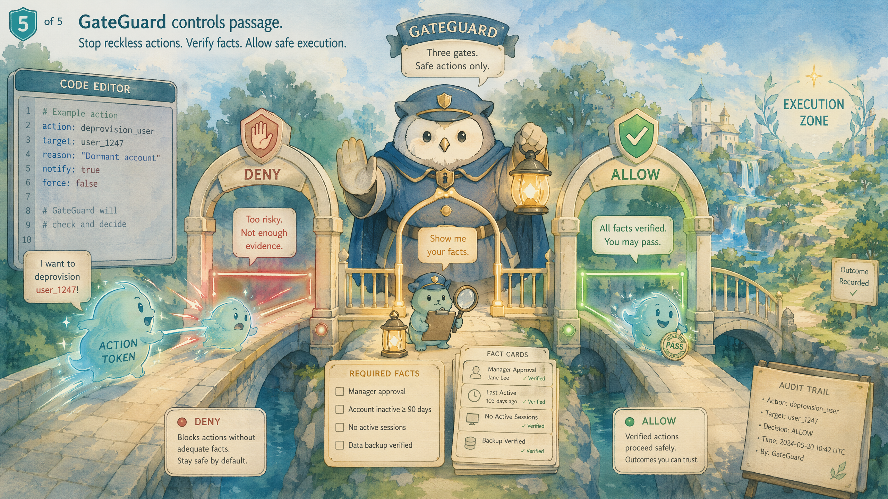

# gstack 与 ECC 深度解析与对比

> 两款 Claude Code 智能体工作流系统的全景对照
> 编制日期:2026-06-08 · 资料来源:官方仓库 + 第三方公开评测(已交叉验证)

## 摘要

gstack 与 ECC(Everything Claude Code) 是 2026 年初社区围绕 Claude Code 涌现的两款代表性智能体工作流系统,均为 MIT 开源、均把通用 AI 编程助手改造为「结构化的工程协作体系」,但侧重点截然不同。

简言之:**gstack 是一个人的高密度「流程哲学」**——围绕单人/小团队的研发冲刺,把 Claude Code 变成一支虚拟工程团队;**ECC 是一个人维护的「跨工具超大型资产库 + 操作员系统」**——主打跨多种 AI 编程宿主通用、持续学习与安全扫描。本文先分别详细介绍二者(含重点功能深度剖析、突出特征、特殊使用技巧),再给出功能对比与基于真实评测的对比评价。

> 说明:文中涉及的 star 数、agent/skill 数量等指标,不同来源与不同时间点差异极大(gstack 自报约 23 skill + 8 工具;ECC 自报已增长到 64 agents / 261 skills / 84 命令垫片),且项目自报数据普遍偏高,均应作「量级参考」而非精确事实看待。

## 一、gstack 介绍

### 1.1 是什么

gstack 由 Y Combinator 现任总裁兼 CEO Garry Tan 开源,是其个人 Claude Code 配置的公开版,MIT 协议、永久免费、无付费层。它把 Claude Code 变成「一支虚拟工程团队」——重新思考产品的 CEO、锁定架构的工程经理、抓 AI 垃圾产出的设计师、找生产 bug 的评审者、开真实浏览器的 QA 主管、跑 OWASP+STRIDE 审计的安全官,以及负责发 PR 的发布工程师,共 **23 个专家 + 8 个高能工具**,全部以斜杠命令(slash command)形式呈现,纯 Markdown 编写[[gstack README]](https://github.com/garrytan/gstack)。

作者的核心叙事是「一个人像二十人的团队一样出活」:他自报近 60 天里兼职做了 3 个生产服务、40+ 功能,并强调这是他每天在用的「开源软件工厂」[[gstack README]](https://github.com/garrytan/gstack)。

官方仓库:[github.com/garrytan/gstack](https://github.com/garrytan/gstack)

### 1.2 核心理念:把开发当成一场冲刺

gstack 的本质不是工具集合,而是一套**强制执行的研发流程**。所有 skill 按真实研发节奏串联,且每一步的输出会喂给下一步:

**Think → Plan → Build → Review → Test → Ship → Reflect**

关键在于「结构化交接」:`/office-hours` 写的设计文档被 `/plan-ceo-review` 读取并产出测试计划,`/plan-eng-review` 写的测试计划由 `/qa` 接手,`/review` 发现的 bug 由 `/ship` 验证已修复——「没有东西会从缝里漏掉,因为每一步都知道前一步做了什么」[[gstack README]](https://github.com/garrytan/gstack)。这条链路正是它区别于零散 prompt 的地方。

### 1.3 重点技能一览(按冲刺阶段)

下面按研发节奏列出最核心的技能,每个都是一位「虚拟专家」:

| 阶段 | 技能 | 扮演角色 | 做什么 |
|---|---|---|---|
| Think | `/office-hours` | YC Office Hours | 起点。用 6 个「逼问式」问题在写代码前重构你的产品,挑战前提、给实现备选,产出设计文档喂给下游 |
| Plan | `/plan-ceo-review` | CEO/创始人 | 重新定义问题,找出藏在需求里的「十星产品」,四种模式:扩张/选择性扩张/守住范围/收缩 |
| Plan | `/plan-eng-review` | 工程经理 | 锁定架构、数据流、ASCII 图、边界情况和测试,把隐藏假设逼到台面上 |
| Plan | `/autoplan` | 评审流水线 | 一条命令自动跑 CEO→设计→工程→DX 评审,只把「品味决策」抛给你确认 |
| Build | `/design-shotgun` → `/design-html` | 设计探索→设计工程师 | 生成 4–6 个 AI 设计变体在浏览器里并排比选(带「品味记忆」),选定后转成可上线的生产级 HTML |
| Review | `/review` | Staff 工程师 | 找那些能过 CI 却在生产炸掉的 bug,自动修明显问题,标注完整性缺口 |
| Review | `/cso` | 首席安全官 | OWASP Top 10 + STRIDE 威胁建模,零噪音(17 条误报排除 + 8/10 置信门槛),每条发现都给出可利用场景 |
| Test | `/qa` | QA 主管 | **杀手锏**(详见 1.4) |
| Ship | `/ship` / `/land-and-deploy` | 发布工程师 | 同步 main、跑测试、审计覆盖率、开 PR;合并后等 CI 与部署、验证生产健康 |
| Reflect | `/retro` / `/learn` | 工程经理/记忆 | 团队感知周复盘;`/learn` 跨会话沉淀(详见 1.5) |

### 1.4 重点功能深度剖析(一):`/qa` —— 真实浏览器 QA

`/qa` 是 gstack 被业界反复点名的杀手锏,也是作者本人称为「巨大解锁」的功能。

- **真实浏览器、真实点击:** `/browse` 底层启动**持久化 Chromium 守护进程**,约 100ms/命令、不冷启动,agent 真的去点击流程、找 bug,而不是读代码猜测[[gstack README]](https://github.com/garrytan/gstack)。
- **闭环修复:** `/qa` 不止报告——它会找到 bug、用**原子提交**修复、再验证,并为**每个修复自动生成回归测试**;若只想要报告不改代码,用 `/qa-only`[[gstack README]](https://github.com/garrytan/gstack)。
- **生产力杠杆:** 作者明确表示 `/qa` 让他从 6 个并行 worker 提升到 12 个——「Claude Code 说『我看到问题了』然后真的修好、生成回归测试、验证修复,这改变了我的工作方式,agent 现在有眼睛了」[[gstack README]](https://github.com/garrytan/gstack)。
- **增强浏览器与防御:** `/open-gstack-browser` 提供带侧栏、反爬隐身、自动模型路由(Sonnet 干动作、Opus 做分析)的定制浏览器;侧栏 agent 配套**提示注入防御**——22MB 本地 ML 分类器扫描每个页面与工具输出 + Haiku 转录检查 + 随机 canary token 检测会话外泄 + 双分类器投票才阻断,紧急开关 `GSTACK_SECURITY_OFF=1`[[gstack README]](https://github.com/garrytan/gstack)。
- **卡住时人工接管:** 遇到 CAPTCHA/登录墙/MFA,`$B handoff` 打开可见 Chrome(cookie 和 tab 原样保留),你解决后 `$B resume` 接着跑;连续 3 次失败 agent 会自动建议接管[[gstack README]](https://github.com/garrytan/gstack)。

> **使用技巧:** 把 `/qa` 放进 `/ship` 之前的固定环节,配合 `/setup-browser-cookies` 导入真实浏览器 cookie 即可测试登录后页面;并行冲刺时它是支撑 10+ worker 的关键。

### 1.5 重点功能深度剖析(二):`/learn` —— 跨会话记忆

`/learn` 是 gstack 让 agent「越用越懂你代码库」的记忆中枢。

- **管理沉淀的知识:** 它管理 gstack 跨会话学到的东西——可**审阅、搜索、修剪、导出**项目专属的模式、坑(pitfalls)和偏好,「学习在会话间累积,gstack 在你的代码库上越来越聪明」[[gstack README]](https://github.com/garrytan/gstack)。
- **与域名技能联动:** `$B domain-skill save` 让 agent 给某站点存一条笔记(如「LinkedIn 的 Apply 按钮在 iframe 里」),下次访问该域名自动触发;经 3 次成功使用后从「隔离」转「激活」,可选 `promote-to-global` 跨项目提升,存储与 `/learn` 的项目级文件放在一起[[gstack README]](https://github.com/garrytan/gstack)。
- **与 GBrain 互补:** `/learn` 偏「会话/项目内的轻量记忆」,更重的持久知识库由 GBrain 承担——一条 `/setup-gbrain` 支持 PGLite 本地(约 30 秒)、Supabase 已有 URL、自动开通新 Supabase(约 90 秒)、远程 MCP 四种路径,每仓库可设 read-write/read-only/deny 三级信任[[gstack README]](https://github.com/garrytan/gstack)。
- **跨机器同步:** GStack memory sync 可把 learnings/CEO 计划/设计文档/复盘/开发者画像推到私有 git 仓库随身带,并有 secret 扫描器在外泄前拦截 AWS key、token、PEM、JWT[[gstack README]](https://github.com/garrytan/gstack)。

> **使用技巧:** 多客户端顾问可对共享 brain 设 `read-only`,在客户 B 的仓库里搜索共享知识但不污染它;`/retro global` 可跨所有项目和 AI 工具(Claude Code、Codex、Gemini)做复盘。

### 1.6 突出特征与特殊技巧(其余)

- **跨模型第二意见(/codex):** 让 OpenAI Codex CLI 独立评审同一份代码,三种模式(通过/不通过门、对抗式挑战、开放咨询);当 `/review`(Claude)和 `/codex`(OpenAI)都跑过同一分支,会生成交叉分析显示哪些发现重叠、哪些各自独有[[gstack README]](https://github.com/garrytan/gstack)。
- **跨 agent 协同(/pair-agent):** 让来自不同厂商的 AI agent(OpenClaw、Hermes、Codex、Cursor 等)共享同一个浏览器,各自独立 tab、互不干扰,带 scoped token、tab 隔离、限流、域名限制[[gstack README]](https://github.com/garrytan/gstack)。
- **安全护栏(/careful、/freeze、/guard):** 破坏性命令前警告;`/freeze` 把编辑锁定在一个目录防止 AI 误改无关代码;`/guard` 两者全开;`/investigate` 会自动冻结到被调查模块[[gstack README]](https://github.com/garrytan/gstack)。
- **团队模式自动更新(./setup --team):** 会话启动时静默自动更新(每小时限流一次、网络失败安全),仓库内不留 vendored 文件、无版本漂移[[gstack README]](https://github.com/garrytan/gstack)。
- **10–15 个并行冲刺:** 配合 Conductor 可同时跑多个隔离工作区的会话,作者常态跑 10–15 个并行冲刺——「正是冲刺结构让并行可行,没有流程,十个 agent 就是十个混乱源」[[gstack README]](https://github.com/garrytan/gstack)。
- **iOS 真机 QA(v1.43+):** 通过 USB CoreDevice 在嵌入式 StateServer 上驱动真实 iPhone,可选 `--tailnet` 让远程 agent 经 Tailscale 跑 iOS QA 而不碰硬件[[gstack README]](https://github.com/garrytan/gstack)。

### 1.7 适用人群

仍想亲手出活的创始人/CEO、第一次用 Claude Code 想要结构化角色而非空白提示的新手,以及希望每个 PR 都有严格评审/QA/发布自动化的技术负责人。定位偏单人/小团队的快速出活。

## 二、ECC 介绍

### 2.1 是什么

ECC(Everything Claude Code)由开发者 Affaan Mustafa(Anthropic 黑客松获奖者)创建,定位「贴合各种 AI 编程宿主的智能体操作员系统(harness-native operator system)」,MIT 协议。它本质是一个 Claude Code 插件 + 跨工具的智能体工作流资产库,把作者 10 个多月每天用 AI 做真实产品沉淀下来的 agents、skills、instincts、memory 优化、hooks、rules、MCP 配置打包成可一键安装的系统,跨 **Codex、Claude Code、Cursor、OpenCode、Gemini、Zed、GitHub Copilot** 等多种宿主运行[[ECC README]](https://github.com/affaan-m/ECC)。

它强调自己「不只是配置,而是一套完整系统:技能、本能(instinct)、内存优化、持续学习、安全扫描和研究优先(research-first)开发」[[ECC README]](https://github.com/affaan-m/ECC)。

官方仓库:[github.com/affaan-m/ECC](https://github.com/affaan-m/ECC)

### 2.2 核心理念:可复用、跨宿主、持续进化

AI 编程工具默认配置都很通用,团队每个项目都要重写 CLAUDE.md、Cursor 规则、MCP 配置,工作无法沉淀。ECC 的赌注是:把这些模式打包成一套可移植、版本化、跨工具的系统,让配置「跟着团队走」。根目录的 AGENTS.md 作为通用跨工具文件被所有支持的宿主读取。自 v1.8 起,它明确把自己重新定位为「agent harness 性能优化系统」,而不仅是配置包[[ECC README]](https://github.com/affaan-m/ECC)。

### 2.3 重点技能一览(按用途分组)

ECC 自报已增长到约 **64 agents、261 skills、84 个命令垫片**[[ECC README]](https://github.com/affaan-m/ECC)。下面挑出最有代表性的:

| 类别 | 代表技能/命令 | 做什么 |
|---|---|---|
| 规划与构建 | `/plan`、`/build-fix` | 分阶段实现规划;系统化修复 build/CI 错误(背后是 build-error-resolver agent) |
| 安全 | `/security-scan`(AgentShield) | 扫描配置、密钥、权限、hook 注入、MCP 风险、agent 定义 5 大类 |
| 编辑前取证 | `gateguard`(Fact-Forcing Gate) | 编辑/写入/破坏性 Bash 前强制调查取证(详见 2.5) |
| 持续学习 | `continuous-learning-v2` / `/instinct-*` / `/evolve` | 从会话学习模式并打置信度分(详见 2.4) |
| 多服务编排 | `/multi-plan`、`/multi-execute`、`/pm2`、`dmux-workflows` | 用 tmux pane 管理器做多 agent 并行编排;PM2 管理多服务工作流 |
| harness 性能 | `/harness-audit`、`/loop-start`、`/quality-gate`、`/model-route` | 对 harness 配置做评分审计、自治循环、质量门、模型路由 |
| 研究 | `/deep-research`、`exa-search`、`documentation-lookup` | 研究优先开发:Exa 神经搜索、Context7 取最新库文档 |
| 语言专属 | `typescript-reviewer`、`java-reviewer`、`go-build-resolver`、`pytorch-patterns` 等 | 覆盖 12+ 语言生态,每语言有专属 reviewer 和 build-resolver |

### 2.4 重点功能深度剖析(一):`continuous-learning-v2`(instinct 持续学习)

这是 ECC「用得越多越懂你」的核心机制,让一次性的会话经验变成可复用、可分享、会进化的资产。

- **自动提取 + 置信度打分:** 系统自动从会话中学习你的模式,形成「本能(instinct)」并给出置信度评分,而不是靠人手写规则[[ECC README]](https://github.com/affaan-m/ECC)。
- **完整生命周期命令:** `/instinct-status` 查看已学到的 instinct 及其置信度;`/instinct-import`/`/instinct-export` 在团队间导入导出共享;`/evolve` 把相关 instinct **聚类成可复用 skill**;`/promote` 把项目级提升到全局;`/prune` 清理 30 天 TTL 的过期待定项[[ECC README]](https://github.com/affaan-m/ECC)。
- **与造技能联动:** `/skill-create --instincts` 可从 git 历史生成 skill 的同时,顺带为 continuous-learning-v2 生成 instinct[[ECC README]](https://github.com/affaan-m/ECC)。
- **跨宿主隔离存储:** instinct 默认存于 `CLV2_HOMUNCULUS_DIR`(默认 `~/.local/share/ecc-homunculus`),独立于普通会话记忆;在 Cursor 与 Claude Code 同机共用时可用 `ECC_AGENT_DATA_HOME` 为各自设单独内存根,避免互相覆盖[[ECC README]](https://github.com/affaan-m/ECC)。

> **使用技巧:** 团队可把成熟 instinct `/export` 后纳入版本库共享,新人 `/import` 即得团队经验;定期 `/evolve` 把高置信度 instinct 固化成 skill,再 `/prune` 清掉噪音,形成「学习→聚类→沉淀」闭环。

### 2.5 重点功能深度剖析(二):GateGuard(Fact-Forcing Gate)

GateGuard 是 ECC 内置的编辑前强制取证闸门,本质是一个 **PreToolUse 钩子**——在 Claude 真正执行 `Edit / Write / Bash`(含 `MultiEdit`)之前先拦下来,强制它去调查取证,而不是凭印象猜[[GateGuard SKILL.md]](https://github.com/affaan-m/ECC/blob/main/skills/gateguard/SKILL.md)。

**核心思路:用「逼出事实」取代「自我反省」。** 设计前提是:让 LLM 自我评估是无效的——你问它「你确定吗 / 违反规则了吗」,答案永远是「没有」,这已被实验验证。但如果改成「列出所有 import 这个模块的文件」,就会逼模型真的去跑 Grep、Read,调查过程本身产生的上下文会改变最终产出的质量[[GateGuard SKILL.md]](https://github.com/affaan-m/ECC/blob/main/skills/gateguard/SKILL.md)。

**三段式闸门 DENY → FORCE → ALLOW:** ①拦截第一次尝试;②明确告诉模型该收集哪些事实;③模型把事实摆出来后放行重试。作者称多数同类工具只做到「deny」就停了,GateGuard 三步都做[[GateGuard SKILL.md]](https://github.com/affaan-m/ECC/blob/main/skills/gateguard/SKILL.md)。

**四类闸门(分场景索要不同事实):**

- **Edit / MultiEdit 闸门**(每个文件首次编辑):列出所有 import 该文件的文件、受影响的公开函数/类、数据文件的字段结构与日期格式(脱敏值)、逐字引用用户指令;MultiEdit 按批次内每个文件单独过闸。
- **Write 闸门**(新建文件首次):说明哪些文件/行会调用它、用 Glob 确认无同功能文件、数据结构说明、引用用户指令。
- **破坏性 Bash 闸门**(每次触发):命中 `rm -rf`、`git reset --hard`、`git push --force`、`drop table` 等时,列出将被改/删的文件、写一行回滚步骤、引用用户指令。
- **常规 Bash 闸门**(每会话一次):一句话说明当前需求与该命令的作用[[GateGuard SKILL.md]](https://github.com/affaan-m/ECC/blob/main/skills/gateguard/SKILL.md)。

**它声称的效果:** 两组独立 A/B 测试(同 agent、同任务),加闸 vs 不加闸平均分 9.0 vs 6.75、**提升 +2.25 分**,两者代码都能跑、都过测试,差距在「设计深度」[[GateGuard SKILL.md]](https://github.com/affaan-m/ECC/blob/main/skills/gateguard/SKILL.md)。

| 任务 | 加闸 | 不加闸 | 差距 |
|---|---|---|---|
| Analytics 模块 | 8.0/10 | 6.5/10 | +1.5 |
| Webhook 校验器 | 10.0/10 | 7.0/10 | +3.0 |
| **平均** | **9.0** | **6.75** | **+2.25** |

> **使用技巧与已知问题:** 零安装可用插件自带 `scripts/hooks/gateguard-fact-force.js`,或 `pip install gateguard-ai` 获得 `.gateguard.yml` 做按项目配置;若误拦安装/修复类工作,用 `ECC_GATEGUARD=off` 启动会话或 `ECC_DISABLED_HOOKS` 关掉该钩子[[GateGuard SKILL.md]](https://github.com/affaan-m/ECC/blob/main/skills/gateguard/SKILL.md)。社区已反馈它有时**拦得过死**导致完全无法编辑[[Issue #1422]](https://github.com/affaan-m/ECC/issues/1422),官方已开 issue 规划 v2 改进粗粒度控制[[Issue #1499]](https://github.com/affaan-m/ECC/issues/1499)。

### 2.6 突出特征与特殊技巧(其余)

- **AgentShield 安全扫描器:** 独立 npm 包 `ecc-agentshield`,对智能体配置做静态分析(自报 1282 条测试、102 条规则),`/security-scan` 可直接在 Claude Code 里跑;被第三方评测者认为「光这一个就值得装」[[ECC README]](https://github.com/affaan-m/ECC)。
- **NanoClaw v2 编排引擎:** 内置 agent 编排,提供模型路由、skill 热加载、会话 branch/search/export/compact/metrics 等运行时控制[[ECC README]](https://github.com/affaan-m/ECC)。
- **跨宿主一致性:** 一套配置覆盖 Claude Code、Cursor、Codex(App+CLI)、OpenCode、Gemini、Zed、Copilot;hook 全部用 Node.js 重写以兼容三大 OS[[ECC README]](https://github.com/affaan-m/ECC)。
- **上下文预算管理(关键技巧):** 太多 MCP 会吃掉上下文——每个 MCP 工具描述都占 200k 窗口的 token,可能压到约 70k。官方建议**单项目启用 < 10 个 MCP、活跃工具 < 80 个**;SessionStart 附加上下文默认上限 8000 字符,可用 `ECC_SESSION_START_MAX_CHARS` 调低或 `ECC_SESSION_START_CONTEXT=off` 关闭(适合本地小模型)[[ECC README]](https://github.com/affaan-m/ECC)。
- **选择性/低上下文安装:** 清单驱动的安装管线,Python 团队只装 Python 规则,Go 团队只装 Go agent;若觉得 hook 太「全局」,可走 minimal profile 只要 rules/agents/commands/核心 skill[[ECC README]](https://github.com/affaan-m/ECC)。
- **避免双装:** 已用 `/plugin install` 后不要再跑 `./install.sh --profile full`,否则会把同一批 skill/命令/hook 复制进用户目录造成重复行为[[ECC README]](https://github.com/affaan-m/ECC)。

### 2.7 商业化

OSS 永久免费(MIT);另有 ECC Pro(面向私有库的托管 GitHub App,按座收费,域名 ecc.tools)、GitHub App、Sponsor 等,「Sponsor 和 Pro 订阅资助开发,这也是单人维护者能每周跨 7 个宿主出货的原因」[[ECC README]](https://github.com/affaan-m/ECC)。

### 2.8 适用人群

重度多宿主用户(同时用 Claude Code + Cursor + Codex,想要统一资产)、想要现成大量语言/框架专属 skill 的工程师,以及关注智能体安全的团队。

## 三、功能对比

下表从核心维度对二者做横向对照(数量为量级参考)。

| 维度 | gstack | ECC(Everything Claude Code) |
|---|---|---|
| 创建者 | Garry Tan(YC 总裁/CEO) | Affaan Mustafa(Anthropic 黑客松获奖者) |
| 核心定位 | 虚拟工程团队 / 研发冲刺流程 | 跨宿主智能体操作员系统 / 资产库 |
| 设计哲学 | 信任流程,把品味决策交给人 | 可复用 + 跨工具 + 持续进化 |
| 资产规模 | 约 23 个 skill + 8 个工具 | 约 64 agent + 261 skill + 84 命令垫片(量级远大于 gstack) |
| 语言/框架覆盖 | 通用为主 | 12+ 语言生态,框架专属 skill 丰富 |
| 跨宿主支持 | 10 个宿主(以 Claude Code 为主) | Claude Code/Cursor/Codex/OpenCode/Gemini/Zed/Copilot 等 |
| 杀手锏功能 | 真实浏览器 QA(持久化 Chromium) | AgentShield 安全扫描 + instinct 持续学习 |
| 跨模型评审 | ✓ /codex(Claude × OpenAI 交叉分析) | 以多宿主/多模型路由(NanoClaw v2)为主 |
| 安全能力 | 护栏式(/careful /freeze /guard)+ 提示注入防御 | 专门安全审计器 AgentShield + GateGuard 取证闸门 |
| 记忆/学习 | 偏会话内流程交接 + /learn + GBrain | instinct 跨会话沉淀 + /evolve 聚类 |
| 并行/编排 | Conductor + 10–15 并行冲刺 | NanoClaw v2 + /multi-* + dmux/tmux 编排 |
| 治理/强制层 | 建议性(护栏)+ 取证缺位 | GateGuard 有「拦+逼+放行」三段强制闸门 |
| 商业化 | 纯免费 | 免费 + ECC Pro(私有库,按座收费) |
| License | MIT | MIT |

### 3.1 一句话区分

- **选 gstack:** 只用 Claude Code、想要「严谨的研发冲刺流程」,且看重真实浏览器 QA。
- **选 ECC:** 同时用多个 AI 编程工具、想要统一配置 + 安全扫描 + 跨会话记忆 + 编辑前取证闸门,且需要大量语言/框架专属 skill。

## 四、对比评价(基于真实评测)

本章观点来自第三方公开评测与社区讨论,并尽量做了多源交叉验证。

### 4.1 各自被认可的优势

**gstack**

- 即时生产力:复制 skill、运行命令即可出活,无繁琐配置,因此短期内 star 爆发式增长。
- 真实出处:这是 YC 总裁本人真实在用的方式,「实战检验」而非纸上谈兵。
- 浏览器优先架构:持久化 Chromium、亚秒级延迟,被评测者称为「genuinely hard engineering」。
- 结构化交接:设计文档→工程评审→QA→发布的链路,是它区别于零散 prompt 的最难复制之处。

**ECC**

- 标准化跨工具层:一套仓库让 Claude Code、Cursor、Codex 等行为一致,省下每个新项目的重复配置时间,被称为 AI 编程工具的「.editorconfig」。
- AgentShield 安全扫描:被评测者认为是最值得优先评估的功能,尤其适合在生产环境跑 MCP 配置的团队。
- 持续学习闭环:instinct 机制让 agent 随团队使用而变强。
- 长期架构信号:in-tree 的 Rust ECC 2.0 alpha 与 NanoClaw v2 表明项目在为长期演进而非单纯刷 star 做准备。

### 4.2 批评与争议(交叉验证)

- **名人光环质疑:** Hacker News 上有评论直言「如果他不是 YC 的 CEO,这东西根本上不了 Product Hunt 和 HN」,作者本人对此类评论亦有不满反应[[Hacker News]](https://news.ycombinator.com/item?id=47418576)。
- **生产力叙事被质疑:** Garry Tan「60 天 60 万行代码」式的说法被评测者明确表示「不照单全收」,社区也引用「代码行数是坏指标 / 代码是负债」予以反驳[[Medium]](https://medium.com/@luongnv89/gstack-is-not-a-dev-tool-its-garry-tan-s-brain-on-ai-b813e09b32c7)。
- **复制别人的大脑:** 数千开发者不加修改地直接跑一个人的主观工作流——「gstack 是 Garry Tan 的大脑,你的团队可能需要另一个大脑」[[Medium]](https://medium.com/@luongnv89/gstack-is-not-a-dev-tool-its-garry-tan-s-brain-on-ai-b813e09b32c7)。
- **ECC 闸门拦得过死:** 社区反馈 GateGuard 升级后出现 Claude 完全无法编辑/执行 Bash、只能读的情况,卸载插件才恢复[[Issue #1422]](https://github.com/affaan-m/ECC/issues/1422);官方已开 issue 规划 GateGuard v2 解决「非黑即白、过度阻塞」的粗粒度问题[[Issue #1499]](https://github.com/affaan-m/ECC/issues/1499)。
- **缺乏强制治理层(共性):** gstack 与 ECC(以及同类的 Superpowers)在「拦截危险操作」这件事上多为建议性——这正是 AEGIS 这类治理型框架切入的空档[[DEV.to]](https://dev.to/th19930828/gstack-vs-superpowers-vs-aegis-3-philosophies-of-ai-agent-systems-o05)。
- **数字虚高:** 两者的 star 数、agent/skill 数量在不同来源严重不一致,项目自报数据尤其需要打折。

### 4.3 横向定位

有评测把这类系统归纳为「三种哲学」(以下为该作者的观点框架,非客观事实):

| 框架 | 哲学 | 适合 |
|---|---|---|
| gstack | 创业冲刺工作流(信任流程,无治理) | 单人/小团队、MVP 快速出活 |
| Superpowers | 工程方法论(强制 TDD、根因调查) | 想让团队「信任 AI」的工程团队 |
| AEGIS | 宪政式治理(规则引擎、红队、审计) | 多智能体、合规敏感行业 |

### 4.4 选型结论

- 二者并非直接对位的竞品:gstack 重「流程哲学」,ECC 重「资产规模 + 跨工具 + 安全/记忆」。
- 最被认可的差异化:gstack 的真实浏览器 QA;ECC 的 AgentShield 安全扫描 + instinct 持续学习 + GateGuard 取证闸门。
- 共同短板:都高度绑定单一作者的主观工作流;自报数字普遍虚高;强制治理层都偏弱(ECC 的 GateGuard 是少有的强制尝试,但又面临「拦得过死」的反向问题)。
- 务实做法:重「能拦截危险操作」的治理诉求,可叠加 AEGIS 这类治理层;二者本身也可与 Superpowers 等组合使用。

## 参考来源

- [gstack 官方仓库 — github.com/garrytan/gstack](https://github.com/garrytan/gstack)
- [ECC 官方仓库 — github.com/affaan-m/ECC](https://github.com/affaan-m/ECC)
- [ECC GateGuard SKILL.md(Fact-Forcing Gate 原始定义)](https://github.com/affaan-m/ECC/blob/main/skills/gateguard/SKILL.md)
- [ECC Issue #1422:GateGuard 拦得过死](https://github.com/affaan-m/ECC/issues/1422)
- [ECC Issue #1499:GateGuard Fact-Forcing Gate v2](https://github.com/affaan-m/ECC/issues/1499)
- [Augment Code:Garry Tan open-sources gstack](https://www.augmentcode.com/learn/garry-tan-gstack-claude-code)
- [Augment Code:Everything Claude Code hits 100K stars](https://www.augmentcode.com/learn/everything-claude-code-github)
- [DEV.to:gstack vs Superpowers vs AEGIS — 3 Philosophies](https://dev.to/th19930828/gstack-vs-superpowers-vs-aegis-3-philosophies-of-ai-agent-systems-o05)
- [MindStudio:GStack vs Superpowers vs Hermes](https://www.mindstudio.ai/blog/gstack-vs-superpowers-vs-hermes-claude-code-frameworks)
- [Hacker News:Garry Tan's Claude Code Setup](https://news.ycombinator.com/item?id=47418576)
- [Medium:gstack is not a dev tool, it's Garry Tan's brain on AI](https://medium.com/@luongnv89/gstack-is-not-a-dev-tool-its-garry-tan-s-brain-on-ai-b813e09b32c7)
