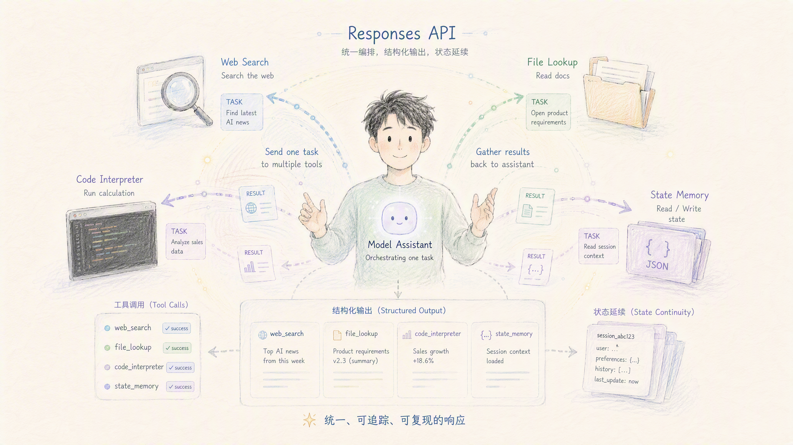
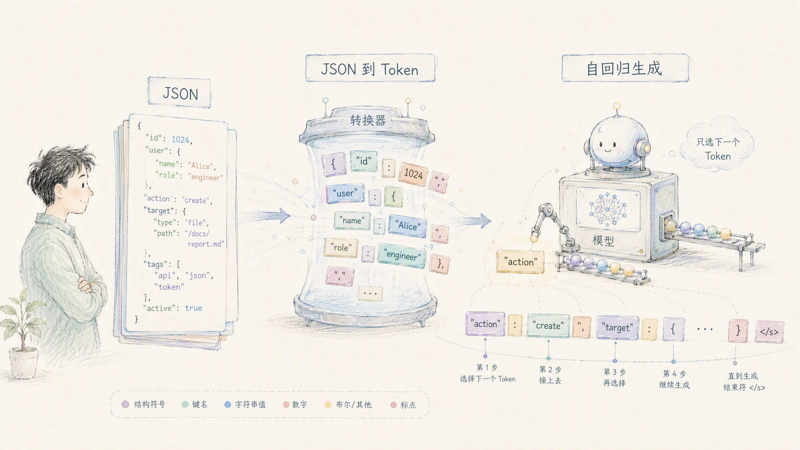
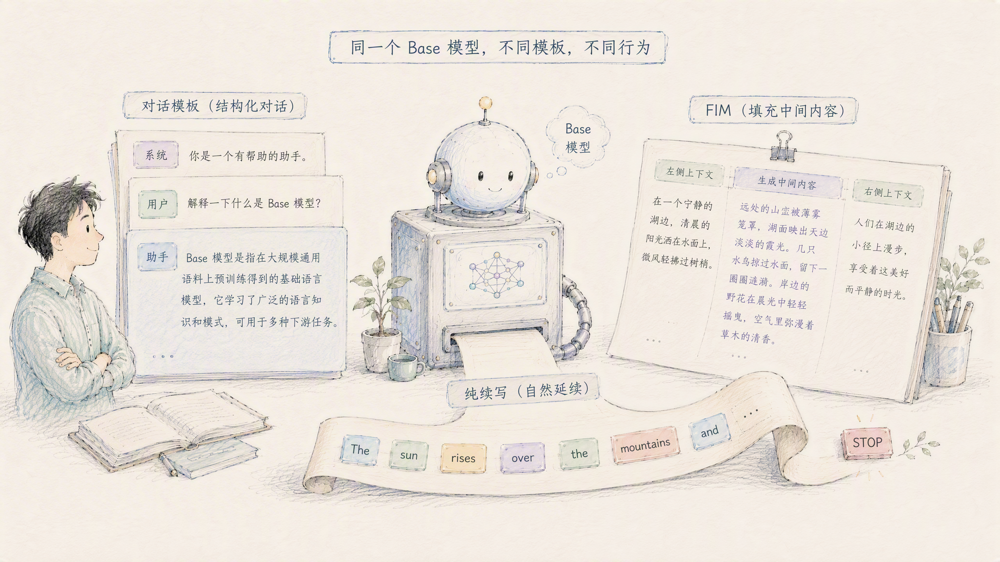

# 从 API 到 Token:大模型调用与底层机制


> 从一个开发者最熟悉的问题出发——「怎么调用大模型」——一路下探到「模型底层到底看到了什么」。全文把三种调用范式、Responses API、内置工具、JSON 到 token 的转换、自回归、对话模板、base 模型续写、停止与 FIM 串成一条完整的因果链。适合有一定编程基础、想搞清楚 LLM「表层接口」与「底层原理」之间关系的读者。

---

## 目录

- [1 引言:调用大模型,其实就是发一个请求](#1-引言调用大模型其实就是发一个请求)
- [2 三种调用范式:补全、对话、交互](#2-三种调用范式补全对话交互)
  - [2.1 从补全到对话:接口是怎么长出来的](#21-从补全到对话接口是怎么长出来的)
  - [2.2 Responses API:面向「交互」的新一代接口](#22-responses-api面向交互的新一代接口)
  - [2.3 Responses vs Chat Completions:改进到底在哪](#23-responses-vs-chat-completions改进到底在哪)
  - [2.4 业界调用格式全景](#24-业界调用格式全景)
- [3 Responses API 深入:结构、工具与原生支持](#3-responses-api-深入结构工具与原生支持)
  - [3.1 请求结构:input、role 与 input item](#31-请求结构inputrole-与-input-item)
  - [3.2 一个完整的多轮 + 函数调用示例](#32-一个完整的多轮--函数调用示例)
  - [3.3 内置工具:联网、检索、代码执行发生在哪](#33-内置工具联网检索代码执行发生在哪)
  - [3.4 「原生支持」意味着什么:以 DeepSeek 为例](#34-原生支持意味着什么以-deepseek-为例)
- [4 从 JSON 到 Token:接口之下的真相](#4-从-json-到-token接口之下的真相)
  - [4.1 最终喂给模型的不是 JSON,而是 token 序列](#41-最终喂给模型的不是-json而是-token-序列)
  - [4.2 主流 LLM 是自回归,不是扩散](#42-主流-llm-是自回归不是扩散)
- [5 模型底座的本质:一切都是「预测下一个 token」](#5-模型底座的本质一切都是预测下一个-token)
  - [5.1 base 模型、对话模板与「续写」](#51-base-模型对话模板与续写)
  - [5.2 为什么是「对话」?还有别的模板方向吗](#52-为什么是对话还有别的模板方向吗)
  - [5.3 如何「停」?如何做到 FIM 填空](#53-如何停如何做到-fim-填空)
- [6 结语:一条贯穿始终的因果链](#6-结语一条贯穿始终的因果链)

---

## 1 引言:调用大模型,其实就是发一个请求

抛开所有术语,「调用大模型」本质上就是:**你按某种格式组织一段文本,通过 HTTP 发给模型服务,它把生成的文本返回给你。** 最直观的一个例子:

```python
from openai import OpenAI

client = OpenAI(api_key="<your key>", base_url="https://api.deepseek.com")

response = client.responses.create(
    model="deepseek-v4-flash",
    instructions="You are a helpful assistant.",  # 系统设定
    input="杭州明天天气怎么样?",                    # 用户的话
)
print(response.output_text)
```

这段代码里藏着本文要拆解的全部问题:

- `instructions` 和 `input` 是什么?为什么系统设定和用户输入要分开?——这是**接口结构**问题(见第 2、3 章)。
- 这段 JSON 发到服务端后,模型到底"看到"了什么?——这是**JSON→token 转换**问题(见第 4 章)。
- 模型凭什么能"回答"而不是"接着往下写"?它怎么知道该停?——这是**模型底座本质**问题(见第 5 章)。

带着这三个问题往下读,你会发现从 API 到 token,是一条清晰的因果链。

---

# 2 三种调用范式:补全、对话、交互

## 2.1 从补全到对话:接口是怎么长出来的


大模型的调用接口不是一开始就长成今天这样,而是随着能力和场景演进出来的,大致经历了三代。

**第一代 · 文本补全(Completions)。** 最原始的形态,只有一个 `prompt` 字段,模型的唯一职责是「接着这段文字往下写」。它没有「对话」「角色」的概念,现在主要用于续写、代码补全、FIM 等场景(第 5 章会讲透它的机制)。

**第二代 · 对话补全(Chat Completions)。** 引入 `messages` 数组和 `role`(system / user / assistant),把「一问一答」显式编码进结构里。这是当下最通用的「最大公约数」——几乎所有第三方模型服务都提供 Chat Completions 兼容端点。它的特点是**无状态**:服务端不记忆任何东西,每一轮都要把完整历史重新传回去。

**第三代 · 交互 / Agent(Responses)。** OpenAI 于 2025 年 3 月推出,把过去需要开发者手工拼装的多个能力——对话、工具调用、状态管理、多步推理——整合成一个面向「任务 / 交互」而非「单次补全」的统一接口。

三代接口的演进,本质是**抽象层级的抬升**:

| 层级 | 代表 | 交互单位 | 核心特征 |
|------|------|---------|---------|
| 文本补全 | Completions、FIM | 一段续写 | 无对话、无 role |
| 对话补全 | Chat Completions、Anthropic Messages、Gemini generateContent | 一问一答 | `messages` + `role`,无状态 |
| 交互 / Agent | Responses、Assistants、Bedrock Converse | 一次完整交互(可含多步) | 可含工具编排、状态、推理 |

一句话概括这条演进线:**从「让模型写一段话」,到「让模型回一句话」,再到「给模型一个任务,它自己边想、边调工具、边给结果」。**

---

## 2.2 Responses API:面向「交互」的新一代接口

Responses API 可以理解为 **Chat Completions 的进化版**。它与旧接口的差异集中在五个维度:

| 维度 | Chat Completions(旧) | Responses(新) |
|------|--------------------------|---------------------|
| 交互单位 | 一问一答的「消息补全」 | 一次完整的「响应 / 交互」,可含多步 |
| 状态管理 | 无状态,每次要把完整历史传回去 | 支持服务端保存状态,可用 `previous_response_id` 续接 |
| 工具调用 | 需手动解析 function call、再回传结果 | 内置工具(联网搜索、文件检索、代码执行等)可自动多轮编排 |
| 推理过程 | 不保留 | 可保留 reasoning 上下文,推理模型表现更好 |
| 输出结构 | `choices / message` | 结构化的 `output` 数组(区分文本、工具调用、推理等) |

设计上,Responses 给 Agent 场景带来四块增量:**(a) 服务端状态管理、(b) 服务端托管工具、(c) 结构化 output 数组、(d) reasoning 上下文的服务端复用。** 这四块是否都落地,取决于具体厂商的实现程度——这一点在第 3.4 节的 DeepSeek 案例里会看到鲜明对比。

---

## 2.3 Responses vs Chat Completions:改进到底在哪

一个常见的质疑值得先在这里辨析清楚:剥离掉服务端 web_search 之后,Responses 是不是「只是把 role 换成 type」,对 Agent 没有实质改进,还因为多了 reasoning 而更费上下文?

**需要修正的认知:不是「role 换成 type」,而是「新增 type 维度、role 下沉到 message」。** Responses 的顶层单位是 input item(用 `type` 区分),`message` 只是其中一种 type,`role` 依然存在,只是降到 message 内部。`type` 和 `role` 是两个共存的维度。正是这个设计,让工具调用、推理能作为「一等公民」与消息平级排列,编排更清晰。

**关于「更费上下文」:方向对,但可缓解。** reasoning 项是否吃上下文,取决于你是否把它追加回历史。真正省不掉的是输出里新产生的 `reasoning_tokens`,而这在 Chat Completions 的思考模式里同样存在,并非 Responses 独有。

所以准确的结论是:**「对 Agent 没改进」只在某些厂商的阉割实现上成立,不是协议本意。** 协议本意的四块增量(状态、托管工具、结构化 output、reasoning 复用),落地几块,Agent 就得到几块价值:

| Responses 相对 Chat Completions 的增量 | 设计本意的价值 |
|------|------|
| 服务端状态 (`previous_response_id`) | 免重传历史、省 token |
| reasoning 服务端复用 | 多轮推理更连贯 |
| 服务端托管工具 | 免自建 search / code 基础设施 |
| 结构化 output(type 分项) | 工具 / 推理与消息平级,编排清晰 |
| 图片 / 文件输入 | 多模态 |

---

## 2.4 业界调用格式全景

除了 OpenAI 系两套,业界常见的 LLM 调用格式大致分四类。

**一、OpenAI 系(事实标准)。** Chat Completions(`/chat/completions`)是通用兼容基线;Responses(`/responses`)是新一代;旧的 Completions(`/completions`)是最原始的纯文本补全,现在主要用于续写、FIM、base 模型。

**二、Anthropic Messages(第二大生态)。** 端点 `/v1/messages`。特点:system 是顶层独立字段;工具调用用 `tool_use` / `tool_result` 的 content block;原生支持服务端工具(走 `server_tool_use` / `web_search_tool_result`),主要服务 Claude Code 场景 [[Using the Anthropic API | DeepSeek API Docs]](https://api-docs.deepseek.com/guides/anthropic_api)。

**三、云厂商 / 大厂自有格式。**

| 厂商 | 原生格式特点 |
|------|-------------|
| Google Gemini | `generateContent` 端点,用 `contents` + `parts`(role 叫 `user` / `model`),多模态一等公民 |
| AWS Bedrock | `Converse` / `InvokeModel` API,统一封装多家模型 |
| 阿里通义 / 百度文心 / 智谱等 | 各有原生 REST 格式,但主推 OpenAI 兼容端点 |
| Cohere | 自有 `/chat` 格式,`message` + `chat_history` |

**四、协议层 / 编排层。** MCP(Model Context Protocol)是架在 Chat / Responses 之上的工具供给协议,解决工具接入标准化;OpenAI Assistants API 是更早的有状态 agent 封装;LangChain / LlamaIndex 等 SDK 在框架层统一接口,底层仍翻译成上述某种格式;本地推理接口如 llama.cpp server、Ollama 的 `/api/generate` 与 `/api/chat`。

**核心三套:** OpenAI Chat Completions(通用兼容基线)、Anthropic Messages(第二生态)、OpenAI Responses(新一代 Agent 向);其余大厂格式基本都能靠 OpenAI 兼容层绕过,而 MCP 属于另一个维度(工具协议)。

---

# 3 Responses API 深入:结构、工具与原生支持



## 3.1 请求结构:input、role 与 input item

Responses API 换了字段名,也换了组织方式,并给了「一句话直接传」的简化写法。

**最简单的写法:不用数组。** 单轮对话可以直接传一个字符串给 `input`,系统提示走独立的 `instructions` 字段(见第 1 章示例)。对照 Chat Completions,`instructions` ≈ system,`input`(字符串)≈ user 那句话:

```python
# Chat Completions 的等价写法
messages=[
    {"role": "system", "content": "You are a helpful assistant."},
    {"role": "user", "content": "杭州明天天气怎么样?"},
]
```

**多轮场景:传数组,但字段名和语义都变了。**

| 维度 | Chat Completions | Responses API |
|------|------------------|---------------|
| 字段名 | `messages` | `input`(可传字符串或数组) |
| 数组元素 | message | **input item**(不只 message,还有 function_call、reasoning、web_search_call 等类型) |
| system 提示 | 数组里的一条 `role:system` | 独立的 `instructions` 字段(也可仍放数组里) |
| content 结构 | 字符串或 content parts | 字符串,或 `input_text` / `output_text` 等 content part |

**最关键的差异:input 数组是「交互项列表」而非「对话消息列表」。** Chat Completions 的数组只装「对话消息」,而 Responses 的 `input` 数组是一个**混合的 input item 列表**——除了 `message`,还可以直接混入 `function_call`、`function_call_output`、`reasoning`、`web_search_call` 这些非对话类型的项 [[Using the Responses API | DeepSeek API Docs]](https://api-docs.deepseek.com/guides/responses_api)。它的心智模型不是「消息列表」,而是「这次交互都发生了哪些事件项」。

---

## 3.2 一个完整的多轮 + 函数调用示例

用「查天气」场景演示 role、各类 input item 的拼装,以及无状态下如何手动维护历史。

```python
import json
from openai import OpenAI

client = OpenAI(api_key="<your key>", base_url="https://api.deepseek.com")

# 1) 定义工具(Responses API 的 function 工具是"扁平"结构)
tools = [
    {
        "type": "function",
        "name": "get_weather",
        "description": "查询指定城市某天的天气",
        "parameters": {
            "type": "object",
            "properties": {
                "city": {"type": "string", "description": "城市名,如 杭州"},
                "date": {"type": "string", "description": "日期,如 明天"},
            },
            "required": ["city", "date"],
        },
    }
]

# 2) 本地维护的历史(无状态时,每轮都要把完整历史塞回 input)
history = [{"role": "user", "content": "杭州明天天气怎么样?"}]

# 3) 第一次请求:模型大概率会决定调用工具
resp = client.responses.create(
    model="deepseek-v4-flash",
    instructions="You are a helpful assistant.",
    input=history,
    tools=tools,
    tool_choice="auto",
)

# 4) 把模型这一轮产出的所有 output item 原样追加进历史
history += resp.output

# 5) 找出 function_call,本地执行,把结果作为 function_call_output 塞回去
def get_weather(city, date):
    return {"city": city, "date": date, "weather": "多云转晴", "temp": "26~34℃"}

for item in resp.output:
    if item.type == "function_call":
        args = json.loads(item.arguments)
        result = get_weather(**args)
        history.append({
            "type": "function_call_output",
            "call_id": item.call_id,          # 必须对应上面 function_call 的 call_id
            "output": json.dumps(result, ensure_ascii=False),
        })

# 6) 第二次请求:带着 function 结果,让模型生成最终自然语言回复
resp2 = client.responses.create(
    model="deepseek-v4-flash",
    instructions="You are a helpful assistant.",
    input=history,
    tools=tools,
)
history += resp2.output
print(resp2.output_text)

# 7) 继续第二轮对话:直接往同一个 history 追加新的 user message
history.append({"role": "user", "content": "那后天呢?"})
resp3 = client.responses.create(
    model="deepseek-v4-flash",
    instructions="You are a helpful assistant.",
    input=history,
    tools=tools,
)
```

**几个关键点:**

- **`input` 数组是混合的 input item 列表**:执行到第 6 步时,`history` 里同时躺着 `message`、`function_call`、`function_call_output` 三种类型 [[Using the Responses API | DeepSeek API Docs]](https://api-docs.deepseek.com/guides/responses_api)。
- **function 结果不用 `role:tool`,而是独立的 `function_call_output` 项**,靠 `call_id` 与前面的 `function_call` 配对 [[Using the Responses API | DeepSeek API Docs]](https://api-docs.deepseek.com/guides/responses_api)。
- **无状态时必须手动累积 `history`**:每轮都得把 `resp.output` 追加回 `history` 再整体传回去。若换成有状态模式,第二轮就只需传 `previous_response_id` + 那条新 user message。

**history 的增长轨迹**(体现「无状态就只增不减」):

| 节点 | history 项数 | 新增了什么 |
|------|-------------|-----------|
| 初始化 | 1 | 初始 user 问题 |
| 第一轮 output | 3 | reasoning + function_call |
| 本地执行结果 | 4 | function_call_output |
| 模型最终回复 | 6 | reasoning + assistant message |
| 开启第二轮 | 7 | 新一轮 user 问题 |

**服务端联网搜索版几乎零改动**,只需把 tools 换成 `[{"type": "web_search"}]`,搜索过程通过 `response.web_search_call.in_progress / searching / completed` 事件反馈 [[Using the Responses API | DeepSeek API Docs]](https://api-docs.deepseek.com/guides/responses_api)。而这引出下一个关键问题:这些「内置工具」到底在哪执行?

---

## 3.3 内置工具:联网、检索、代码执行发生在哪

一个必须澄清的误区:**内置工具能力,不代表服务端能直接摸到你本地磁盘。** 内置工具的执行位置分两类。

**第一类 · 服务端托管型(server-side hosted)——不碰你本地磁盘。** 联网搜索、代码执行、文件检索这类,执行动作发生在模型服务提供方的服务器上:

- **联网搜索**:服务端有自己的搜索基础设施,模型决定搜什么 → 服务端替它发起搜索 → 把结果喂回模型,全程在服务端闭环。
- **代码执行**:服务端起一个**沙箱容器**跑代码,不在你机器上跑。
- **文件检索**:前提是你**先通过 Files API 把文件上传到服务端**建立向量库,模型检索的是**服务端那份已上传的副本**,不是你磁盘上的原件。

**第二类 · 需要访问本地资源时,靠 function calling(客户端回环)。** 如果任务需要读本地磁盘、内网数据库、本地命令行,就不走内置工具,而走自定义 function,执行权在客户端:

```
模型: "我需要调用 read_local_file(path='./data.csv')"   ← 服务端只输出"调用意图"
  ↓
你的客户端: 真正去读本地磁盘 / 执行本地命令 / 查内网库
  ↓
你的客户端: 把执行结果回传给服务端
  ↓
模型: 拿到结果继续推理 / 再调下一个工具
```

汇总成一张表:

| 工具类型 | 谁执行 | 能否碰你本地磁盘 |
|----------|--------|------------------|
| 联网搜索 | 服务端 | 否(服务端联网) |
| 代码执行 | 服务端沙箱 | 否(沙箱隔离) |
| 文件检索 file_search | 服务端 | 否,检索的是**你已上传**的副本 |
| 自定义 function(读本地 / 内网) | **你的客户端** | 是——因为执行在你这边 |

**结论:** 服务端托管工具的数据得先上传到服务端;本地 / 私有资源一律走 function calling,由客户端执行后回传。服务端拿不到、也不需要拿到你的磁盘访问权。

---

## 3.4 「原生支持」意味着什么:以 DeepSeek 为例

「大模型原生支持 Responses API」这句话,含义是**模型服务端在底层直接实现了 Responses API 的完整语义,而不是靠中间层把请求「翻译」成内部老格式**。原生支持意味着:服务端状态存储与 `previous_response_id` 续接、内置工具的多步自动编排、reasoning 上下文的保留复用、结构化 `output` 的原生产出——都是底层直接支持,而非勉强兼容。

但「原生支持」是有程度的,DeepSeek 就是一个典型的**有明确边界的子集**——主要为对接 **Codex** 而做,支持函数调用和服务端联网搜索,但不支持有状态、不支持文件检索 / 代码解释器。以下均依据官方文档 [[Using the Responses API | DeepSeek API Docs]](https://api-docs.deepseek.com/guides/responses_api)。

**基本盘。** 直接用 OpenAI 官方 base_url `https://api.deepseek.com`,通过 `client.responses.create(...)` 调用;当前仅支持 `deepseek-v4-flash`,`deepseek-v4-pro` 计划 2026 年 8 月初补上。

**「原生」体现在事件流。** 它原生吐出 Responses API 的语义化 SSE 事件流,每个事件带 `event` 类型 + 递增 `sequence_number`,以 `response.completed / incomplete / failed` 结尾(没有 `data: [DONE]`)。原生事件包括推理链、输出文本增量、函数调用参数增量,以及服务端联网搜索状态事件。

**内置工具只支持两类。**

| 工具类型 | DeepSeek 支持情况 | 执行位置 |
|----------|-------------------|----------|
| `function`(自定义函数) | ✅ 支持 | 客户端执行 |
| `web_search` | ✅ 支持 | 服务端执行 |
| `custom`(仅 `apply_patch`) | ⚠️ 只支持 Codex 专用的 `apply_patch` | — |
| `file_search` / `code_interpreter` / `mcp` 等 | ❌ 被忽略 | — |

**最关键的限制:无状态(stateless)。** 这是与 OpenAI 原版最大的差异——`previous_response_id`、`conversation`、`store`、`background`、`context_management` / `truncation` 全都不支持,超出上下文窗口直接返回 400 [[Using the Responses API | DeepSeek API Docs]](https://api-docs.deepseek.com/guides/responses_api)。所以每轮仍要把完整历史传回去。它「原生」的是接口协议、事件流和服务端工具编排,而不是「服务端状态存储」那一层。

**良好降级。** 不支持的参数静默忽略、不报错,现有 OpenAI Responses API 客户端不改代码也能直接连上;图片和文件输入不支持(`input_image` 不报错,但会被替换成占位文本)。

**三套接口并存。** DeepSeek 还通过 Anthropic 兼容端点(`https://api.deepseek.com/anthropic`)原生支持 Web Search,主要服务 Claude Code 场景 [[Using the Anthropic API | DeepSeek API Docs]](https://api-docs.deepseek.com/guides/anthropic_api)。因此它目前**三套接口并存**:OpenAI Chat Completions、OpenAI Responses、Anthropic Messages,分别对接不同的 Agent 生态(Codex 走 Responses,Claude Code 走 Anthropic)。

回到设计本意的四块增量对照:DeepSeek 目前只落地了「服务端托管工具」里的 web_search 和「结构化 output」的格式,「服务端状态」和「reasoning 复用」完全没做。这解释了为什么在它当前的实现上,Responses 相对 Chat Completions 的净增量约等于「只有服务端 web_search」——**不是协议没价值,而是这一版实现只落地了协议的一小块。**

---

# 4 从 JSON 到 Token:接口之下的真相

## 4.1 最终喂给模型的不是 JSON,而是 token 序列



无论用 Chat Completions、Responses 还是 Anthropic Messages,那些结构化 JSON 都**只活在 API 网关那一层**。真正做前向推理时,模型看到的只有**一维 token id 序列**。转换分两步:

1. **结构化 JSON → 一段纯文本字符串**(套用该模型的 chat template / prompt format)
2. **纯文本 → token id 序列**(tokenizer 编码)

模型 forward 的入参本质就是 `input_ids`(整数数组)+ 采样参数。role、tool、type 在这一步全被编码成特殊标记文本,塞进同一条序列里。

**这条链路在开源栈里是完全白盒的:**

- **chat template 是模型自带、公开可查的**:主流开源模型在 `tokenizer_config.json` 里带一个 `chat_template`(Jinja2 模板),`transformers` 的 `apply_chat_template()` 用它把 `messages` 渲染成最终字符串。
- **prompt 格式是公开约定的**,例如典型的 ChatML 风格:

```
<|im_start|>system
You are a helpful assistant.<|im_end|>
<|im_start|>user
杭州明天天气怎么样?<|im_end|>
<|im_start|>assistant
```

`<|im_start|>`、`<|im_end|>` 是特殊 token,role 名是普通文本。不同模型分隔符不同(Llama 用 `[INST]`、Gemma 用 `<start_of_turn>`),机制一致。

- **工具调用也是「拼进文本」的**:`tools` 定义被渲染成一段文本,模型「调用工具」其实是按训练格式吐出一段结构化文本(如 `<tool_call>{...}</tool_call>`),再由服务端 / 客户端解析成 JSON。
- **推理框架入口开源**:vLLM、SGLang、TGI 的 OpenAI 兼容层源码可读——收到 `messages` → 调 `apply_chat_template` → tokenize → 送进 engine。

**闭源厂商这一层只能强推测,但机制大概率相同**:官方不公开具体内部 prompt 格式,但 Transformer 架构决定输入必然是 token 序列,OpenAI 公开过 ChatML,各家特殊 token 会随 SDK / 模型部分暴露,DeepSeek 云端与开源权重同源。

| 环节 | 开源栈 | 闭源云端 |
|------|--------|----------|
| API JSON 长啥样 | 公开 | 公开 |
| JSON→文本的 chat template | ✅ 白盒 | ❌ 不公开,但机制大概率相同 |
| 特殊 token / 分隔符 | ✅ 可查 | ❌ 不公开(偶有逆向) |
| tokenizer 编码 | ✅ 开源 | ⚠️ 部分随 SDK 暴露 |
| 模型 forward 入参 | `input_ids` + 采样参数 | 架构决定必然如此 |

---

## 4.2 主流 LLM 是自回归,不是扩散


既然模型吃进去的是一条 token 序列,那它是怎么「吐出」下一段序列的?**主流 LLM(GPT、Claude、Llama、Qwen、DeepSeek 等)都是自回归(autoregressive)模型,不是扩散(diffusion)模型。**

| | 自回归(主流 LLM) | 文本扩散模型 |
|---|---|---|
| 生成方式 | 从左到右一个 token 一个 token 预测 | 从噪声 / 掩码序列并行去噪,多步迭代 |
| 代表 | GPT、Claude、Llama、Qwen、DeepSeek… | 少数研究性模型(如 LLaDA 等) |
| 现状 | 绝对主流 | 前沿探索,尚未成为主力 |

文本扩散模型确实存在(理论上可并行生成、可控性更强),但远未成为主流;图像 / 视频生成领域(Stable Diffusion、Sora 那类)才是扩散模型的主场。

这里要澄清一个常见混淆:**三个层次互相独立,不要混为一谈。**

| 层次 | 问的是什么 | 答案 |
|------|-----------|------|
| 生成机制 | 自回归 vs 扩散 | 主流是自回归 |
| 模型架构 | 用什么网络 | 主流是 Transformer(与生成机制正交) |
| 对话格式 | 怎么把对话拼成输入 | ChatML 只是其中一种模板,各模型不同 |

`<|im_start|>` 里的 "im" = instant message(消息),是 ChatML 对话模板的特殊标记,和「生成机制是自回归还是扩散」毫无关系。「用不用 im 模板」是输入格式问题,「自回归还是扩散」是生成机制问题,两个维度互不决定。

---

# 5 模型底座的本质:一切都是「预测下一个 token」



## 5.1 base 模型、对话模板与「续写」

要理解为什么需要对话模板,得先分清「同一个模型的两个阶段产物」。

| | Base 模型(基座) | Chat / Instruct 模型(对话版) |
|---|---|---|
| 训练 | 只做预训练:海量文本学「预测下一个 token」 | 在 base 之上再做指令微调 + 对齐(SFT / RLHF) |
| 会不会对话 | 不会,只会接着往下写 | 会,能理解「你问我答」的角色关系 |
| 用不用对话模板 | 不用 | 用(ChatML / Llama 格式等) |
| 你能不能直接用 | 一般拿不到,或需自己套格式 | 就是你日常在用的 |

**「纯 base 模型直接吃原始文本续写」是什么意思?** Base 模型的唯一技能是**文本接龙**,不理解「指令 / 问答 / 角色」。例如输入 `杭州明天天气怎么样?`,它可能续写成 `后天呢?大后天呢?这是很多要出行的朋友都关心的问题……`——因为语料里问句后面常跟更多问句或文章。要让它「翻译」,得用续写思路诱导:

```
中文:你好
英文:
```

它才会接上 `Hello`。这叫 few-shot / 补全式 prompting,是 GPT-3 时代的主要用法。

**为什么对话版必须用模板?** 核心在于:模型底层永远只做一件事——预测下一个 token,它看到的是一条连续序列,天生没有「这是用户说的、那是我该回答的」这种概念。对话模板用来在纯文本里人为标出边界和角色,原因有三:

1. **消除歧义**:把「角色 + 轮次」编码进文本,让模型知道多轮里谁说了什么、该扮演谁。
2. **训练与推理必须对齐**(最硬的理由):对话微调时数据就是按这套模板拼好喂进去的,推理必须用同一套模板,否则表现明显变差。
3. **提供控制锚点**:特殊 token(如 `<|im_end|>`)兼任停止符;system 提示、工具定义靠模板固定位置注入。

完整链条:**Base(会续写)→ 用带模板的对话数据做微调 → Chat 模型(会对话)→ 推理时继续用同一套模板。**

---

## 5.2 为什么是「对话」?还有别的模板方向吗

「对话」并非唯一或天然最优的形式,它更多是「历史路径 + 商业需求」共同选出的一个通用接口。

**为什么「纯续写」不是好的使用方式?** 续写不是能力差,而是接口烂:意图无法明确表达;没有「停」的概念,容易跑偏、自问自答;不可控、prompt 高度敏感;不安全,base 不会拒绝任何东西;不可组合,「设定 + 任务 + 历史」都得手工拼进一段文本。续写是「模型视角」的原生形态,不是「人类视角」好用的形态。

**为什么偏偏选了「对话」?** 不是信息论最优,而是同时满足几个现实约束:它是几乎所有任务都能塞进去的**最通用容器**(user 提要求 → assistant 回应);它天然解决「意图 + 边界 + 历史」(`role` 区分意图来源,`<|im_end|>` 划任务边界,多轮 message 承载上下文);对齐(RLHF)恰好长在对话上(人类要对「回应」打分,而「回应」必须先有角色结构);再加上 ChatGPT 引爆市场后的产品直觉与路径依赖。

**有没有别的模板方向?——有,且大多真实存在。**

| 设想方向 | 现实对应 | 说明 |
|---|---|---|
| xxx-reasoning | ✅ 已成主流 | 推理模型在模板里显式划出思维链区(如 `<think>…</think>`) |
| xxx-world | ✅ 存在雏形 | 世界模型 / 交互式模拟:维护状态,输入「动作」,输出「世界下一状态」 |
| xxx-rules | ✅ 部分存在 | 结构化约束:JSON Schema 强制输出、function calling、DSL |
| xxx-guess | ⚠️ 概念上存在 | 补全 / 填空是 base 原生形态;FIM 就是「猜中间」的专用模板 |

**关键洞察:** 这些新方向大多不是取代对话,而是**套在对话之上或与之并列**(嵌套关系)——对话是「外层通用容器」,专用结构是「内层任务格式」。而对话会不会一直是默认?不一定。Agent 化(重心从对话轮次转向「状态 + 动作 + 观察」,Responses API 把 `function_call`、`reasoning`、`web_search_call` 与 message 平级,正是「对话不够用了」的信号 [[Using the Responses API | DeepSeek API Docs]](https://api-docs.deepseek.com/guides/responses_api))、推理时代、多模态 / 具身,都在松动这个默认。

---

## 5.3 如何「停」?如何做到 FIM 填空

前面反复强调「模型只会预测下一个 token」,那两个看似高级的能力——知道该「停」、会「填空」——是怎么实现的?答案指向同一个机制:**不是靠外部规则,而是靠训练时见过某个特殊 token,于是学会在合适的位置生成它。**

**先说「停」。** 有两种停法:

- **停法 A · 外部强制截断(不依赖模型自己)**:`max_tokens` 生成到 N 个 token 强行切断,是最可靠的兜底;`stop` 字符串告诉引擎「一旦生成出这个字符串就停」——纯 base 模型续写式使用主要靠这个,如前面翻译例子里设 `stop=["\n"]`。这层「停」的智能不在模型里,在调用方设的规则里。
- **停法 B · 模型自己生成结束 token(EOS)**:每个模型词表里都有一个特殊「结束符」(`<|endoftext|>`、`</s>`、`<|eot_id|>` 等)。预训练时把无数文档拼起来、每篇结尾插一个 `<|endoftext|>`,模型就学到「一段内容语义完整了,下一个最可能 token 就是结束符」;推理时模型某步预测出的最高概率 token 恰好是它,引擎看到就停。chat 模型「精准在答完时停」,就是微调时用 `<|im_end|>` / `<|eot_id|>` 训练出的更可靠版本。

**再说 FIM(Fill-in-the-Middle)填空。** 核心把戏是:**把「中间」挪到「最后」,把「填空」重排成「续写」。** 关键在训练时的数据重排。想在下面这段代码中间填一行:

```
def add(a, b):
    return a + b
```

FIM 在训练时把文本重新拼装成:

```
<fim_prefix>def add(a, b):\n    <fim_suffix>\n<fim_middle>return a + b<|endoftext|>
```

`<fim_prefix>` 后跟前文,`<fim_suffix>` 后跟后文,`<fim_middle>` 后跟真正要填的中间内容。注意:prefix、suffix 都被放在前面,middle 挪到了最后——于是「填中间」变成了「在 `<fim_middle>` 之后续写」,模型只需干老本行:顺着往下写。推理时把场景拼成 `<fim_prefix>…<fim_suffix>…<fim_middle>` 喂进去,它就续写出中间内容,写完吐结束符停下。

两个能力的共同本质:

| 能力 | 表面看 | 真实机制 |
|------|--------|----------|
| 「停」 | 模型知道该结束了 | 训练时见过结束符放在文档末尾 → 学会在合适处生成它 → 引擎见到就停 |
| 「FIM 填空」 | 模型会填中间 | 训练时把 middle 重排到末尾并用特殊 token 标记 → 把填空伪装成续写 |

**统一规律:base 模型永远只会预测下一个 token。所有「高级行为」(停止、填空、对话)都是通过「训练时用特殊 token + 特定数据排列,教它在正确的位置生成正确的 token」实现的。** 特殊 token 是控制信号,数据重排是把新任务翻译成续写任务。

---

## 6 结语:一条贯穿始终的因果链

回头看第 1 章那段几行的调用代码,它背后其实是一条从「表层接口」下探到「底层原理」的完整链路:

1. **接口层**:大模型调用接口经历了「补全 → 对话 → 交互」三代演进。Responses API 是面向交互的新一代,把对话、工具、状态、推理整合进来;但「原生支持」只是接口语义的实现,不等于服务端能碰你本地磁盘。落地几块协议增量,就得到几块 Agent 价值。

2. **格式层**:业界核心三套是 OpenAI Chat Completions、Anthropic Messages、OpenAI Responses,其余靠兼容层绕过,MCP 是正交的工具协议。这些结构化 JSON 只活在 API 网关那一层。

3. **转换层**:所有 JSON 最终都被 chat template 拼成纯文本、再 tokenize 成 token id 序列。开源栈这条链路白盒可验证,闭源厂商机制大概率相同。

4. **模型层**:主流 LLM 是基于 Transformer 的自回归模型(不是扩散),底层只做一件事——预测下一个 token。

5. **本质层**:对话模板、FIM、推理模板、停止机制……全是同一招的不同应用——**在纯续写的底座上,靠「特殊 token + 训练数据的排列方式」雕刻出各种专用行为。** 对话只是当下的「默认外壳」,内部正长出越来越多非对话的专用结构,未来外壳本身也可能被更适合 Agent / 世界模拟的容器部分取代。

一句话收束:**你在 API 层看到的一切「角色、指令、工具、推理」,到了模型眼里都只是一条 token 序列;而让这条序列产生「对话 / 填空 / 停止 / 推理」等行为的,是训练时埋下的特殊 token 与数据重排。理解了这一点,就理解了从 Responses API 到 base 模型续写的完整因果链。**
