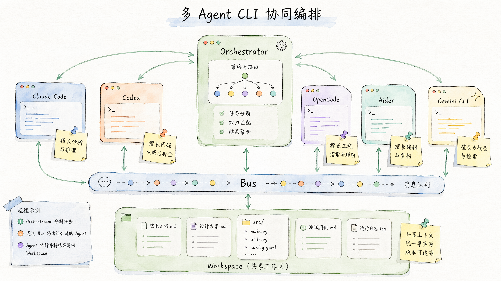
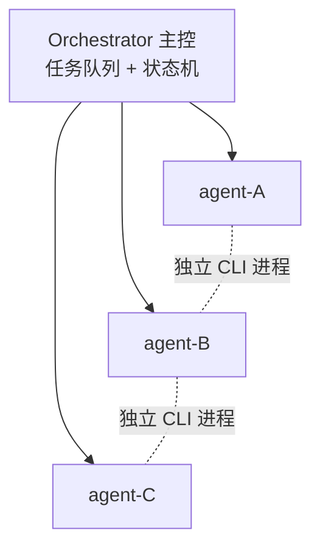
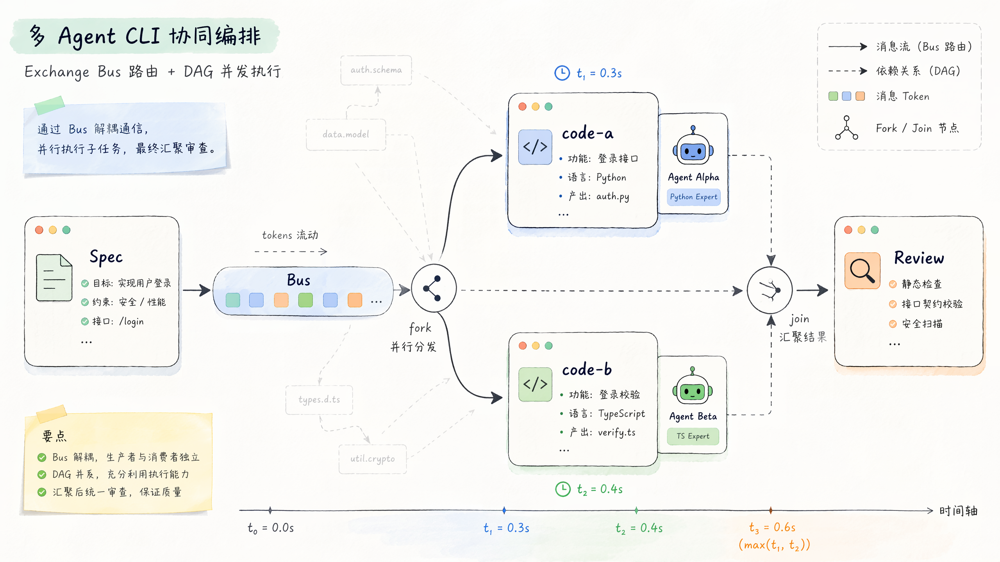
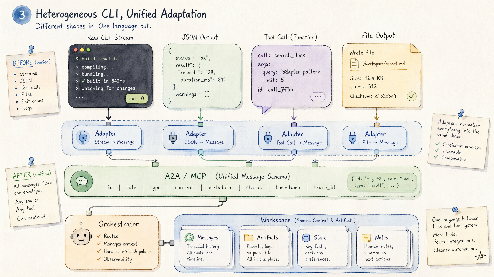
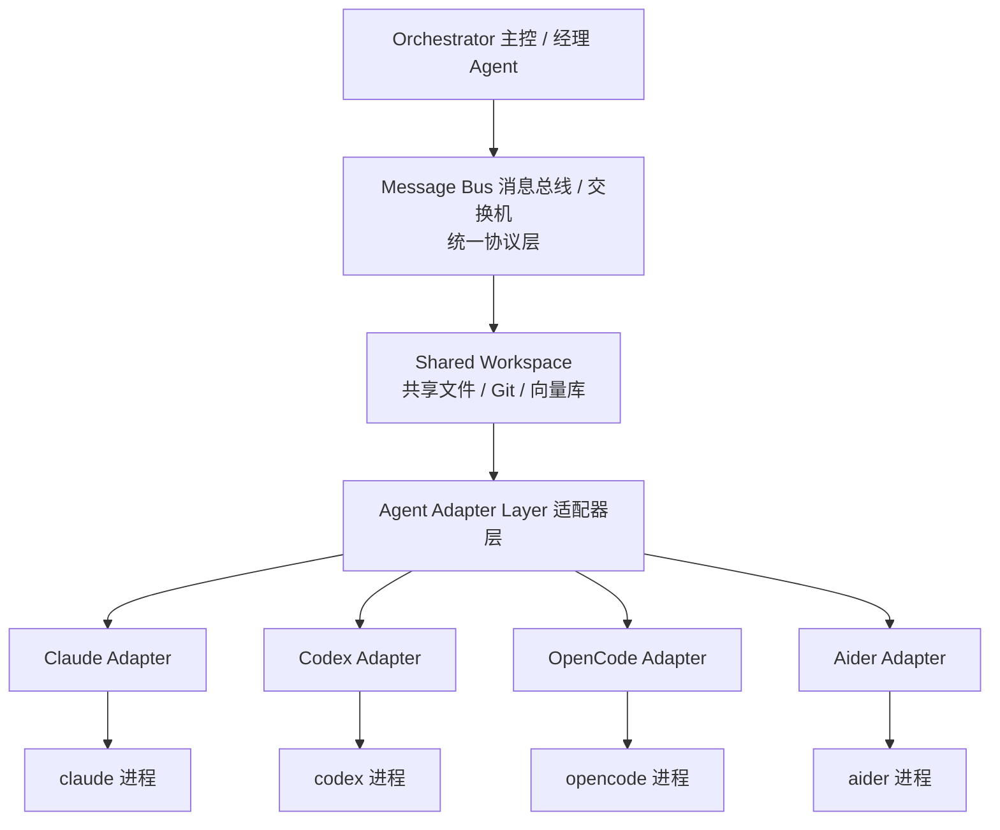
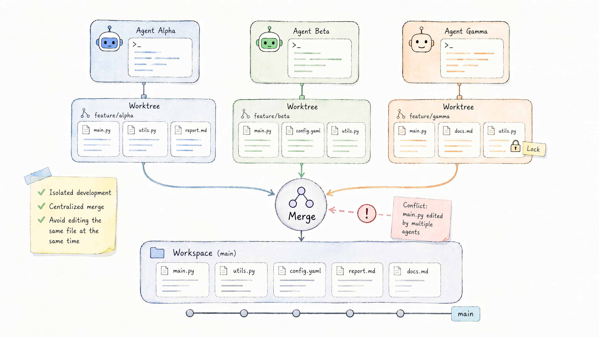
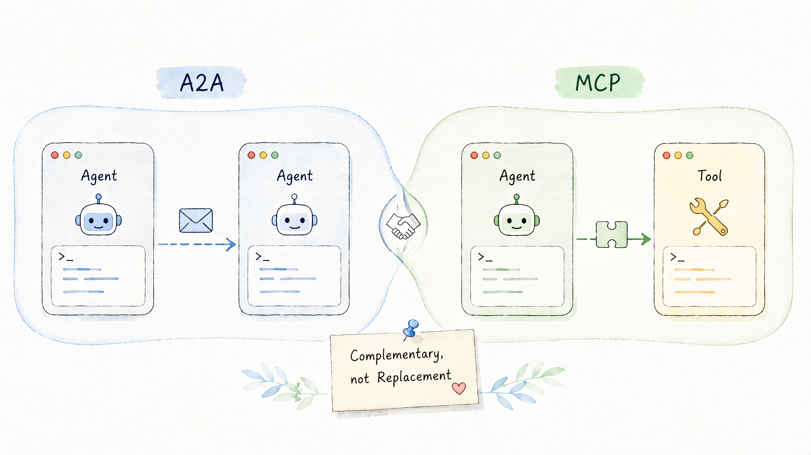
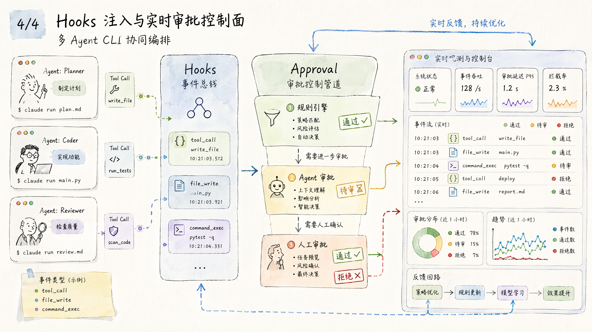
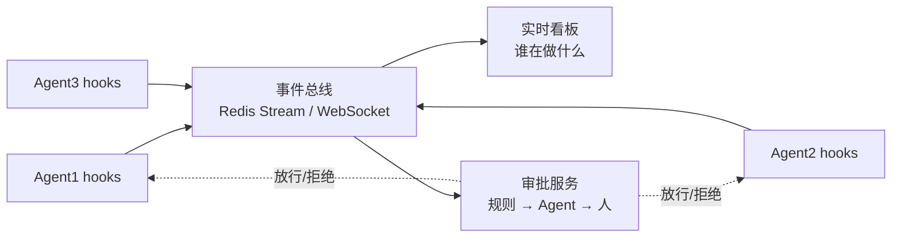

# 多 Agent CLI 协同编排技术指南

> 💡 **文档摘要**：本文系统梳理如何技术上控制并协同多个异构 Agent CLI(Claude Code、Codex、OpenCode、Aider、Gemini CLI 等),覆盖进程级输入输出控制、Agent 间通信"交换机"、并发任务指挥、A2A 协议现状、多 Agent 办公室模拟原理,以及基于 Hooks 注入 + 事件监听实现的实时状态采集与统一审批控制平面。面向需要构建"AI 团队/虚拟办公室"类系统的工程师。

**关键词**:多 Agent 编排 · Orchestrator-Worker · 消息总线 · MCP · A2A · Hooks 拦截 · 统一审批 · 可观测性

---

## 一、总体架构:多 Agent CLI 编排的核心模式



### 1.1 三种核心架构模式

控制多个 Agent CLI 协同工作,本质上是一个**进程编排 + 消息总线 + 状态管理**的问题。把每个 Agent CLI 当成一个"带状态的微服务",用分布式系统那套方法(消息队列、健康检查、trace、限流、幂等)去管它,而不是当成"另一个聊天窗口"。常见有三种架构模式。

#### 模式 A:Orchestrator-Worker(中心调度)

一个主控进程(Python/Node)作为指挥官,每个 Agent CLI 是一个 worker 子进程。主控负责派发任务、收集输出、做路由决策。适合任务可拆分、需要全局视角的场景,例如"A 写代码 → B review → C 部署"。

#### 模式 B:Blackboard / Shared Workspace(共享黑板)

所有 Agent 读写同一个文件系统目录或消息队列,靠"文件事件"或"消息订阅"触发下一步。无中心、松耦合,适合探索式协作、Agent 数量动态变化的场景。

#### 模式 C:Hierarchical(多层指挥)

顶层 Orchestrator 调度若干"中层 lead Agent",每个 lead 再管一组 worker。Claude Code 的 Sub-agent、AutoGen 的 GroupChat 都是这个思路。



### 1.2 模式选择速查

| 模式 | 中心化 | 耦合度 | 适用场景 |
| --- | --- | --- | --- |
| Orchestrator-Worker | 强中心 | 中 | 任务可拆分、需要全局决策 |
| Blackboard | 无中心 | 松 | 探索式协作、动态扩缩 |
| Hierarchical | 多层中心 | 中 | 大规模、需分组管理 |

## 二、进程级控制:输入输出怎么"喂"和"接"

### 2.1 各家 CLI 的接口形态

通信方案的所有约束都来自这一层。先盘点各家 CLI(截至 2026)的输入输出能力。

| CLI | 输入方式 | 输出方式 | 持久会话 | 工具协议 | 适配难度 |
| --- | --- | --- | --- | --- | --- |
| Claude Code | claude -p / --input-format=stream-json | stream-json | ✅ session id | MCP 原生 | 低 |
| Codex CLI | codex exec / stdin | text + JSON event | ✅ | 函数调用 + MCP | 低 |
| OpenCode | TUI + headless | JSON event stream | ✅ | MCP | 低 |
| Aider | aider --message | text + diff | ✅ git-based | 自有插件 | 中 |
| Gemini CLI | gemini -p | text/json | ✅ | MCP | 中 |
| Cursor Agent | API | JSON | ✅ | 自有 | 中 |

> 📌 **关键结论**:每家都有"headless + 结构化输出"模式,但 schema 不统一。要做团队协同,必须先把它们包成统一协议的 worker。

### 2.2 四种输入输出模式

| 模式 | 适用场景 | 实现 |
| --- | --- | --- |
| 一次性调用(claude -p "prompt") | 短任务、批处理 | subprocess.run / child_process.spawn |
| 持久会话(REPL pty) | 多轮对话、保持上下文 | pexpect(Python) / node-pty |
| Headless + JSON stream | 结构化输出、可解析 | --output-format=stream-json |
| MCP Server 模式 | Agent 之间互相调用工具 | 启动为 stdio/SSE server |

**推荐组合**:用 `--output-format=stream-json --input-format=stream-json` 模式启动 CLI,主控通过 stdin 喂 JSON 消息、通过 stdout 增量读 JSON 事件。这比解析终端 ANSI 文本健壮得多。

### 2.3 最小代码骨架(Python asyncio)

*spawn / send / recv 异构 CLI*

```python
import asyncio, json

async def spawn_agent(name, system_prompt):
    proc = await asyncio.create_subprocess_exec(
        "claude", "-p", "--output-format=stream-json",
        "--input-format=stream-json", "--system-prompt", system_prompt,
        stdin=asyncio.subprocess.PIPE,
        stdout=asyncio.subprocess.PIPE,
    )
    return proc

async def send(proc, msg):
    proc.stdin.write((json.dumps({"type":"user","content":msg})+"\n").encode())
    await proc.stdin.drain()

async def recv(proc):
    async for line in proc.stdout:
        evt = json.loads(line)
        yield evt
```

## 三、Agent 间通信"交换机"的实现

### 3.1 四种交换机方案

| 方案 | 机制 | 优点 | 适用 |
| --- | --- | --- | --- |
| A. 消息总线(生产首选) | Redis Streams / NATS / RabbitMQ 做中央 broker,各 Agent 订阅 topic,主控按规则路由 | 天然支持背压、重试、多订阅、可观测 | 跨机、需重启恢复 |
| B. MCP 互联(Agent-as-Tool) | Agent B/C 以 MCP server 暴露能力,Agent A 通过 MCP client 直接 call_tool | 工具调用语义清晰,Anthropic 官方路线 | Agent 互相调用 |
| C. 文件系统 + 文件锁 | 约定 inbox/outbox 目录,用 inotify / chokidar 监听 | 最朴素最稳 | 本地小规模实验 |
| D. A2A 协议 | Google 推的标准 task/message 格式,跨厂商互通 | 跨厂商标准化 | 混用多厂商 Agent |

### 3.2 统一消息 schema(借鉴 A2A Task 模型)

*跨 Agent 统一消息格式*

```json
{
  "msg_id": "uuid",
  "trace_id": "task-123",
  "from": "claude-coder-1",
  "to": "reviewer",
  "type": "task | result | question | status",
  "role": "user | assistant | system",
  "content": [
    {"kind": "text", "text": "..."},
    {"kind": "file", "path": "src/foo.py", "diff": "..."},
    {"kind": "tool_call", "name": "...", "args": {}}
  ],
  "ts": 1780904000,
  "deps": ["msg_id-of-parent"]
}
```

### 3.3 三种路由模式(可混用)

1. **点对点(Direct)**:经理把任务派给指定打工人,`bus.publish("agent.coder-1.inbox", task)`。
2. **话题广播(Pub/Sub)**:"今天 standup,大家都汇报",`bus.publish("topic.standup", msg)`。
3. **共享黑板(Blackboard)**:写到共享 doc,谁感兴趣谁拿,`workspace.watch("artifacts/*.py")` 触发 review。

实际产品里三种都会用:点对点派任务、话题做晨会/通知、黑板做产物交付。

### 3.4 背压与流控(关键)

LLM Agent 处理慢、token 贵,bus 必须有:

- **队列上限**:Redis Stream 用 MAXLEN,超了让上游等。
- **per-agent 并发上限**:同一 Agent 最多并行 N 个任务,防止 OOM。
- **token 配额**:全局 + per-agent 预算,超了降级到便宜模型或拒绝。
- **超时熔断**:任务超过 X 分钟自动 cancel + 通知 orchestrator。

## 四、并发指挥:同时做不同任务



### 4.1 任务图(DAG)描述

用 YAML/JSON 描述依赖,主控用拓扑排序 + asyncio.gather 并发执行无依赖节点。

*任务依赖 DAG*

```yaml
tasks:
  - id: spec
    agent: planner
    prompt: "拆分需求为 3 个模块"
  - id: code-a
    agent: coder-1
    needs: [spec]
    prompt: "实现模块 A"
  - id: code-b
    agent: coder-2
    needs: [spec]
    prompt: "实现模块 B"
  - id: review
    agent: reviewer
    needs: [code-a, code-b]
```

### 4.2 现成框架对比

| 框架 | 定位 | 适配 CLI |
| --- | --- | --- |
| LangGraph | 状态机 + 图编排 | 需自己包一层 CLI 调用 |
| AutoGen / AG2 | 多 Agent 对话 | 默认 API,可改 CLI |
| CrewAI | 角色化协作 | 同上 |
| Claude Code SDK | 原生 sub-agent + Task tool | 直接用 |
| tmuxinator + zellij | 纯进程编排 | 无智能路由,适合人盯 |

> 💡 Claude Code 自带的 **Task tool + Sub-agent** 已能在单个 session 内并发派发子任务,各 sub-agent 有独立上下文窗口,很多场景不需要自己造编排器。

### 4.3 最小可跑骨架(Python + asyncio)

*内存总线 + 双 Agent 协作*

```python
import asyncio, json
from collections import defaultdict

class Bus:
    def __init__(self): self.q = defaultdict(asyncio.Queue)
    async def send(self, to, msg): await self.q[to].put(msg)
    async def recv(self, who): return await self.q[who].get()

class Agent:
    def __init__(self, name, system, bus):
        self.name, self.system, self.bus = name, system, bus
    async def run(self):
        proc = await asyncio.create_subprocess_exec(
            "claude","-p","--output-format=stream-json",
            "--input-format=stream-json","--system-prompt",self.system,
            stdin=asyncio.subprocess.PIPE, stdout=asyncio.subprocess.PIPE)
        while True:
            msg = await self.bus.recv(self.name)
            if msg.get("type")=="stop": break
            proc.stdin.write((json.dumps({"type":"user","content":msg["content"]})+"\n").encode())
            await proc.stdin.drain()
            async for line in proc.stdout:
                evt = json.loads(line)
                if evt.get("type")=="result":
                    await self.bus.send(msg["reply_to"],
                        {"from":self.name,"content":evt["content"]})
                    break
```

## 五、异构 CLI 协同的通信原理



把异构 CLI Agent 当团队成员一起管,本质是异构系统集成问题——每个 CLI 协议不同、输出格式不同、能力边界不同,需要在它们之间建一层**协议适配 + 消息路由 + 共享状态**。

### 5.1 三层抽象架构



### 5.2 Adapter 层:异构 CLI → 统一消息

每个 CLI 包一个 Agent Adapter,把它的 native 协议翻译成团队统一消息格式。三种接入档位,按可控性从高到低:

| 档位 | 方式 | 适用 |
| --- | --- | --- |
| ★★★ Stream-JSON | stdin/stdout 双向 JSON | Claude Code、Codex、OpenCode |
| ★★ Headless one-shot | cli -p "prompt" 拿 stdout | 所有 CLI 兜底 |
| ★ PTY 抓终端 | pexpect/node-pty 解析 ANSI | 只有 TUI、没 headless 的产品 |

★ 档不到万不得已不用,ANSI 解析非常脆。

*Claude Adapter 示例*

```python
class ClaudeAdapter(AgentAdapter):
    async def start(self):
        self.proc = await asyncio.create_subprocess_exec(
            "claude", "-p",
            "--input-format=stream-json",
            "--output-format=stream-json",
            "--system-prompt", self.role_prompt,
            stdin=PIPE, stdout=PIPE)

    async def send(self, unified_msg):           # 统一消息 → native
        native = {"type":"user","content": unified_msg["content"][0]["text"]}
        self.proc.stdin.write((json.dumps(native)+"\n").encode())

    async def recv(self):                        # native → 统一消息
        async for line in self.proc.stdout:
            evt = json.loads(line)
            if evt["type"] == "result":
                yield to_unified(evt)
```

### 5.3 Orchestrator(经理 Agent)

经理本身也是个 Agent(通常用强推理模型),其 system prompt 列出所有下属能力与可用工具(assign_task / ask_question / broadcast / read_artifact / wait_for)。经理形态有三种:

| 经理形态 | 优 | 劣 |
| --- | --- | --- |
| LLM 经理(动态) | 灵活、能处理意外 | 贵、可能死循环、难调试 |
| DAG/SOP(静态) | 可预期、便宜 | 不灵活 |
| 混合(SOP + LLM 在分支点) | 平衡 | 实现复杂 |

### 5.4 共享工作区



CLI Agent 大多操作文件系统,工作区天然就是"共享目录 + Git"。冲突处理三招:

- **Worktree 隔离**:每个 Agent 一个 git worktree,经理负责 merge。
- **文件级锁**:Redis SETNX 给文件加排他锁,防止两 Agent 同时改。
- **CRDT / 最后写入胜**:文档协作场景。

### 5.5 一帧完整通信流程示例

「经理让 Claude 写 API,让 Codex 写前端,Aider review 改动」:消息走 bus(JSON-over-Redis-Stream),代码产物走 Git workspace,trace_id 贯穿全程,所有事件落日志,前端可实时渲染"团队聊天 + Git 活动"。

## 六、A2A 协议支持范围现状(2026.06)



A2A(Agent-to-Agent)是用于**跨厂商、跨框架 Agent 互通**的开放协议,定位类似"Agent 之间的 HTTP"。它解决的是不同团队、不同语言、不同模型实现的 Agent 如何标准化地发现彼此、交换任务与消息。

### 6.1 治理与版本现状(截至 2026.06)

| 维度 | 现状 |
| --- | --- |
| 发起方 | Google 提出,2025 年捐给 Linux Foundation,转为中立治理 |
| 版本 | 已发布 v1.0 稳定规范,进入生态扩张期 |
| 背书厂商 | 微软(Azure AI Foundry / Copilot Studio)、AWS、Salesforce、SAP、ServiceNow 等数十家 |
| 官方 SDK | Python / JavaScript / Java / .NET / Go 多语言 SDK |
| 与 MCP 关系 | 互补:MCP 解决"Agent 调工具",A2A 解决"Agent 调 Agent" |

### 6.2 核心概念

- **AgentCard**:Agent 的"名片",JSON 文档,声明能力(skills)、端点 URL、认证方式、支持的传输协议。通常放在 `/.well-known/agent-card.json` 供发现。
- **Task**:一次有状态的任务,有生命周期(submitted → working → input-required → completed/failed/canceled),可长期运行。
- **Message / Part**:消息由多个 Part 组成,支持 TextPart / FilePart / DataPart(结构化 JSON),天然多模态。
- **Artifact**:任务产出物,同样由 Part 组成。

### 6.3 传输与交互

| 能力 | 说明 |
| --- | --- |
| 多传输 | JSON-RPC 2.0、gRPC、HTTP+JSON(REST)三种,厂商可选实现 |
| 流式 | SSE 推送 task 增量更新,适合长任务进度回传 |
| 异步通知 | Push notification(webhook),任务完成后主动回调 |
| 认证 | 复用 HTTP 标准:OAuth2 / API Key / mTLS,声明在 AgentCard |

### 6.4 支持范围的边界(实事求是)

> 💡 A2A 标准化的是**通信协议层**,不规定 Agent 内部如何推理、如何编排。它不替代 LangGraph/AutoGen 这类编排框架,而是让这些框架产出的 Agent 能对外暴露统一接口。真正"开箱即用互通"目前仍以大厂托管平台间的集成最成熟,自建 Agent 接入需要自己实现 AgentCard 与 server 端。

- ✅ 已成熟:协议规范、多语言 SDK、主流云平台的 server/client 实现。
- 🟡 发展中:跨厂商真实生产互通案例、统一的 Agent 注册中心/目录服务。
- ❌ 不在范围:Agent 的记忆/规划/工具执行逻辑(这些归框架与 MCP 管)。

## 七、多 Agent 办公室/团队模拟类 App 的实现原理

市面上"AI 办公室/虚拟公司/团队模拟"类产品(ChatDev、MetaGPT、Generative Agents、各类 AI Town),底层都是**角色化多 Agent + 记忆系统 + SOP/剧本驱动**的组合,差异主要在"偏生产力"还是"偏拟真社交"。

### 7.1 两大流派

| 流派 | 代表 | 目标 | 核心机制 |
| --- | --- | --- | --- |
| 生产力型(虚拟软件公司) | ChatDev、MetaGPT | 把需求自动做成软件/文档 | SOP 工序流水线 + 角色分工 + 产物交付 |
| 拟真社交型(生成式智能体) | Generative Agents(Smallville)、AI Town | 模拟人类日常行为与社交涌现 | 记忆流 + 反思 + 规划 + 环境感知 |

### 7.2 生产力型:SOP 驱动

MetaGPT 的口号是"Code = SOP(Team)"——把人类公司的标准作业流程编码成 Agent 协作流程。每个角色(产品经理→架构师→工程师→QA)有固定职责、输入产物、输出产物,像流水线一样传递:

*虚拟软件公司工序流*

```text
需求 → [PM] PRD → [架构师] 设计文档 → [工程师] 代码
     → [QA] 测试报告 → [工程师] 修复 → 交付
```

关键点:用"**结构化产物**"(PRD、API 设计、文件 diff)而非自由聊天来传递,大幅降低 Agent 间误解和 token 消耗。ChatDev 进一步把流程拆成"对话链"(Chat Chain),每个工序是一对 Agent 的双人对话(指导者 + 执行者)。

### 7.3 拟真社交型:记忆流架构

斯坦福 Generative Agents 论文奠定了拟真智能体的经典三件套:

1. **Memory Stream(记忆流)**:把所有观察按时间顺序存为自然语言条目。
2. **Retrieval(检索)**:综合打分取最相关记忆喂给 LLM。
3. **Reflection(反思)**:周期性把零散记忆归纳成高层洞察,再存回记忆流。
4. **Planning(规划)**:基于记忆与反思生成当天计划并随事件动态调整。

> 💡 记忆检索打分公式(经典实现): **score = α·recency + β·importance + γ·relevance** recency 用指数衰减、importance 由 LLM 对该记忆打 1-10 分、relevance 用 embedding 余弦相似度。三者归一化加权。

### 7.4 通用技术栈

- **角色 = system prompt + 工具集 + 记忆库**,本质仍是给每个 Agent 配不同人设与权限。
- **环境/世界状态**:拟真型有"地图 + 物体 + 时钟",用沙盒维护可交互世界;生产力型的"环境"就是文件系统 + 代码仓。
- **调度**:生产力型偏静态 SOP(可预期);拟真型偏事件驱动 + 每个 Agent 独立 tick。
- **前端呈现**:像素小镇 / 看板 / 群聊三种 UI,底层都是把 Agent 事件流实时渲染出来。

## 八、Hooks 注入 + 事件监听:实时采集与统一审批



"用 Hooks 注入 + 事件监听实现多 Agent 状态实时采集,并统一接管权限审批"——结论是**可行,且是目前最干净的方案之一**。核心是把每个 Agent CLI 的生命周期钩子接到一条中央事件总线 + 审批服务上。

### 8.1 Claude Code 的 Hook 能力

| Hook | 触发时机 | 用途 |
| --- | --- | --- |
| PreToolUse | 工具执行前 | 采集"即将做什么" + 拦截审批(关键) |
| PostToolUse | 工具执行后 | 采集执行结果、产物 |
| Stop / SubagentStop | 主/子 Agent 结束 | 采集任务完成、统计 |
| UserPromptSubmit / Notification | 用户输入 / 通知 | 采集对话、提醒 |

> 🔑 **审批拦截的核心机制**:PreToolUse hook 返回**退出码 2** 表示"拦截",stderr 内容作为拒绝理由回灌给 Agent;退出码 0 放行。这就是"统一接管权限"的钩子——所有危险操作(写文件、跑命令、网络请求)在执行前先经过你的审批逻辑。

### 8.2 实时状态采集架构



每个 hook 是一个小脚本,被触发时把结构化事件(`{agent_id, type, tool, args, trace_id, ts}`)POST 到总线;看板订阅总线即可实时展示"团队动态"。

### 8.3 统一审批的三级漏斗

1. **规则引擎(自动)**:白名单命令直接放行、黑名单直接拒,覆盖 90% 流量,零延迟。
2. **Agent 审批(智能)**:灰区交给一个"安全审查 Agent"判断风险等级。
3. **人工审批(兜底)**:高危操作推到人(飞书卡片/IM),人点"批准"才放行。

### 8.4 异构 CLI 的兜底方案

> 💡 不是所有 CLI 都有 Claude Code 这么完善的 hooks。对没有原生 hook 的 Agent,用 **命令代理(PATH shim)** 或 **沙箱包装器** 兜底:把 `bash/git/curl` 等替换成你的代理脚本,代理里先做审批+上报再转发真实命令;MCP 工具调用则用 **MCP proxy 中间件**拦截。这样无论 Agent 是否支持 hooks,危险动作都跑不出你的控制面。

## 九、工程细节与踩坑清单

把多 Agent CLI 真正跑起来,踩坑大多不在"调用"本身,而在并发、状态一致性、成本和可观测性。这里汇总工程落地的高频坑与对策。

### 9.1 进程与 I/O

- **别解析 ANSI 终端文本**:优先 stream-json,PTY 抓屏(pexpect/node-pty)极脆,光标转义、颜色码、重绘都会污染解析。
- **stdout 缓冲死锁**:子进程 stdout 写满管道而主控不读会卡死;务必持续 drain,按行(NDJSON)增量读。
- **进程僵尸/泄漏**:任务结束要 kill 进程组并回收;长会话要做健康检查 + 自动重启。

### 9.2 并发与状态一致性

- **文件写冲突**:两个 Agent 同时改一个文件 → 用 git worktree 隔离 + 经理 merge,或文件级锁(Redis SETNX)。
- **上下文漂移**:block_id / 行号会随他人编辑漂移,改之前先重新 fetch 当前态。
- **幂等性**:消息可能重投,带 msg_id 去重,写操作设计成可重放。

### 9.3 成本与流控

| 坑 | 对策 |
| --- | --- |
| LLM 经理死循环烧钱 | 设最大轮数/最大预算,超了强制停 |
| 广播风暴(N² 消息) | 用 topic 精准订阅,避免全员互发 |
| 慢 Agent 拖垮全局 | 超时熔断 + per-agent 并发上限 |
| token 失控 | 全局 + per-agent 配额,灰区降级到便宜模型 |

### 9.4 可观测性(必须从第一天就做)

- **trace_id 贯穿全链路**:一个任务从派发到交付的所有消息/工具调用共享 trace_id,否则出问题无法追溯。
- **结构化日志落盘**:所有事件 NDJSON 落盘,既是审计也是回放素材。
- **实时看板**:至少展示"每个 Agent 当前状态 + 队列深度 + 错误率"。

### 9.5 安全

- **最小权限**:每个 Agent 只给它需要的目录/命令/网络权限。
- **危险操作必经审批**:见第 8 节统一审批漏斗。
- **沙箱隔离**:Agent 跑在容器/沙箱里,限制文件系统与网络出口。

## 十、选型建议与最小可跑骨架

最后给出可直接落地的选型决策与一个最小可跑骨架,作为本指南的实操收尾。

### 10.1 选型决策树

| 你的场景 | 推荐方案 |
| --- | --- |
| 只想在单机快速试多 Agent 协作 | Claude Code 自带 Task tool + Sub-agent,无需自建编排器 |
| 任务可拆、需全局调度 | Orchestrator-Worker + 内存/Redis 总线 |
| 跨机、要重启恢复、生产级 | Redis Streams / NATS 做消息总线 + DAG 编排 |
| 需要复杂状态机/分支 | LangGraph(自己包一层 CLI 调用) |
| 角色化协作、偏对话 | AutoGen / AG2 / CrewAI |
| 跨厂商 Agent 互通 | A2A 协议 + 各自 AgentCard |
| 统一权限管控 | Hooks(有则用)+ 命令代理/MCP proxy(兜底)+ 中央审批服务 |

### 10.2 推荐技术组合(生产首选)

- **接入**:stream-json 模式包每个 CLI 成统一 worker(Adapter 层)。
- **通信**:Redis Streams 做总线,统一消息 schema(借鉴 A2A Task 模型)。
- **编排**:DAG 描述依赖 + 拓扑排序并发执行;经理用强推理模型或 SOP+LLM 混合。
- **工作区**:git worktree 隔离 + 经理 merge。
- **管控**:PreToolUse hook / 命令代理统一审批,三级漏斗。
- **观测**:trace_id 全链路 + NDJSON 日志 + 实时看板。

### 10.3 最小可跑骨架

*内存总线 + 经理派发 + 异构 worker(精简版)*

```python
import asyncio, json
from collections import defaultdict

class Bus:
    def __init__(self): self.q = defaultdict(asyncio.Queue)
    async def send(self, to, msg): await self.q[to].put(msg)
    async def recv(self, who): return await self.q[who].get()

async def worker(name, system, bus):
    proc = await asyncio.create_subprocess_exec(
        "claude","-p","--output-format=stream-json",
        "--input-format=stream-json","--system-prompt",system,
        stdin=asyncio.subprocess.PIPE, stdout=asyncio.subprocess.PIPE)
    while True:
        msg = await bus.recv(name)
        if msg.get("type") == "stop": break
        proc.stdin.write((json.dumps(
            {"type":"user","content":msg["content"]})+"\n").encode())
        await proc.stdin.drain()
        async for line in proc.stdout:
            evt = json.loads(line)
            if evt.get("type") == "result":
                await bus.send(msg["reply_to"],
                    {"from":name,"content":evt["content"]})
                break

async def manager(bus):
    # 派活 → Claude 写代码,结果回到 manager
    await bus.send("coder",
        {"type":"task","content":"实现一个快排","reply_to":"manager"})
    res = await bus.recv("manager")
    print("交付:", res["content"])
    await bus.send("coder", {"type":"stop"})

async def main():
    bus = Bus()
    await asyncio.gather(
        worker("coder","你是资深工程师", bus),
        manager(bus))

asyncio.run(main())
```

> ✅ **一句话总结**:把每个 Agent CLI 当成"带状态的微服务",用分布式系统那套(消息总线、DAG 编排、背压、trace、统一审批)去管,而不是当成另一个聊天窗口——这就是多 Agent CLI 协同的工程本质。