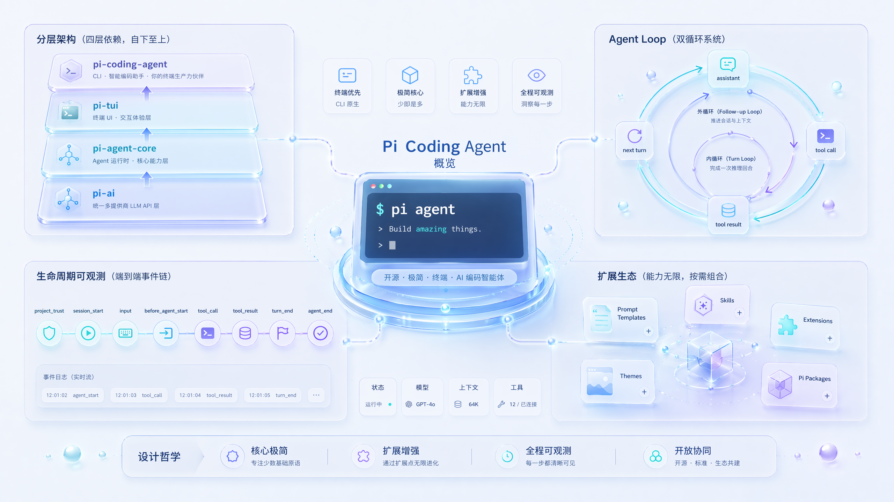
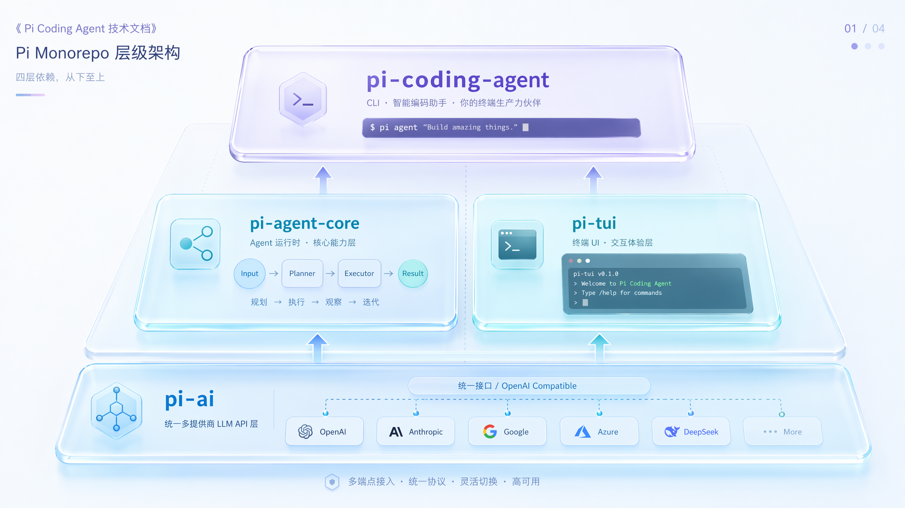
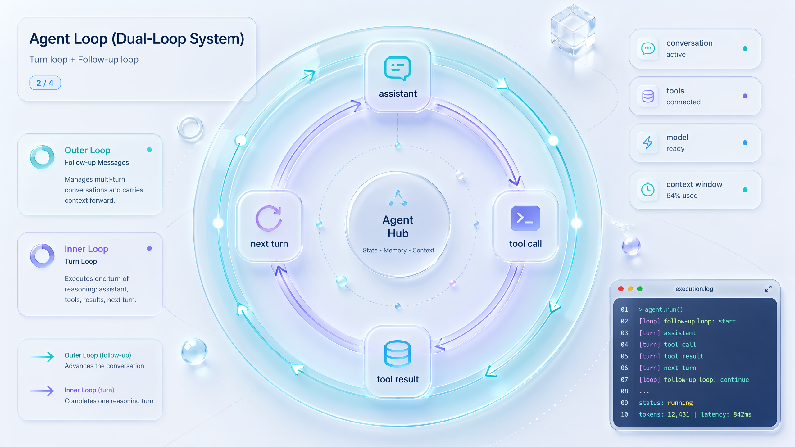
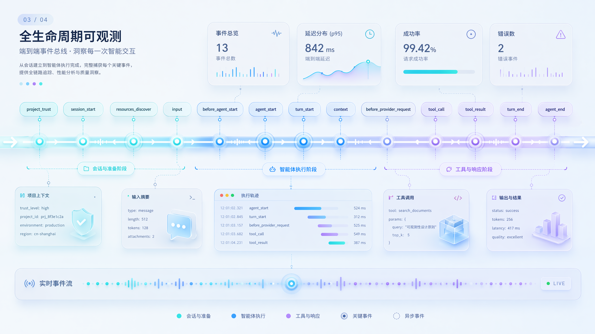
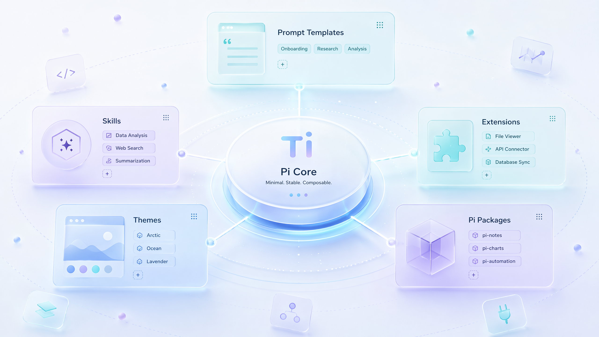

# Pi Coding Agent 技术分析


> 一份关于开源极简终端编程 agent **Pi** 的技术资料,涵盖定位、架构、核心能力、agent loop、运行生命周期、系统提示词与扩展生态。

---

## 目录

1. [Pi 是什么](#一pi-是什么)
2. [Monorepo 架构](#二monorepo-架构)
3. [核心能力](#三核心能力)
4. [Agent Loop 逻辑](#四agent-loop-逻辑)
5. [运行流程:生命周期、事件、钩子](#五运行流程生命周期事件钩子)
6. [默认 System Prompt 分析](#六默认-system-prompt-分析)
7. [扩展生态与设计哲学](#七扩展生态与设计哲学)

---

## 一、Pi 是什么



**Pi** 是一个**开源、极简主义的终端命令行 AI 编程助手(coding agent)**,由开发者 Mario Zechner(@badlogic)发起,代码托管在 GitHub 仓库 `earendil-works/pi`,官网为 [pi.dev](https://pi.dev)。它与 Claude Code、OpenAI Codex、Gemini CLI 属于同一类工具——直接在终端里读写代码、执行命令、完成开发任务,但设计哲学截然不同。

### 核心特点

| 维度 | Pi 的做法 |
|---|---|
| 设计哲学 | 极简(minimal)——只提供少量核心原语(primitives),不做臃肿封装 |
| 可定制性 | 几乎所有东西都能改,包括完全替换系统提示词(system prompt) |
| 扩展机制 | 通过 Extensions、Skills、Prompt Templates、Themes 增强,可经 npm/git 分享 |
| 运行模式 | 四种:交互式、print/JSON、RPC、SDK |
| 技术栈 | 主要用 TypeScript 编写,MIT 许可证开源 |
| 模型支持 | 可通过 `models.json` 或扩展接入任意厂商/模型 |

### 与其他 agent 最大的不同

大多数第三方 coding agent(如 Claude Code)是"黑盒",想改某个行为只能等官方更新。Pi 的理念是:**如果你想让它做某件它默认不做的事,你自己就能加上去**。它把 plan mode、TODO 管理、MCP 支持、子 agent 等通常内置的功能,都交给用户用扩展自行实现——核心保持精简,能力靠社区生态。

正如作者所言:Pi 不仅是一个编程 agent,也是"一套可以拿来自己搭 agent 的小组件集合"。它的核心理念是 **"Adapt pi to your workflows, not the other way around"**。

> 提示:"Pi" 这个名字在 AI 领域也指 Inflection AI 的对话助手 Pi(personal AI),二者完全无关。本文讨论的是终端编程工具。

---

## 二、Monorepo 架构



仓库 `earendil-works/pi` 是一个 agent harness 单体仓库,`packages/` 下有 4 个包,呈清晰的分层架构。

```
┌─────────────────────────────────────────────┐
│  pi-coding-agent  (CLI 产品 / 直接用的 pi)     │  ← 最上层
├──────────────────────┬──────────────────────┤
│   pi-agent-core      │      pi-tui          │
│  (agent 运行时)       │   (终端 UI 库)        │
├──────────────────────┴──────────────────────┤
│              pi-ai  (统一多供应商 LLM API)     │  ← 最底层
└─────────────────────────────────────────────┘
```

### 四个核心包

| 包目录 | npm 名 | 定位 |
|---|---|---|
| `ai/` | `@earendil-works/pi-ai` | 统一多供应商 LLM API(屏蔽 OpenAI/Anthropic/Google 协议差异);streamSimple、Message、Context、Tool、ThinkingLevel 等类型源头 |
| `agent/` | `@earendil-works/pi-agent-core` | agent 运行时引擎:agent-loop.ts、types.ts、turn 循环、工具三段式管线、消息队列、各类钩子;可被 SDK 嵌入任何应用 |
| `tui/` | `@earendil-works/pi-tui` | 终端 UI 库,带差分渲染(只重绘变化部分);消息区、流式更新、可折叠输出、状态行、overlay |
| `coding-agent/` | `@earendil-works/pi-coding-agent` | 交互式编程 agent CLI(最终产品):默认系统提示词、内置工具、会话管理、扩展/技能/Pi Packages、四种运行模式、项目信任 |

### 依赖关系

| 包 | 层级 | 依赖于 |
|---|---|---|
| pi-ai | 基础 | (无,最底层) |
| pi-agent-core | 运行时 | pi-ai |
| pi-tui | UI | (相对独立) |
| pi-coding-agent | CLI 产品 | pi-agent-core、pi-ai、pi-tui |

### 这种拆分的意义

- 想接新模型供应商 → 只动 pi-ai
- 想把 agent 嵌进自己的 App、不要终端界面 → 用 pi-agent-core 的 SDK
- 想做别的 TUI 程序 → 单独用 pi-tui
- 想要完整终端编程助手 → 用 pi-coding-agent
- 想做聊天机器人/工作流 → 用姊妹仓库 `earendil-works/pi-chat`(Slack / chat 自动化与工作流;OpenClaw 即"用 Pi 内核 + 自定义界面"的真实案例)

### 工程细节:供应链安全

直接外部依赖全部 pin 到精确版本;`.npmrc` 设 `min-release-age=2` 避免引入当天发布的依赖;发布前用 `npm run release:local` 在仓库外做隔离安装冒烟测试。

> **界面形态**:Pi 是纯终端(TUI)工具,UI 层是 `pi-tui`,渲染目标是终端而非浏览器,整个 monorepo 没有任何 web 前端包,也没有内置 Web 服务器。`/export` 导出的静态 HTML 和 `/share` 上传的 GitHub gist 都只是会话快照,不能交互。想在浏览器里用 Pi,可用 `pi-agent-core` 的 SDK 或 `pi --mode rpc` 的 JSONL 协议自己接 Web 前端(OpenClaw 即此模式),或用 ttyd / gotty 把终端转发到浏览器。

---

## 三、核心能力

Pi 开箱即默认给模型四个工具:`read`、`write`、`edit`、`bash`,模型靠这四个原语完成绝大多数任务;此外内置 `grep`、`find`、`ls`,共七个。所有更高级能力都靠 Skills、Prompt Templates、Extensions、Pi Packages 叠加,而非塞进内核。

### 1. 多供应商 / 多模型
- **订阅登录**:Anthropic Claude Pro/Max、OpenAI ChatGPT Plus/Pro(Codex)、GitHub Copilot
- **API Key**:Anthropic、OpenAI、Azure、DeepSeek、Google Gemini/Vertex、Amazon Bedrock、Mistral、Groq、xAI、OpenRouter、Kimi、MiniMax、Xiaomi MiMo 等数十家
- 用 `/model`(或 Ctrl+L)随时切换;`models.json` 可接入任何兼容 OpenAI/Anthropic/Google 协议的自定义供应商

### 2. 交互式界面
- 顶部状态头、消息区、编辑器(边框颜色表示 thinking 等级)、底部 footer(显示工作目录、token/缓存用量、成本、上下文占用、当前模型)
- 编辑器特性:`@` 模糊搜索项目文件、Tab 补全路径、Shift+Enter 多行、Ctrl+V 粘贴图片、`!command` 执行 shell 并把输出发给模型(`!!command` 则不发)

### 3. 会话管理与持久化
- 会话存为 JSONL 树状结构,按工作目录自动保存到 `~/.pi/agent/sessions/`——这同时也是 Pi 的**单会话历史与跨重启持久化**基础
- `pi -c` 续接最近会话、`pi -r` 浏览选择、`--no-session` 临时模式、`--name` 命名
- 分支能力:`/tree`(就地导航历史树、任意点续聊、切分支)、`/fork`(从某条消息派生新会话)、`/clone`(复制当前分支)
- 扩展可用 `pi.appendEntry()` 把状态写进会话文件(跨重启存活,todo.ts、tools.ts、snake.ts 等示例都用它)
- **关于长期记忆**:Pi 没有内置的自动长期记忆 / RAG,但提供了构建记忆所需的全部底层机制(见 §5 钩子);社区 fork `oh-my-pi` 已实现 "Hindsight Memory——agent 自我策展记忆" 特性

### 4. 上下文压缩(Compaction)
- 默认开启自动压缩:上下文溢出时恢复重试,接近上限时主动压缩
- 手动 `/compact [自定义指令]`;压缩有损但完整历史仍保留在 JSONL,可用 `/tree` 回溯

### 5. 消息队列
- 模型工作时仍可输入:**Enter** 排队"引导消息"(steering,当前回合工具执行完后送达)、**Alt+Enter** 排队"跟进消息"(follow-up,全部完成后才送达)、Escape 取消

### 6. 命令与快捷键
- `/login`、`/model`、`/settings`、`/resume`、`/new`、`/tree`、`/compact`、`/export`(导出 HTML)、`/share`(上传为私密 GitHub gist)、`/copy`、`/reload`、`/hotkeys` 等
- 快捷键可在 `~/.pi/agent/keybindings.json` 自定义

### 7. 上下文文件与系统提示词
- 启动加载 `AGENTS.md` / `CLAUDE.md`(全局 + 逐级父目录),作为**项目静态记忆**以 `<project_context>` 注入提示词
- 可用 `.pi/SYSTEM.md`(项目)或 `~/.pi/agent/SYSTEM.md`(全局)完全替换默认系统提示词,或用 `APPEND_SYSTEM.md` 追加

### 8. 工具控制体系
| 场景 | 命令 |
|---|---|
| 只读审查 | `pi --tools read,grep,find,ls -p "审查代码"` |
| 关掉某个具体工具 | `pi --exclude-tools ask_question` |
| 禁用内置工具但保留扩展工具 | `pi --no-builtin-tools` |
| 完全禁用所有工具 | `pi --no-tools` |

### 9. 四种运行模式
| 模式 | 用途 |
|---|---|
| 交互式 | 默认终端对话 |
| print/JSON | `-p` 打印后退出;`--mode json` 输出 JSON 行;支持管道 |
| RPC | `--mode rpc`,基于 stdin/stdout 的严格 LF 分隔 JSONL 帧 |
| SDK | 用 `createAgentSession()` 等 API 嵌入自己的应用 |

### 10. 项目信任机制(Project Trust)
启动时对含项目级配置的目录询问是否信任;只有信任后才会读取项目 `AGENTS.md`、`.pi/settings.json`、执行项目扩展。

---

## 四、Agent Loop 逻辑



基于核心源码 `packages/agent/src/agent-loop.ts` 分析。

### 整体结构:双层循环 + 事件流

Pi 的 agent loop 本质是一个**嵌套的双层 while 循环**,所有过程通过 `EventStream` 把事件(`AgentEvent`)推送出去——这就是为什么扩展、UI、SDK 都能实时观测每一步。

入口有两个:
- `agentLoop(prompts, ...)`:带新用户消息启动
- `agentLoopContinue(context, ...)`:不加新消息、从现有 context 续跑(用于重试;要求最后一条消息能转成 `user` 或 `toolResult`)

二者最终汇入核心函数 `runLoop`。

```
外层 while(true)          ← 处理「follow-up 跟进消息」
  └─ 内层 while(hasMoreToolCalls || pendingMessages.length > 0)  ← 一个 turn 接一个 turn
```

### 内层循环(一个 turn 的生命周期)

1. 发 `turn_start` 事件(首轮跳过)
2. 注入 pending 消息(steering 消息在下次模型响应前插入)
3. 流式获取 assistant 响应(`streamAssistantResponse`)
4. 若 `stopReason` 是 `error` 或 `aborted` → 发 `turn_end` + `agent_end`,退出
5. 抽取 tool calls:`message.content.filter(c => c.type === "toolCall")`
6. 若有 tool call → 执行,把 `toolResult` push 回 context;`hasMoreToolCalls = !terminate`
7. 发 `turn_end`(带 message 和 toolResults)
8. `prepareNextTurn` 钩子:可动态换模型、换 thinking 等级、改 context
9. `shouldStopAfterTurn` 钩子:返回 true 则退出
10. 重新拉取 steering 消息,进入下一轮

**终止条件**:既没有更多 tool call(模型只输出文本),也没有 pending 消息。这就是经典 agent loop 的核心判据——**模型还在调工具就继续转,不再调工具就停**。

### 外层循环(跟进消息)

内层退出后检查 `getFollowUpMessages()`:有则设为 pending 重进内层(对应 Alt+Enter),没有则 break、发 `agent_end` 结束。

### 工具执行:并行 vs 串行

`executeToolCalls` 判断:若 `toolExecution === "sequential"` 或任一工具声明 `executionMode: "sequential"` → 串行;否则并行。并行版逐个 prepare(保持顺序),用 `Promise.all` 并发执行,但结果仍按原始顺序组装。

每个工具走三段式管线:

| 阶段 | 函数 | 作用 |
|---|---|---|
| prepare | `prepareToolCall` | 查工具存在 → `prepareArguments` → `validateToolArguments` → `beforeToolCall` 钩子(可 block) |
| execute | `executePreparedToolCall` | 调 `tool.execute(...)`,支持 `partialResult` 流式回调 |
| finalize | `finalizeExecutedToolCall` | 跑 `afterToolCall` 钩子(可改写 content/details/isError/terminate) |

任一步异常都被捕获、转成 error 类型 `toolResult` 喂回模型,而非崩溃。

### terminate 机制

工具结果可带 `terminate: true`。`shouldTerminateToolBatch` 规定:**只有当这批工具调用全部都 `terminate === true` 时,才终止后续循环**。

### 关键设计

1. 极简内核 + 钩子密布
2. 全程事件驱动(UI/SDK/RPC 共用同一套循环)
3. AgentMessage 贯穿全程,只在调 LLM 那一刻才转成 Message[]
4. 停止判据纯粹:模型不再调工具即停,叠加队列和 terminate 标志做精细控制
5. 每次 LLM 调用都重新解析 API key(应对会过期的 token)

---

## 五、运行流程:生命周期、事件、钩子



Pi 的运行模型可概括为:**一切都是事件,扩展通过订阅事件 + 实现钩子来在不改内核的前提下注入逻辑**。它有两层抽象——上层是扩展可见的事件总线(`pi.on(...)`),底层是 agent loop 内部的配置钩子(`AgentLoopConfig`)。

### 完整生命周期总览

```
pi 启动
  ├─► project_trust        (仅 user/global + CLI 扩展;加载项目资源之前)
  ├─► session_start        { reason: "startup" }
  └─► resources_discover   { reason: "startup" }
        │
        ▼
用户发送 prompt
  ├─► (先检查扩展命令,命中则旁路)
  ├─► input                (可拦截/改写/直接处理)
  ├─► (skill / 模板展开,若未被处理)
  ├─► before_agent_start   (可注入消息、改 system prompt)
  ├─► agent_start
  │   ┌──── turn(只要 LLM 还在调工具就重复)────┐
  │   ├─► turn_start
  │   ├─► context           (可改 messages)
  │   ├─► before_provider_request (可改/换 payload)
  │   ├─► after_provider_response (状态码+响应头)
  │   │   LLM 响应,可能调工具:
  │   │     ├─► tool_execution_start
  │   │     ├─► tool_call    (可 block)
  │   │     ├─► tool_execution_update
  │   │     ├─► tool_result  (可 modify)
  │   │     └─► tool_execution_end
  │   └─► turn_end
  └─► agent_end

/new、/resume → session_before_switch → session_shutdown → session_start → resources_discover
/fork、/clone → session_before_fork  → session_shutdown → session_start → resources_discover
/compact     → session_before_compact → session_compact
/tree        → session_before_tree    → session_tree
/model、Ctrl+P → thinking_level_select → model_select
退出(Ctrl+C/D、SIGTERM)→ session_shutdown
```

### 启动期事件

| 事件 | 时机与作用 |
|---|---|
| `project_trust` | 决定是否信任项目前触发;此时只加载 user/global 和 CLI 扩展;返回 `{ trusted: "yes"\|"no"\|"undecided" }` |
| `session_start` | 会话开始,带 reason;扩展建立内存状态处(可在此重新装载记忆) |
| `resources_discover` | session_start 之后触发,扩展贡献额外 skill/prompt/theme 路径 |

### 提示处理期事件

1. 扩展命令优先(命中旁路 agent loop)
2. `input`:可拦截、改写、自行处理
3. skill / prompt 模板展开
4. `before_agent_start`:可注入持久化消息、链式改写 system prompt、读取 `systemPromptOptions`

### turn 循环期事件

| 事件 | 能力 |
|---|---|
| `turn_start` | 带 turnIndex、timestamp |
| `context` | 每次 LLM 调用前触发,深拷贝可改,返回替换发给模型的消息(RAG/剪枝/注入) |
| `before_provider_request` | payload 发送前,可替换(改 temperature、改系统指令) |
| `after_provider_response` | 收到 HTTP 响应、消费流体前,带 status/headers |
| `tool_execution_start` | 带 toolCallId、toolName、args |
| `tool_call` | 可阻断;`event.input` 可变(原地改参数);返回 `{ block, reason }` |
| `tool_execution_update` | 工具流式中间结果 |
| `tool_result` | 可修改结果,链式中间件 |
| `tool_execution_end` | 带最终 result、isError |
| `message_start/update/end` | 消息生命周期;message_end 可替换最终消息 |
| `turn_end` | 带 turnIndex、message、toolResults |
| `agent_end` | 每个 prompt 一次,带本次 messages |

### 底层钩子:AgentLoopConfig

| 钩子 | 作用 |
|---|---|
| `convertToLlm` | 内部 AgentMessage[] → LLM Message[];过滤 UI-only 消息(必须实现) |
| `transformContext` | convertToLlm 前的 AgentMessage 级变换(剪枝、外部上下文注入) |
| `getApiKey` | 每次 LLM 调用动态解析 API key(应对过期 OAuth token) |
| `shouldStopAfterTurn` | 每个 turn 后调用,返回 true 优雅退出 |
| `prepareNextTurn` | turn_end 后,返回新 context/model/thinkingLevel 影响下一 turn |
| `getSteeringMessages` | 工具执行后注入消息("边干边引导",对应 Enter) |
| `getFollowUpMessages` | agent 本会停下时调用,返回则继续(对应 Alt+Enter) |
| `beforeToolCall` | 参数校验后、执行前,可 block |
| `afterToolCall` | 工具执行后,可逐字段覆盖结果(无深合并) |

### ExtensionContext(ctx)能力

`ctx.ui`(select/confirm/input/notify、自定义 TUI)、`ctx.cwd`、`ctx.sessionManager`、`ctx.modelRegistry`/`ctx.model`、`ctx.signal`、`ctx.isIdle()`/`ctx.abort()`/`ctx.hasPendingMessages()`、`ctx.getContextUsage()`、`ctx.compact()`、`ctx.getSystemPrompt()`、`ctx.shutdown()`;命令上下文还有 `ctx.newSession()`/`ctx.fork()`/`ctx.navigateTree()`/`ctx.switchSession()`/`ctx.reload()`。

> **构建长期记忆的典型挂点**:`transformContext` / `context`(检索注入,RAG 核心)→ `before_agent_start`(prompt 前注入)→ `agent_end` / `turn_end`(一轮结束后提炼要点)→ `pi.appendEntry()`(持久化)→ `session_start`(重启重载)。

---

## 六、默认 System Prompt 分析

基于源码 `packages/coding-agent/src/core/system-prompt.ts` 中的 `buildSystemPrompt()`。

Pi 的系统提示词不是写死文本,而是**动态拼装**。核心提示词正文极短——只有角色定义 + 工具清单 + 寥寥几条 guidelines。

### 默认提示词正文(无项目上下文时)

```
You are an expert coding assistant operating inside pi, a coding agent harness.
You help users by reading files, executing commands, editing code, and writing new files.

Available tools:
- read: …
- bash: …
- edit: …
- write: …

In addition to the tools above, you may have access to other custom tools depending on the project.

Guidelines:
- Be concise in your responses
- Show file paths clearly when working with files

Pi documentation (read only when the user asks about pi itself, …):
- Main documentation: <readmePath>
- Additional docs: <docsPath>
- Examples: <examplesPath>
- …

Current date: 2026-06-08
Current working directory: /your/cwd
```

### 六个动态组装区块

| # | 区块 | 内容 | 是否可变 |
|---|---|---|---|
| 1 | 角色定义 | "You are an expert coding assistant…" | 固定 |
| 2 | Available tools | 工具清单,每行 `- name: 一行描述` | 动态 |
| 3 | 自定义工具提示 | "你可能还有项目相关的自定义工具" | 固定 |
| 4 | Guidelines | 行为准则列表 | 动态去重 |
| 5 | Pi 文档指引 | 仅当问 pi 自身时才读的文档路径 | 固定(路径动态) |
| 6 | 项目上下文 + 技能 + 日期/cwd | `<project_context>`、skills、日期与工作目录 | 动态 |

### 关键设计细节

1. **工具清单"按需可见"**:`visibleTools = tools.filter(name => !!toolSnippets?.[name])`——只有调用方提供了一行描述的工具才出现;默认工具集 `["read","bash","edit","write"]`
2. **Guidelines 条件式 + 可去重叠加**:始终含 "Be concise" 和 "Show file paths clearly";仅当有 bash 但没 grep/find/ls 时才加 "Use bash for file operations"
3. **"Be concise" 是唯一硬性风格约束**——这解释了 Pi 输出克制
4. **文档懒加载**:只有问到 pi 本身时才读文档,平时不占上下文
5. **日期与 cwd 永远放最后**,cwd 把反斜杠统一替换成 `/`

### 可替换性

若传入 `customPrompt`(来自 `--system-prompt`、`.pi/SYSTEM.md` 或模板),整段默认正文被完全丢弃,只保留尾部链式处理:`customPrompt + appendSystemPrompt + <project_context> + skills(仅当 read 可用)+ 日期/cwd`。

### 项目上下文注入格式

```xml
<project_context>
Project-specific instructions and guidelines:
<project_instructions path="/abs/AGENTS.md">
…文件内容…
</project_instructions>
</project_context>
```

---

## 七、扩展生态与设计哲学



### 可扩展四件套 + Pi Packages

| 机制 | 说明 |
|---|---|
| **Prompt Templates** | Markdown 复用提示词,`/name` 展开,支持 `{{变量}}` |
| **Skills** | 遵循 Agent Skills 标准的按需能力包,`/skill:name` 调用或模型自动加载 |
| **Extensions** | TypeScript 模块,注册自定义工具、命令、快捷键、事件钩子、UI 组件 |
| **Themes** | 内置 `dark`/`light`,热重载 |
| **Pi Packages** | 用 npm/git 打包分享上述资源(`pi install npm:...` / `git:...`)|

### 刻意不内置、留给扩展实现的能力

Pi 官方设计哲学明确:**自带强大默认能力,但刻意跳过一批通常内置的功能,全部交给扩展/包补上**。

| 不内置的功能 | 官方建议的实现路径 |
|---|---|
| **plan mode** | 写 `TODO.md` 计划文件;或用 Extensions 自建;或装第三方包(官方示例 `plan-mode/` 即 Claude Code 风格的只读探索 plan mode,带 `/plan` 命令与步骤跟踪)|
| **子 agent** | 用 tmux 起多个 Pi 实例 |
| **MCP** | 用带 README 的 CLI 工具替代 |
| **权限弹窗** | 改用容器或自定义确认流 |
| **内置 TODO** | 认为会干扰模型,交给扩展 |
| **后台 bash** | 改用 tmux,保证完全可观测 |
| **长期记忆 / RAG** | 用 §5 的钩子自建,或装社区包(如 `oh-my-pi` 的 Hindsight Memory)|

### 设计哲学总结

Pi 把"功能"换成了"原语 + 扩展点":

- **核心极简**:四个工具(read/write/edit/bash)+ 三个辅助(grep/find/ls),一段几百 token 的系统提示词
- **一切可观测**:从 project_trust 到 tool_execution_end 全程 emit 事件,UI/SDK/RPC 共用
- **一切可注入**:input、before_agent_start、context、tool_call、tool_result、message_end、before_provider_request——请求从输入到落盘的每个环节都有挂钩点
- **一切可驱动**:shouldStopAfterTurn、prepareNextTurn、getSteering/FollowUpMessages 让扩展直接改变循环行为
- **没有的都能造**:plan mode、子 agent、MCP、权限弹窗、长期记忆,本质上都是在钩子上写几十行 TypeScript,或装一个 Pi Package

它不替你决定 agent 该是什么样,而是给你一个几乎空白、却处处留有注入口的底座——这正是它 **"Adapt pi to your workflows, not the other way around"** 的核心理念。

---

*本文档整理自对 Pi 官方仓库 `earendil-works/pi` 源码与文档的分析,资料截至 2026-06-08。*
