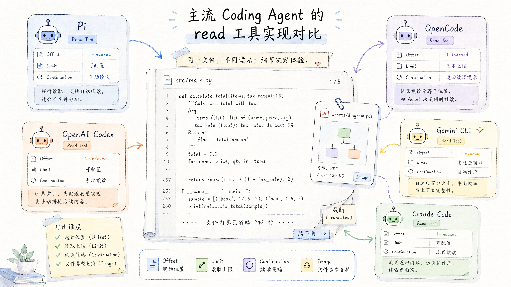
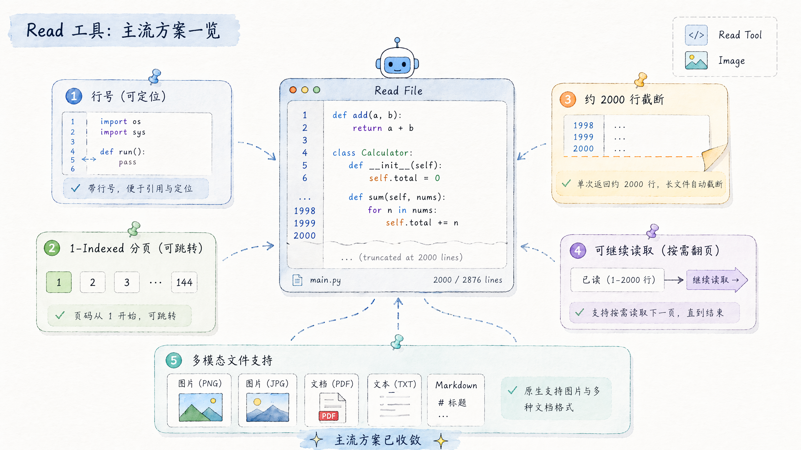
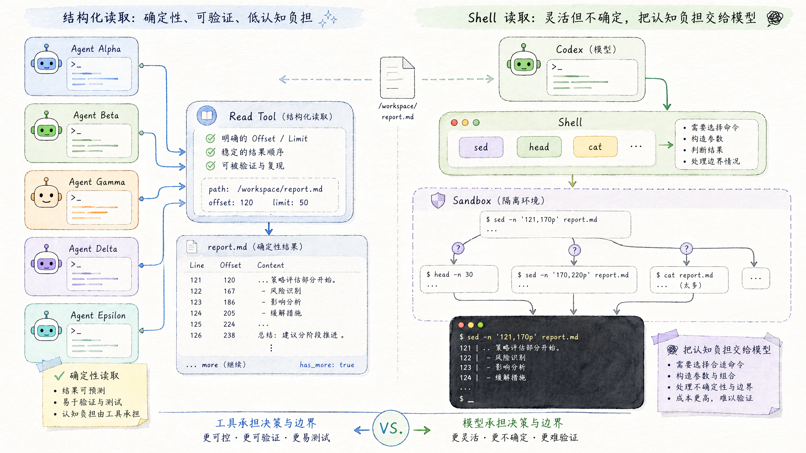
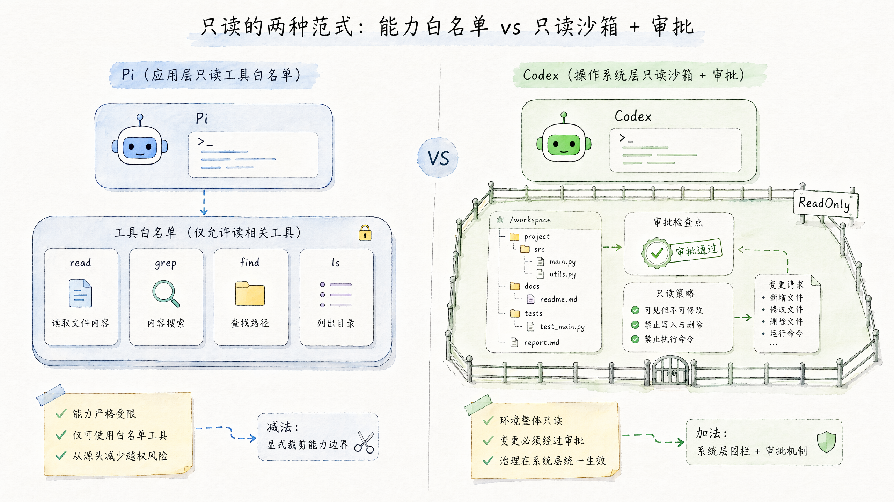

# 主流 Coding Agent 的 read 工具实现对比

> **一句话结论：**读取文件这件"小事"上,主流 agent 已收敛出一套事实标准——**cat -n 行号 + 1-indexed 分页 + 2000 行截断 + actionable 续读提示 + 图片多模态**。真正的哲学分歧只有一条:**要不要独立的结构化 read 工具**。Pi / OpenCode / Gemini CLI / Claude Code 都给了;唯独 OpenAI Codex 没有,它把读文件统一交给 shell + OS 级沙箱。

本文整理自对 5 个主流 coding agent 的 `read`(读文件)工具实现的源码级调研。其中 Pi、OpenCode、Gemini CLI 为开源,结论基于一手源码;Codex 为开源 Rust,结论基于 handler 源码;Claude Code 为闭源,结论基于工具描述泄露与社区实测,证据强度较弱,文中已逐条标注。



---

# 一、横向对比总览

下表汇总 5 个 agent 在读文件维度上的关键设计。其中"证据强度"一列标注结论的可靠程度。



| 维度 | Pi | OpenCode | Gemini CLI | Codex (Rust) | Claude Code |
|-|-|-|-|-|-|
| 独立 read 工具 | ✅ read | ✅ read | ✅ read_file | ❌ 无,走 shell | ✅ Read |
| 分页参数 | offset/limit(1-indexed) | offset/limit(1-indexed) | start_line/end_line(1-based 闭区间) | (用 sed/head) | offset/limit |
| 默认行数上限 | 2000 行 | 2000 行 | 按字节/行截断 | 无固定 | 2000 行 |
| 字节上限 | 50 KB | 50 KB | 有 | 无 | 分级,tier-2 现为 50K 字符 |
| 单行长度上限 | 截断,给 sed 兜底 | 2000 字符 + 后缀 | 截断 | — | 长行截断(阈值未证实) |
| 行号前缀 | cat -n 风格 | N: 内容 | cat -n 风格 | 无 | cat -n 风格 |
| 续读提示 | offset=N to continue | offset=N to continue | start_line: N | — | 类似 |
| 图片 / PDF | ✅ 自动缩放 + vision 检测 | ✅ 返回 data URL 附件 | ✅ | view_image(独立工具) | ✅ |
| 目录读取 | ❌(另有 ls) | ✅ read 兼读目录 | ❌ | — | ❌ |
| 二进制处理 | 文本/图片二分支 | 采样嗅探 + 黑名单,拒读 | 有 | — | 有 |
| 远程 / 可插拔 IO | ✅ ReadOperations 接口 | ✅ Effect FSUtil | FileSystemService | 沙箱内 shell | — |
| 证据强度 | 强(开源源码) | 强(开源源码) | 强(开源源码) | 强(开源源码) | 中(泄露+逆向) |

---

# 二、Pi 的 read 工具

Pi 的 `read` 工具源码分布在三个文件:`read.ts`(主逻辑)、`truncate.ts`(截断)、`path-utils.ts`(路径解析)。它是这套对比里设计最克制、可移植性最强的一版。

## 2.1 工具定义与 Schema

导出 `createReadToolDefinition(cwd, options)`,用 TypeBox 定义参数 schema:

```typescript
readSchema = Type.Object({
  path: Type.String,
  offset: Type.Optional(Type.Number),  // 1-indexed 起始行
  limit: Type.Optional(Type.Number),   // 最大行数
})
```

## 2.2 五个关键设计

1. **可插拔 ReadOperations IO 接口**——`readFile` / `access` / `detectImageMimeType?` 三个方法可被替换,为 SSH / 远程文件系统预留。这是 Pi"agent 内核可嵌入"哲学的体现,其他几家都直接绑死本地 fs。
2. **AbortSignal 取消**——execute 包在 Promise 里,每个 await 后检查 `if (aborted) return;`,支持中途取消。
3. **macOS 路径容错**——`resolveReadPathAsync` 对窄不换行空格(U+202F,AM/PM 用)、NFD 归一化、弯引号(U+2019)及其组合做多重 fallback。这是其他几家都没有的细节打磨。
4. **四态输出**——见 §2.3,每种截断情形都给出可操作的下一步。
5. **truncateHead 双上限**——2000 行 / 50KB 双限,且**永不返回半行**(不破坏整行)。

## 2.3 四态 actionable 续读输出

Pi 截断后不是简单丢一句"已截断",而是按情形给出模型能直接照做的下一步指令:

| 情形 | 触发条件 | 输出提示 |
|-|-|-|
| ① | 首行就超字节上限 | 建议改用 bash:`sed -n 'Np' path \| head -c 50KB` |
| ② | 因截断停止 | [Showing lines X-Y of Z. Use offset=N to continue.] |
| ③ | 用户 limit 提前停 | [N more lines in file. Use offset=N to continue.] |
| ④ | 正常读完 | 仅内容,无额外提示 |

> **说明:**`truncateHead`(read 用,取文件头)与 `truncateTail`(bash 用,取末尾错误/结果)的区别——read 保整行,bash 的 tail 可能在 UTF-8 边界返回半截首行。常量:`DEFAULT_MAX_LINES = 2000`、`DEFAULT_MAX_BYTES = 50 * 1024`、`GREP_MAX_LINE_LENGTH = 500`。

---

# 三、OpenCode 的 read 工具

OpenCode 与 Pi 几乎是孪生设计:同为 TypeScript、同样 2000 行 / 50KB 双上限、同样 1-indexed offset、续读提示都是 `Use offset=N to continue`。源码在 `packages/opencode/src/tool/read.ts`,关键常量如下:

```typescript
const DEFAULT_READ_LIMIT = 2000
const MAX_LINE_LENGTH = 2000
const MAX_BYTES = 50 * 1024
const SAMPLE_BYTES = 4096
const SUPPORTED_IMAGE_MIMES = new Set(["image/jpeg","image/png","image/gif","image/webp"])
```

## 3.1 与 Pi 的差异点

> **OpenCode 独有**
> - 行号格式 `N: 内容`(非 cat -n 对齐)
> - read 直接**兼读目录**(列条目,目录加 /)
> - 文件不存在时**模糊匹配**给 "Did you mean"
> - 读前 `SAMPLE_BYTES=4096` 采样嗅探
> - `isBinaryFile()`:NUL 字节 + 非打印占比 >30% + 扩展名黑名单,**二进制直接拒读**
> - LSP 预热(`lsp.touchFile`)

> **Pi 独有**
> - cat -n 经典行号(右对齐 + tab)
> - 目录拆给独立 ls / find 工具
> - 单行不破坏整行,改建议 sed 兜底
> - 可插拔 ReadOperations IO 接口
> - macOS 多重路径 fallback
> - 四态输出(多一态:首行超限)

## 3.2 单行截断的精确行为

OpenCode 是**先截单行(2000 字符 + 后缀 `... (line truncated to 2000 chars)`),再把截断后的行长计入 MAX_BYTES 字节预算**,所以长行不会爆掉预算。截断结尾有三态:

- `file.cut`(撞字节上限)→ `(Output capped at 50 KB. Showing lines X-Y. Use offset=N to continue.)`
- `file.more`(撞行数 limit)→ `(Showing lines X-Y of Z. Use offset=N to continue.)`
- 正常读完 → `(End of file - total N lines)`

另外 OpenCode 会显式检查 offset 越界并报错 `Offset N is out of range for this file (M lines)`,与 Pi 行为一致。

---

# 四、Gemini CLI 的 read_file 工具

Gemini CLI 用**闭区间 `start_line` / `end_line`**(1-based)而非 offset+limit;截断提示是 `start_line: ${end+1}`。它把真正的读取逻辑下沉到 `processSingleFileContent`,`read-file.ts` 本身更像编排层,额外带 JIT 子目录上下文注入和 telemetry 埋点。

> **设计取向:**Gemini CLI 的 read-file 是"薄编排 + 厚底层服务"——参数校验、路径访问控制(`validatePathAccess`)、ignore 规则过滤都在工具层,真正的读取/截断在共享的 `FileSystemService` 里。这与 Pi/OpenCode"逻辑都在 read.ts 里"的紧凑风格不同。

---

# 五、Codex 的特殊范式:没有 read 工具

> **注意:**早期二手博客分析的是**旧版 TypeScript** Codex(那时核心工具确实只有 shell)。Codex 现已用 Rust 重写,本节结论已通过一手 Rust 源码核实。

## 5.1 一手源码证据

拉取 `codex-rs/core/src/tools/handlers/mod.rs`,内置工具 handler 完整清单为:`agent_jobs`、`apply_patch`、`extension_tools`、`get_context_remaining`、`mcp` 系列、`multi_agents`、`plan`、`request_permissions`、`request_user_input`、`shell`、`sleep`、`tool_search`、`unified_exec`、`view_image`。

**其中没有任何 read / read_file 模块。**与文件读写相关的只有四类:

| Handler | 职责 |
|-|-|
| shell / unified_exec | 读文本靠在沙箱里跑 cat / sed / head |
| apply_patch | 专门的编辑工具 |
| view_image | 唯一独立的"读"工具,但只读图片(VIEW_IMAGE_TOOL_NAME),不读文本 |

这解释了社区现象:模型常以为文件被截断,然后反复用 sed 折腾;环境缺 cat/sed 时直接读不了文件。准确说法是:**在"读取文件"这件事上,Codex 没有结构化 read 工具,而是复用 shell;只有图片单独开了 view_image。**


_左侧是独立 read 工具把分页、截断和续读提示收束成确定性接口;右侧是 shell + sandbox 路线,把更多读取策略交给模型自己组织。_

## 5.2 Codex 如何实现只读子代理

Pi 靠"工具白名单"(`--tools read,grep,find,ls`)做只读;Codex 没有 read 工具,白名单走不通,它走**OS 级沙箱 + 审批策略**。由两个正交旋钮控制:

**① SandboxPolicy(沙箱能力)**——`codex-rs/protocol/src/protocol.rs` 里的枚举,关键三档:

- `ReadOnly`——只读磁盘,默认禁出网(network_access: false)。这是只读子代理的核心档位。
- `WorkspaceWrite`——源码注释直言"Same as ReadOnly but additionally grants write access to the cwd",可见**只读是基线,写权限是在只读之上加白**。
- `DangerFullAccess`——无限制。

**② AskForApproval(审批策略)**——枚举 `UnlessTrusted` / `OnFailure` / `OnRequest` / `Never`,决定越权操作何时升级给用户批准。

> **只读如何落地到 OS:**Codex 用平台原生沙箱——macOS 用 Seatbelt(sandbox-exec),Linux 用 Landlock + seccomp,这也是它从 TS 重写到 Rust 的动机之一。所以"只读"不是靠提示词约束模型自觉,而是内核级强制:`cat file` 能跑,`echo > file` 直接被系统拒。子代理(multi_agents 的 spawn_agent)共享同一套沙箱框架——"只读探索型子代理"本质就是在 ReadOnly 沙箱下 spawn 的 agent。

---

# 六、Claude Code 的 Read 工具(闭源,证据较弱)

> **前提:**Claude Code 闭源,源码未官方公开(虽曾因"人为失误"短暂泄露过部分)。本节结论来自**工具描述泄露 + 社区实测**,证据强度不如前述开源项目。

| 结论 | 是否准确 | 证据强度 |
|-|-|-|
| 有 Read 工具,带 offset/limit | ✅ 准确 | 强(工具 schema 泄露) |
| 2000 行默认上限 | ✅ 准确 | 强(社区一致实测) |
| 单行 >2000 字符截断 | ⚠️ 方向对,数字存疑 | 中 |
| cat -n 行号风格 | ✅ 基本准确 | 中(提示词泄露) |
| 有字节上限 | ✅ 准确 | 强(分级阈值) |
| 续读提示 | ✅ 准确 | 中 |

**需修正的两点:**

- **字节上限是分级的,不是单一硬上限**——v2.1.51+ 把 tier-2 阈值从 100K 字符降到 50K 字符(降到 50K 后巧合地与 Pi/OpenCode 的 50KB 撞上)。
- **"单行 2000 字符"无一手证据**——"长行会截断"行为存在,但具体阈值仅来自早期泄露,应降级表述为"长行会截断(阈值未经一手证实)"。

> **一个已知缺陷,反衬 Pi 设计:**Claude Code 被要求读含行为规则的文件时,Read 可能返回截断预览,而 agent 会把它**当成完整文件**,导致未读部分的规则静默丢失——社区定性为"静默安全失败"。这正是 Pi 的 actionable 续读提示(明确告诉模型"还没读完")想要避免的问题。

---

# 七、共识与分歧

> **已收敛的事实标准**
> cat -n 行号 + 1-indexed offset 分页 + 2000 行截断 + 续读提示 + 图片多模态。Pi、OpenCode、Claude Code 在这套上高度一致,Gemini CLI 仅在分页参数形态(闭区间)上略有不同。

> **唯一的真正分歧**
> 要不要独立 read 工具。Codex 选"一切走 shell",极简但把截断/分页的认知负担甩给模型;其余四家选"结构化 read",用确定性截断 + actionable 续读降低模型试错。

## 两种只读范式对比


_Pi 用工具白名单收缩能力边界;Codex 用 OS 级 ReadOnly 沙箱围出执行边界。两者都能得到只读子代理,但拦截层和工程代价完全不同。_

| 维度 | Pi(工具白名单) | Codex(沙箱策略) |
|-|-|-|
| 拦截层 | 应用层(不暴露工具) | OS 内核层(syscall 拒绝) |
| 只读子代理 | --tools read,grep,find,ls | SandboxPolicy::ReadOnly + spawn |
| 绕过风险 | 低(工具不存在) | 极低(越权 syscall 被拒) |
| 粒度 | 工具级 | 路径级(可指定 writable_roots) |
| 代价 | 裁剪模型能力,但简单可移植 | 需平台原生沙箱,实现重 |

> **总结:**Pi 把"只读"做成**减法**(拿掉写工具),Codex 把"只读"做成**围栏**(工具不变,圈在只读沙箱里)。前者轻量、跨平台、可观测;后者更接近真正的安全边界(连模型用 shell 钻空子写文件都被内核拦),但依赖 Seatbelt/Landlock 这类平台能力。这恰好呼应两者整体哲学:Pi 极简可移植,Codex 工程更重、把安全下沉到操作系统。

---

*本文整理自本会话对 Pi、OpenCode、Gemini CLI、OpenAI Codex(Rust)、Claude Code 的 read 工具源码与公开资料调研,资料截至 2026-06。开源项目结论基于一手源码;Codex 基于 handler 源码;Claude Code 基于工具描述泄露与社区实测,证据强度较弱,文中已逐条标注。*
