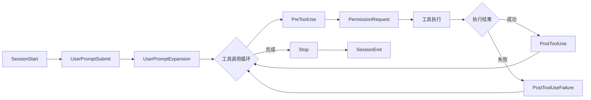
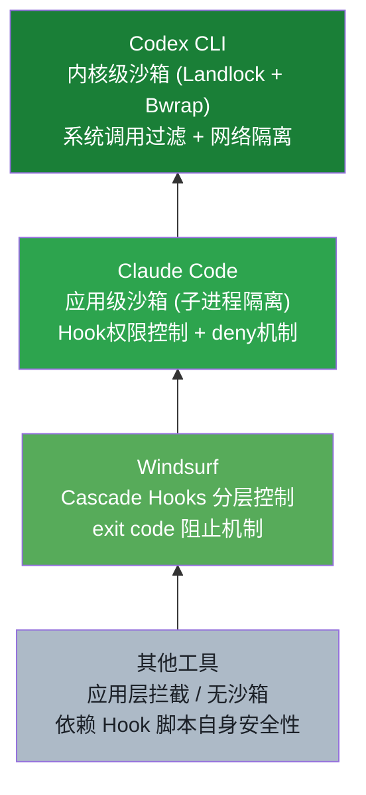

# 主流 AI Coding Agent Hook 能力对比调研报告

## 核心发现（Key Findings）

1. **Hook能力丰富度差异显著**：Claude Code提供13种Hook类型，Continue.dev提供16+种，而OpenAI Codex CLI仅支持5种
2. **安全模型各有侧重**：Codex CLI采用内核级沙箱（Landlock+Bwrap），Claude Code采用应用级沙箱，Windsurf通过Cascade Hooks实现分层控制
3. **配置方式多样化**：Claude Code支持多层级JSON配置，Codex CLI支持TOML内联配置，Aider和Cursor提供事件驱动型配置
4. **性能影响差异明显**：Claude Code简单Hook响应<10ms，Codex CLI沙箱初始化需~200ms
5. **社区生态发展不均衡**：Claude Code拥有最活跃的社区（claude-code-hooks-mastery等项目），Trae和Windsurf生态相对薄弱

---

## 一、研究背景与目的

随着AI Coding Agent技术的快速发展，Hook机制作为扩展Agent能力的核心手段，已成为开发者关注的重点。本报告通过对比主流AI Coding Agent的Hook能力，分析其技术特点、适用场景及发展趋势，为开发者选型提供参考。

---

## 二、调研范围

本次调研覆盖9款主流AI Coding Agent工具：

| # | 工具 | 类型 |
|:--|:-----|:-----|
| 1 | Claude Code | CLI Agent |
| 2 | OpenAI Codex CLI | CLI Agent |
| 3 | OpenCode | CLI Agent |
| 4 | Aider | CLI Agent |
| 5 | Cursor | IDE |
| 6 | Cline | VS Code 插件 |
| 7 | Continue.dev | IDE 插件 |
| 8 | Windsurf | IDE |
| 9 | Trae | IDE |

---

## 三、各工具 Hook 能力详述

### 3.1 Claude Code

- **Hook类型**：13种，包括会话生命周期类（SessionStart、SessionEnd）、工具调用类（PreToolUse、PostToolUse等）、子代理类、用户交互类和系统事件类
- **触发时机**：SessionStart → UserPromptSubmit → UserPromptExpansion → 工具调用循环 → Stop → SessionEnd
- **配置方式**：全局（`~/.claude/settings.json`）、项目（`.claude/settings.json`）、本地（`.claude/settings.local.json`）、`/hooks`命令
- **可执行操作**：阻止操作、修改行为、自动化、通知、审计记录、上下文注入
- **匹配规则**：精确匹配、多工具匹配（`|`分隔）、通配符（`*`）
- **限制**：超时60秒、最多50轮工具使用、Hook失败不阻止主流程

### 3.2 OpenAI Codex CLI

- **Hook类型**：5种（SessionStart、UserPromptSubmit、PreToolUse、PostToolUse、Stop）
- **配置方式**：全局（`~/.codex/hooks.json`）、项目（`.codex/hooks.json`）、TOML内联、环境变量
- **安全模型**：suggest模式、auto-edit模式、full-auto模式
- **扩展性**：插件系统、多语言脚本、matcher正则匹配
- **沙箱强度**：内核级沙箱（Landlock+Bwrap）

### 3.3 OpenCode

- TypeScript插件系统，`.opencode/plugin/`目录
- 支持工具替换、上下文定制
- 社区awesome-opencode

### 3.4 Aider

- AiderDesk事件Hook：onTaskCreated、onPromptFinished、onToolCalled等30+事件
- 拦截危险操作、转换提示词、自动回答审批

### 3.5 Cursor

- Rules（`.cursor/rules/`）+ Hooks（`hooks.json`）
- stop hook、beforeSubmitPrompt、PreToolUse、PostToolUse
- v1.7引入

### 3.6 Cline

- 插件系统+SDK，`.clinerules/hooks`目录
- 工作区快照恢复、策略执行

### 3.7 Continue.dev

- CLI Hooks系统（2026年3月新增）
- 16+ CLI事件类型、正则匹配
- 模型路由、自定义slash命令

### 3.8 Windsurf

- Cascade Hooks：pre-hooks（exit code 2阻止）和post-hooks
- `.windsurfrules`文件+Memories自动学习
- `.workflows/`目录工作流定义
- 支持40+ IDE插件

### 3.9 Trae

- MCP协议扩展，无直接hook机制
- `.trae/rules/`目录规则文件
- 自定义Agent配置（角色/工具/步骤数）
- MCP支持stdio/SSE/Streamable HTTP

---

## 四、横向对比分析

### 4.1 Hook 全生命周期对比（按执行顺序）

以下表格按 Agent 使用的生命周期顺序，列出所有工具 Hook 事件的并集，逐一对比各工具的支持情况：

| 生命周期阶段 | Hook 事件 | Claude Code | Codex CLI | OpenCode | Cursor | Windsurf | Aider | Cline | Continue.dev | Trae |
|:---|:---|:---|:---|:---|:---|:---|:---|:---|:---|:---|
| 会话启动 | SessionStart | ✅ | ✅ | ✅ 插件初始化 | 无 | 无 | 无 | 无 | 无 | 无 |
| 配置变更 | ConfigChange | ✅ | 无 | 无 | 无 | 无 | 无 | 无 | 无 | 无 |
| 工作目录变更 | CwdChanged | ✅ | 无 | 无 | 无 | 无 | 无 | 无 | 无 | 无 |
| 用户提交提示 | UserPromptSubmit | ✅ | ✅ | 无 | ✅ beforeSubmitPrompt | 无 | ✅ onPromptFinished | 无 | ✅ CLI事件 | 无 |
| 提示扩展 | UserPromptExpansion | ✅ | 无 | 无 | 无 | 无 | 无 | 无 | 无 | 无 |
| 子代理启动 | SubagentStart | ✅ (v2.1.49+) | 无 | 无 | 无 | 无 | 无 | 无 | 无 | 无 |
| 工具调用前 | PreToolUse | ✅ matcher匹配 | ✅ 正则matcher | ✅ 拦截修改 | ✅ (v1.7) | ✅ pre-hooks | ✅ onToolCalled | ✅ SDK注册 | ✅ 正则匹配 | 无（MCP代替） |
| 权限请求 | PermissionRequest | ✅ | 无（沙箱代替） | 无 | 无 | 无 | 无 | 无 | 无 | 无 |
| 权限拒绝 | PermissionDenied | ✅ | 无 | 无 | 无 | 无 | 无 | 无 | 无 | 无 |
| 工具调用后 | PostToolUse | ✅ | ✅ | ✅ | ✅ (v1.7) | ✅ post-hooks | ✅ | ✅ | ✅ | 无 |
| 工具调用失败 | PostToolUseFailure | ✅ | 无 | 无 | 无 | 无 | 无 | 无 | 无 | 无 |
| 文件变更 | FileChanged | ✅ | 无 | 无 | 无 | 无 | ✅ onFileAdded | 无 | 无 | 无 |
| 上下文压缩前 | PreCompact | ✅ | 无 | ✅ session.compacting | 无 | 无 | 无 | 无 | 无 | 无 |
| 通知 | Notification | ✅ | 无 | 无 | 无 | 无 | 无 | 无 | 无 | 无 |
| 子代理结束 | SubagentStop | ✅ (v2.1.49+) | 无 | 无 | 无 | 无 | 无 | 无 | 无 | 无 |
| 任务创建 | onTaskCreated | 无 | 无 | 无 | 无 | 无 | ✅ | ✅ | 无 | 无 |
| Agent 停止 | Stop | ✅ | ✅ | 无 | ✅ stop hook | 无 | 无 | 无 | 无 | 无 |
| 工作区快照 | Snapshot/Restore | 无 | 无 | 无 | 无 | 无 | 无 | ✅ | 无 | 无 |
| 会话结束 | SessionEnd | ✅ | 无 | 无 | 无 | 无 | 无 | 无 | 无 | 无 |

### 4.2 能力维度统计汇总

| 维度 | Claude Code | Codex CLI | OpenCode | Cursor | Windsurf | Aider | Cline | Continue.dev | Trae |
|:---|:---|:---|:---|:---|:---|:---|:---|:---|:---|
| Hook 事件总数 | 16 | 5 | 4 | 4 | 2 | 5+ | 4 | 3 | 0 |
| 配置格式 | JSON | JSON/TOML | TypeScript | JSON/MD | YAML/文件 | 扩展API | SDK/目录 | YAML/JSON | MCP JSON |
| 匹配机制 | 精确/通配/多选 | 正则 | 插件路由 | 规则匹配 | 文件路径 | 事件名 | SDK注册 | 正则 | 无 |
| 阻止能力 | ✅ deny返回 | ✅ block返回 | ✅ 拦截 | ✅ | ✅ exit code 2 | ✅ | ✅ | ✅ | 无 |
| 修改参数 | ✅ | ✅ | ✅ | 无 | 无 | ✅ | 无 | 无 | 无 |
| 异步执行 | ✅ | 无 | 无 | 无 | 无 | 无 | 无 | 无 | 无 |
| 多级配置 | 全局/项目/本地 | 全局/项目/插件 | 全局/项目 | 项目级 | 全局/工作区 | 项目级 | 工作区级 | 全局/工作区 | 全局/项目 |
| 安全沙箱 | 应用层 | 内核层 | 无 | 无 | 无 | 无 | 无 | 无 | 无 |
| 扩展生态 | 社区Hook库 | 插件系统 | awesome列表 | 规则市场 | Memories | 扩展系统 | SDK生态 | 模型路由 | MCP市场 |

### 4.3 对比结论

1. **Claude Code 覆盖最全**：16 个 Hook 事件覆盖从会话创建到结束的全生命周期，是唯一支持子代理 Hook、权限 Hook、异步执行的工具
2. **Codex CLI 精简但安全**：仅 5 个核心 Hook，但配合内核级沙箱实现了更强的安全隔离
3. **Trae 走差异化路线**：不提供传统 Hook 机制，通过 MCP 协议和自定义 Agent 实现扩展，属于「协议驱动」而非「事件驱动」
4. **IDE 类工具正在补齐**：Cursor v1.7、Continue.dev 2026.3 才引入 Hook，功能尚在早期阶段
5. **Windsurf 最简模型**：仅 pre/post 两类 Hook，但结合 Workflows 和 Memories 形成独特的工作流定制方案

### 4.4 原有对比表格（按工具维度）

| 工具 | Hook类型数量 | 触发时机 | 配置方式 | 安全模型 | 扩展性 | 性能影响 | 社区生态 |
|:---|:---|:---|:---|:---|:---|:---|:---|
| Claude Code | 13 | 完整生命周期 | JSON多层级 | 应用级沙箱 | 高 | 简单Hook<10ms | 活跃（3个开源项目） |
| OpenAI Codex CLI | 5 | 基础生命周期 | JSON+TOML+环境变量 | 内核级沙箱 | 中 | 沙箱初始化~200ms | 一般 |
| OpenCode | 插件系统 | 灵活 | TypeScript插件 | 未提及 | 高 | 未提及 | 社区项目 |
| Aider | 30+ | 事件驱动 | 事件Hook | 未提及 | 高 | 未提及 | 未提及 |
| Cursor | 4+ | 关键节点 | Rules+Hooks | 未提及 | 中 | 未提及 | 未提及 |
| Cline | 插件系统 | 灵活 | 插件+SDK | 未提及 | 高 | 未提及 | 未提及 |
| Continue.dev | 16+ | 完整CLI事件 | 正则匹配 | 未提及 | 高 | 未提及 | 2026年新增 |
| Windsurf | Cascade Hooks | 分层触发 | .windsurfrules | 分层控制 | 高 | 未提及 | 40+ IDE插件 |
| Trae | 无直接机制 | 无 | .trae/rules | MCP协议 | 中 | 未提及 | 未提及 |

---

## 五、架构设计与技术实现对比

### 执行环境

- **Claude Code**：子进程沙箱，默认2分钟超时，512MB内存限制
- **Codex CLI**：Linux Landlock+Bwrap / macOS Seatbelt / Windows专用用户账户
- **其他工具**：未提及具体沙箱机制

### 执行流程

- **Claude Code**：同步（PreToolUse阻塞）+异步（Notification后台）
- **Codex CLI**：同步为主
- **其他工具**：未提及

### 性能

- **Claude Code**：简单Hook <10ms，复杂100-500ms
- **Codex CLI**：沙箱初始化~200ms
- **其他工具**：未提及

### 架构对比示意

```mermaid
graph TB
    subgraph Claude_Code["Claude Code 架构"]
        CC_User["用户层: 配置文件 JSON / /hooks 命令"]
        CC_App["应用层: Hook Engine + Matcher → 执行器"]
        CC_Sandbox["沙箱层: 子进程隔离 / 超时控制 / 内存限制"]
        CC_Sys["系统层: 文件系统 + 环境变量"]
        CC_User --> CC_App --> CC_Sandbox --> CC_Sys
    end

    subgraph Codex_CLI["Codex CLI 架构"]
        CX_User["用户层: 配置文件 JSON/TOML / 环境变量"]
        CX_App["应用层: Hook Engine + 正则 Matcher"]
        CX_Kernel["内核层: Landlock+Bwrap / Seatbelt / 专用账户"]
        CX_User --> CX_App --> CX_Kernel
    end

    subgraph Trae["Trae 架构（协议驱动）"]
        TR_User["用户层: .trae/rules / Agent 配置"]
        TR_Proto["协议层: MCP (Model Context Protocol)"]
        TR_Trans["传输层: stdio / SSE / Streamable HTTP"]
        TR_Svc["服务层: MCP Server 市场"]
        TR_User --> TR_Proto --> TR_Trans --> TR_Svc
    end
```

### Claude Code Hook 生命周期流程图

### 安全模型层次

---

## 六、最佳实践与选型建议

### 最佳实践

1. **GitHub开源项目**：claude-code-hooks-mastery、claude-code-hooks、claude-tools
2. **配置管理**：采用分层配置（全局+项目+本地）
3. **性能优化**：避免在PreToolUse中执行复杂操作
4. **安全控制**：使用deny操作阻止危险工具调用

### 选型建议

| 场景 | 推荐工具 | 理由 |
|:-----|:---------|:-----|
| 企业级开发 | Claude Code / Codex CLI | 丰富Hook能力+活跃社区 / 强安全模型 |
| 插件开发 | OpenCode / Cline | 灵活TypeScript插件系统 |
| IDE集成 | Windsurf | 40+ IDE插件支持 |
| 最新技术尝鲜 | Continue.dev | 2026年新增CLI Hooks系统 |
| 轻量级使用 | Aider / Cursor | 简单配置+事件驱动 |
| 协议驱动扩展 | Trae | MCP协议，适合已有MCP生态的团队 |

---

## 七、总结与展望

AI Coding Agent的Hook机制正朝着更丰富、更灵活、更安全的方向发展。未来，Hook能力将成为AI Coding Agent的核心竞争力之一，社区生态和可视化调试工具将成为发展重点。

**趋势预判：**

1. Hook 事件将持续丰富，子代理、多模态等新场景将催生新 Hook 类型
2. 安全沙箱将从可选变为标配，内核级隔离将成为主流
3. 可视化 Hook 调试工具将出现，降低配置门槛
4. MCP 等协议驱动的扩展方式将与传统事件驱动 Hook 融合互补

---

## References

- Claude Code官方文档
- OpenAI Codex CLI文档
- OpenCode社区文档
- AiderDesk事件Hook文档
- Cursor官方博客
- Continue.dev CLI Hooks公告
- Windsurf官方文档
- Trae MCP协议文档
